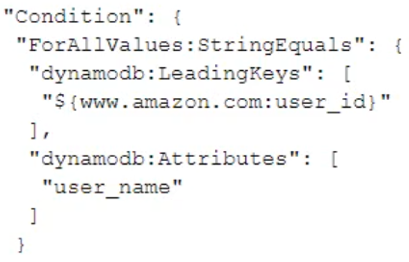
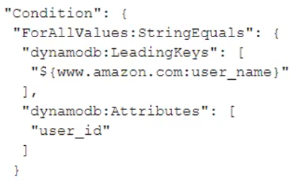
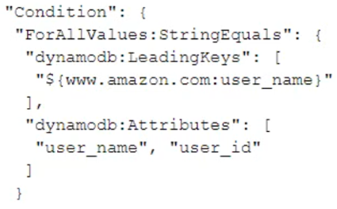
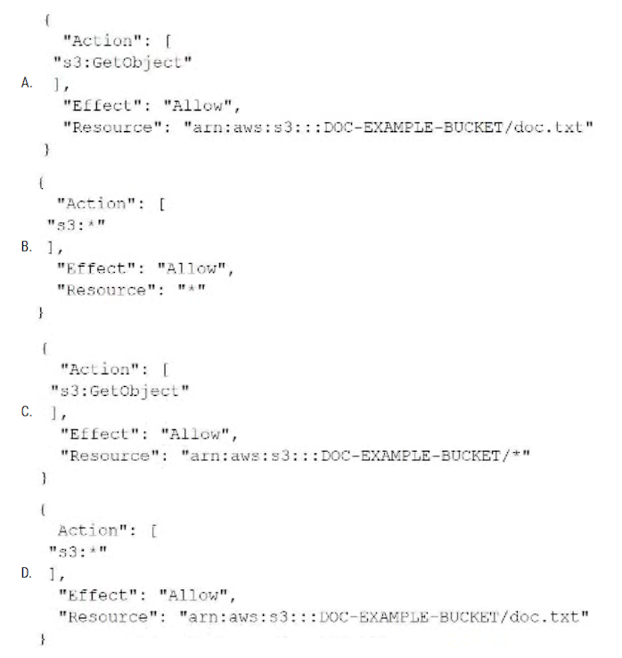

Question #1

A gaming website gives users the ability to trade game items with each other on the platform. The platform requires both users' records to be updated and persisted in one transaction. If any update fails, the transaction must roll back.
Which AWS solution can provide the transactional capability that is required for this feature?

A. Amazon DynamoDB with operations made with the Consistent Read parameter set to true
B. Amazon ElastiCache for Memcached with operations made within a transaction block
C. Amazon DynamoDB with reads and writes made by using Transact* operations
D. Amazon Aurora MySQL with operations made within a transaction block
E. Amazon Athena with operations made within a transaction block

Correct Answer: C 不确定

---

Question #2

A developer has created a Java application that makes HTTP requests directly to AWS services. Application logging shows 5xx HTTP response codes that occur at irregular intervals. The errors are affecting users.
How should the developer update the application to improve the application's resiliency?
A. Revise the request content in the application code.
B. Use the AWS SDK for Java to interact with AWS APIs.
C. Scale out the application so that more instances of the application are running.
D. Add additional logging to the application code.

Correct Answer: B

All AWS SDKs have a built-in retry mechanism with an algorithm that uses exponential backoff. This algorithm implements increasingly longer wait times between retries for consecutive error responses.

---

Question #3

A global company has a mobile app with static data stored in an Amazon S3 bucket in the us-east-1 Region. The company serves the content through an Amazon
CloudFront distribution. The company is launching the mobile app in South Africa. The data must reside in the af-south-1 Region. The company does not want to deploy a specific mobile client for South Africa.
What should the company do to meet these requirements?

A. Use the CloudFront geographic restriction feature to block access to users in South Africa.
B. Create a Lambda@Edge function. Associate the Lambda@Edge function as an origin request trigger with the CloudFront distribution to change the S3 origin Region.
C. Create a Lambda@Edge function. Associate the Lambda@Edge function as a viewer response trigger with the CloudFront distribution to change the S3 origin Region.
D. Include af-south-1 in the alternate domain name (CNAME) of the CloudFront distribution.

Correct Answer: B

Lambda@Edge – Lambda@Edge 是 AWS Lambda 的扩展，可为复杂的函数提供强大而灵活的计算，并带来更接近您的查看器的完整应用程序逻辑，并且具有高度安全性。Lambda@Edge 函数在 Node.js 或 Python 运行时环境中运行。您将函数发布到单个 AWS 区域，当您关联该函数与 CloudFront 分配时，Lambda@Edge 可自动将您的代码复制到世界上任何地点。

 Used to change CloudFront requests and responses:
• Viewer Request – after CloudFront receives a request from a 
viewer
• Origin Request – before CloudFront forwards the request to the 
origin
• Origin Response – after CloudFront receives the response from the 
origin
• Viewer Response – before CloudFront forwards the response to 
the viewer

---

Question #4

A developer is testing an AWS Lambda function by using the AWS Serverless Application Model (AWS SAM) local CLI. The application that is implemented by the
Lambda function makes several AWS API calls by using the AWS software development kit (SDK). The developer wants to allow the function to make AWS API calls in a test AWS account from the developer's laptop.
What should the developer do to meet these requirements?
A. Edit the template.yml file. Add the AWS_ACCESS_KEY_ID property and the AWS_SECRET_ACCESS_KEY property in the Globals section.
B. Add a test profile by using the aws configure command with the --profile option. Run AWS SAM by using the sam local invoke command with the -profile option.
C. Edit the template.yml tile. For the AWS::Serverless::Function resource, set the role to an IAM role in the AWS account.
D. Run the function by using the sam local invoke command. Override the AWS_ACCESS_KEY_ID parameter and the AWS_SECRET_ACCESS_KEY parameter by specifying the --parameter-overrides option.

Correct Answer: B

---

Question #5

A developer designed an application on an Amazon EC2 instance. The application makes API requests to objects in an Amazon S3 bucket.
Which combination of steps will ensure that the application makes the API requests in the MOST secure manner? (Choose two.)
A. Create an IAM user that has permissions to the S3 bucket. Add the user to an IAM group.
B. Create an IAM role that has permissions to the S3 bucket.
C. Add the IAM role to an instance profile. Attach the instance profile to the EC2 instance.
D. Create an IAM role that has permissions to the S3 bucket. Assign the role to an 1AM group.
E. Store the credentials of the IAM user in the environment variables on the EC2 instance.

Correct Answer: BC 

---

Question #6

A developer is configuring an Amazon CloudFront distribution for a new application to provide encryption in transit. The application is running in the eu-west-1
Region. The developer creates a new certificate in AWS Certificate Manager (ACM) in eu-west-1, but the certificate is not visible in the CloudFront distribution settings.
What should the developer do to fix this problem?
A. Create the certificate for the domain in the same Region as the application. Ensure that the alternate domain name (CNAME) in the distribution settings matches the domain name in the certificate.
B. Create the certificate in the eu-west-1 Region. Ensure that the alternate domain name (CNAME) in the distribution settings matches the domain name in the certificate.
C. Recreate the CloudFront distribution in the same Region as the certificate.
D. Specify the ACM certificate name as the default root object of the CloudFront distribution.

Correct Answer: B 

这题打错字了，B选项是us-west-1

---

Question #7

A developer is building an application that runs behind an Application Load Balancer (ALB). The ALB is configured as the origin for an Amazon CloudFront distribution. Users will log in to the application by using their social media accounts.
How can the developer authenticate users?
A. Validate the users by inspecting the tokens in an AWS Lambda authorizer on the ALB.
B. Configure the ALB to use Amazon Cognito as one of the authentication providers.
C. Configure CloudFront to use Amazon Cognito as one of the authentication providers.
D. Validate the users by calling the Amazon Cognito API in an AWS Lambda authorizer on the ALB.

Correct Answer: B

Lambda Authorizer (formerly Custom Authorizers)是API GateWay的东西，自己实现一个lambda Authorizer，来和第三方验证tokens集成
ALB有个identity providers


---

Question #8

A company has an application that analyzes photographs. A developer is preparing the application for deployment to Amazon EC2 instances. The application's image analysis functions require a mix of GPU instances and CPU instances that run on Amazon Linux. The developer needs to add code to the application so that the functions can determine whether they are running on a GPU instance.
What should the functions do to obtain this information?
A. Call the DescribeInstances API operation and filter on the current instance ID. Examine the ElasticGpuAssociations property.
B. Evaluate the GPU AVAILABLE environment variable.
C. Call the DescribeElasticGpus API operation.
D. Retrieve the instance type from the instance metadata.

Correct Answer: D

http://169.254.169.254/latest/meta-data/

---

Question #9

A company has an application that uses Amazon Cognito user pools as an identity provider. The company must secure access to user records. The company has set up multi-factor authentication (MFA). The company also wants to send a login activity notification by email every time a user logs in.
What is the MOST operationally efficient solution that meets this requirement?
A. Create an AWS Lambda function that uses Amazon Simple Email Service (Amazon SES) to send the email notification. Add an Amazon API Gateway API to invoke the function. Call the API from the client side when login confirmation is received.
B. Create an AWS Lambda function that uses Amazon Simple Email Service (Amazon SES) to send the email notification. Add an Amazon Cognito post authentication Lambda trigger for the function.
C. Create an AWS Lambda function that uses Amazon Simple Email Service (Amazon SES) to send the email notification. Create an Amazon CloudWatch Logs log subscription filter to invoke the function based on the login status.
D. Configure Amazon Cognito to stream all logs to Amazon Kinesis Data Firehose. Create an AWS Lambda function to process the streamed logs and to send the email notification based on the login status of each user.

Correct Answer: B 

CUP can invoke a Lambda function synchronously on these triggers

---

Question #10

A company hosts a three-tier web application on AWS behind an Amazon CloudFront distribution. A developer wants a dashboard to monitor error rates and anomalies of the CloudFront distribution with the shortest possible refresh interval.
Which combination of slops should the developer take to meet these requirements? (Choose two.)
A. Activate real-time logs on the CloudFront distribution. Create a stream in Amazon Kinesis Data Streams.
B. Export the CloudFront logs to an Amazon S3 bucket. Detect anomalies and error rates with Amazon QuickSight.
C. Configure Amazon Kinesis Data Streams to deliver logs to Amazon OpenSearch Service (Amazon Elasticsearch Service). Create a dashboard in OpenSearch Dashboards (Kibana).
D. Create Amazon CloudWatch alarms based on expected values of selected CloudWatch metrics to detect anomalies and errors.
E. Design an Amazon CloudWatch dashboard of the selected CloudFront distribution metrics.

Correct Answer: AC 

It mentions shortest possible refresh interval so best to use the real-time logs

---

Question #11

A developer creates a customer managed key for multiple AWS users to encrypt data in Amazon S3. The developer configures Amazon Simple Notification
Service (Amazon SNS) to publish a message if key deletion is scheduled. The developer needs to preserve any SNS messages that cannot be delivered so that those messages can be reprocessed.
Which AWS service or feature should the developer use to meet this requirement?
A. Amazon Simple Email Service (Amazon SES)
B. AWS Lambda
C. Amazon Simple Queue Service (Amazon SQS)
D. Amazon CloudWatch alarm

Correct Answer: C

---

Question #12

A developer needs to deploy an application to AWS Elastic Beanstalk for a company. The application consists of a single Docker image. The company's automated continuous integration and continuous delivery (CI/CD) process builds the Docker image and pushes the image to a public Docker registry.
How should the developer deploy the application to Elastic Beanstalk?

A. Create a Dockerfile. Configure Elastic Beanstalk to build the application as a Docker image.
B. Create a docker-compose.yml file. Use the Elastic Beanstalk CLI to deploy the application.
C. Create a .zip file that contains the Docker image. Upload the .zip file to Elastic Beanstalk.
D. Create a Dockerfile. Run the Elastic Beanstalk CLI eb local run command in the same directory.

Correct Answer: B

不确定

---

Question #13

A company is using AWS CodeDeploy for all production deployments. A developer has an Amazon Elastic Container Service (Amazon ECS) application that uses the CodeDeployDefault.ECSAIIAtOnce configuration. The developer needs to update the production environment in increments of 10% until the entire production environment is updated.
Which CodeDeploy configuration should the developer use to meet these requirements?
A. CodeDeployDefault.ECSCanary10Percent5Minutes
B. CodeDeployDefault.ECSLinear10PercentEvery3Minutes
C. CodeDeployDefault.OneAtATime
D. CodeDeployDefault.LambdaCanary10Percent5Minutes

Correct Answer: B 

---

Question #14

A company is using AWS Elastic Beanstalk to deploy a three-tier application. The application uses an Amazon RDS DB instance as the database tier. The company wants to decouple the DB instance from the Elastic Beanstalk environment.
Which combination of steps should a developer lake to meet this requirement? (Choose two.)

A. Create a new Elastic Beanstalk environment that connects to the DB instance.
B. Create a new DB instance from a snapshot of the previous DB instance.
C. Use the Elastic Beanstalk CLI to decouple the DB instance.
D. Use the AWS CLI to decouple the DB instance.
E. Modify the current Elastic Beanstalk environment to connect to the DB instance.

Correct Answer: AB  不确定
https://aws.amazon.com/premiumsupport/knowledge-center/decouple-rds-from-beanstalk/

在不影响环境运行状况的前提下，按照以下步骤从 Elastic Beanstalk 环境解耦您的数据库：

    创建 Amazon RDS 数据库快照。
    防止您的 RDS 数据数据库实例被删除。
    创建新 Elastic Beanstalk 环境。
    执行蓝绿部署。
    更新 beanstalk 环境 A 的数据库删除策略。
    从 beanstalk 环境 A 解耦 RDS 实例。
    终止旧 Elastic Beanstalk 环境。


---

Question #15

A company has point-of-sale devices across thousands of retail shops that synchronize sales transactions with a centralized system. The system includes an
Amazon API Gateway API that exposes an AWS Lambda function. The Lambda function processes the transactions and stores the transactions in Amazon RDS for MySQL. The number of transactions increases rapidly during the day and is near zero at night.
How can a developer increase the elasticity of the system MOST cost-effectively?

A. Migrate from Amazon RDS to Amazon Aurora MySQL. Use an Aurora Auto Scaling policy to scale road replicas based on CPU consumption.
B. Migrate from Amazon RDS to Amazon Aurora MySQL. Use an Aurora Auto Scaling policy to scale read replicas based on the number of database connections.
C. Create an Amazon Simple Queue Service (Amazon SQS) queue. Publish transactions to the queue. Set the queue to invoke the Lambda function. Turn on enhanced fanout for the Lambda function.
D. Create an Amazon Simple Queue Service (Amazon SQS) queue. Publish transactions to the queue. Set the queue to invoke the Lambda function. Set the reserved concurrency of the Lambda function to be less than the number of database connections.

Correct Answer: D

A and B are for read problem, nor for write.
C its not possible because enhanced fanout its for kinesis
D is the most probably


---


Question #16

A developer is writing an AWS Lambda function. The Lambda function needs to access items that are stored in an Amazon DynamoDB table.
What is the MOST secure way to configure this access for the Lambda function?

A. Create an IAM user that has permissions to access the DynamoDB table. Create an access key for this user. Store the access key ID and secret access key in the Lambda function environment variables.
B. Add a resource-based policy to the DynamoDB table to allow access from the Lambda function's IAM role.
C. Create an IAM policy that allows access to the DynamoDB table. Attach this policy to the Lambda function's IAM role.
D. Create a DynamoDB Accelerator (DAX) cluster. Configure the Lambda function to use the DAX duster to access the DynamoDB table.

Correct Answer: C 

Amazon DynamoDB **不支持resource-based policy**

---

Question #17

A developer is implementing user authentication and authorization for a web application that is hosted on an Amazon EC2 instance. The developer needs to ensure that the user credentials are encrypted and secure when they are stored and transmitted.
Which solution will meet these requirements?

A. Activate web server modules for authentication and authorization on the instance. Use HTTP basic authentication for the user login.
B. Deploy a custom authentication and authorization API over HTTP. Store the user credentials on Amazon ElastiCache for Redis.
C. Use Amazon Cognito to configure a user pool. Use the Amazon Cognito API to authenticate and authorize the users.
D. Create IAM users. Assign the users to different IAM groups. Use AWS Single Sign-On to authenticate and authorize each user.

Correct Answer: C

---

Question #18

A company that has multiple offices uses an Amazon DynamoDB table to store employee payroll information. Item attributes consist of employee names, office identifiers, and cumulative daily hours worked The most frequently used query extracts a report of an alphabetical subset of employees for a specific office.
Which design of the DynamoDB table primary key will have the MINIMUM performance impact?

A. Partition key on the office identifier and sort key on the employee name
B. Partition key on the employee name and sort key on the office identifier
C. Partition key on the employee name
D. Partition key on the office identifier

Correct Answer: A

不确定

---

Question #19

A company hosts a microservices application that uses Amazon API Gateway. AWS Lambda, Amazon Simple Queue Service (Amazon SQS), and Amazon
DynamoDB. One of the Lambda functions adds messages to an SQS FIFO queue.
When a developer checks the application logs, the developer finds a few duplicated items in a DynamoDB table. The items were inserted by another polling function that processes messages from the queue.
What is the MOST likely cause of this issue?

A. Write operations on the DynamoDB table are being throttled.
B. The SQS queue delivered the message to the function more than once.
C. API Gateway duplicated the message in the SQS queue.
D. The polling function timeout is greater than the queue visibility timeout.

Correct Answer: D

---

Question #20

A development team has been using a builder server that is hosted on an Amazon EC2 instance to perform builds and deployments for the last 3 months. The
EC2 instance's instance profile uses an IAM role that contains the Administrator Access managed policy. The development team must replace that policy with a policy that provides only the required permissions.
What is the FASTEST way to create a custom 1AM policy for the EC2 instance to meet this requirement?

A. Create a new IAM policy based on services that the build server deployed or updated in the last 3 months.
B. Create a new IAM policy that includes all actions that AWS CloudTrail recorded for the IAM role in the last 3 months.
C. Create a new permissions boundary policy that denies all access. Associate the permissions boundaries with the IAM role.
D. Create a new IAM policy by using Amazon Athena to query an Amazon S3 bucket that contains AWS CloudTrail events that the IAM role performed in the last 3 months.

Correct Answer: B

"As an administrator or developer, you might grant permissions to IAM entities (users or roles) beyond what they require. IAM provides several options to help you refine the permissions that you grant. One option is to generate an IAM policy that is based on access activity for an entity. IAM Access Analyzer reviews your AWS CloudTrail logs and generates a policy template that contains the permissions that the entity used in your specified date range. You can use the template to create a policy with fine-grained permissions that grant only the permissions that are required to support your specific use case."

https://docs.aws.amazon.com/IAM/latest/UserGuide/access_policies_generate-policy.html

---

Question #21

A developer needs to write an AWS CloudFormation template on a local machine and deploy a CloudFormation stack to AWS.
What must the developer do to complete these tasks?

A. Install the AWS CLI. Configure the AWS CLI by using an IAM user name and password.
B. Install the AWS CLI. Configure the AWS CLI by using an SSH key.
C. Install the AWS CLI. Configure the AWS CLI by using an IAM user access key and secret key.
D. Install an AWS software development kit (SDK). Configure the SDK by using an X.509 certificate.

Correct Answer: C

---

Question #22

A developer is working on a web application that runs on Amazon Elastic Container Service (Amazon ECS) and uses an Amazon DynamoDB table to store data.
The application performs a large number of read requests against a small set of the table data.
How can the developer improve the performance of these requests? (Choose two.)

A. Create an Amazon ElastiCache cluster. Configure the application to cache data in the cluster.
B. Create a DynamoDB Accelerator (DAX) cluster. Configure the application to use the DAX cluster for DynamoDB requests.
C. Configure the application to make strongly consistent read requests against the DynamoDB table.
D. Increase the read capacity of the DynamoDB table.
E. Enable DynamoDB adaptive capacity.

Correct Answer: AB 或者 BD 不确定


DynamoDB本身不直接支持使用ElastiCache来缓存数据。
然而，您可以在应用程序层面使用ElastiCache来缓存从DynamoDB中检索的数据。这需要您在应用程序中编写逻辑，将从DynamoDB获取的数据存储到ElastiCache中，并在需要时首先检查缓存以获取数据，而不是直接从DynamoDB读取。这样可以减少对DynamoDB的请求次数，提高读取性能和降低成本。

---

Question #23

A developer needs to use Amazon DynamoDB to store customer orders. The developer's company requires all customer data to be encrypted at rest with a key that the company generates.
What should the developer do to meet these requirements?
A. Create the DynamoDB table with encryption set to None. Code the application to use the key to decrypt the data when the application reads from the table. Code the application to use the key to encrypt the data when the application writes to the table.
B. Store the key by using AWS Key Management Service (AWS KMS). Choose an AWS KMS customer managed key during creation of the DynamoDB table. Provide the Amazon Resource Name (ARN) of the AWS KMS key.
C. Store the key by using AWS Key Management Service (AWS KMS). Create the DynamoDB table with default encryption. Include the kms:Encrypt parameter with the Amazon Resource Name (ARN) of the AWS KMS key when using the DynamoDB software development kit (SDK).
D. Store the key by using AWS Key Management Service (AWS KMS). Choose an AWS KMS AWS managed key during creation of the DynamoDB table. Provide the Amazon Resource Name (ARN) of the AWS KMS key.

Correct Answer: B

https://aws.amazon.com/blogs/database/bring-your-own-encryption-keys-to-amazon-dynamodb/

---

Question #24

A developer is creating a solution to track an account's Amazon S3 buckets over time. The developer has created an AWS Lambda function that will run on a schedule. The function will list the account's S3 buckets and will store the list in an Amazon DynamoDB table. The developer receives a permissions error when the developer runs the function with the AWSLambdaBasicExecutionRole AWS managed policy.
Which combination of permissions should the developer use to resolve this error? (Choose two.)

A. Cross-account IAM role
B. Permission for the Lambda function to list buckets in Amazon S3
C. Permission for the Lambda function to write in DynamoDB
D. Permission for Amazon S3 to invoke the Lambda function
E. Permission for DynamoDB to invoke the Lambda function

Correct Answer: BC

---

Question #25

A company is adding items to an Amazon DynamoDB table from an AWS Lambda function that is written in Python. A developer needs to implement a solution that inserts records in the DynamoDB table and performs automatic retry when the insert fails.
Which solution meets these requirements with MINIMUM code changes?

A. Configure the Python code to run the AWS CLI through shell to call the PutItem operation
B. Call the PutItem operation from Python by using the DynamoDB HTTP API
C. Queue the items in AWS Glue, which will put them into the DynamoDB table
D. Use the AWS software development kit (SDK) for Python (boto3) to call the PutItem operation

Correct Answer: D 

---

Question #26

A developer is writing an AWS Lambda function. The developer wants to log key events that occur during the Lambda function and include a unique identifier to associate the events with a specific function invocation.
Which of the following will help the developer accomplish this objective?
A. Obtain the request identifier from the Lambda context object. Architect the application to write logs to the console.
B. Obtain the request identifier from the Lambda event object. Architect the application to write logs to a file.
C. Obtain the request identifier from the Lambda event object. Architect the application to write logs to the console.
D. Obtain the request identifier from the Lambda context object. Architect the application to write logs to a file.

Correct Answer: A 

---

Question #27

A company experienced partial downtime during the last deployment of a new application. AWS Elastic Beanstalk split the environment's Amazon EC2 instances into batches and deployed a new version one batch at a time after taking them out of service. Therefore, full capacity was not maintained during deployment.
The developer plans to release a new version of the application, and is looking for a policy that will maintain full capacity and minimize the impact of the failed deployment.

Which deployment policy should the developer use?
A. Immutable
B. All at Once
C. Rolling
D. Rolling with an Additional Batch

Correct Answer: A 

这题没有提到成本，所以最厉害的是A

The answer is the A given that we must have full capacity and we have to minimize the impact of failed deployment. With immutable we can prepare the new environment and switch when it is ready. If there is some issue it is always possible to switch back to the previuos version.

---

Question #28

A company is providing services to many downstream consumers. Each consumer may connect to one or more services. This has resulted in a complex architecture that is difficult to manage and does not scale well. The company needs a single interface to manage these services to consumers.
Which AWS service should be used to refactor this architecture?

A. AWS Lambda
B. AWS X-Ray
C. Amazon SQS
D. Amazon API Gateway

Correct Answer: D

---


Question #29

When a Developer tries to run an AWS CodeBuild project, it raises an error because the length of all environment variables exceeds the limit for the combined maximum of characters.
What is the recommended solution?

A. Add the export LC_ALL=ג€en_US.utf8ג€ command to the pre_build section to ensure POSIX localization.
B. Use Amazon Cognito to store key-value pairs for large numbers of environment variables.
C. Update the settings for the build project to use an Amazon S3 bucket for large numbers of environment variables.
D. Use AWS Systems Manager Parameter Store to store large numbers of environment variables.

Correct Answer: D

---

Question #30

A Development team decides to adopt a continuous integration/continuous delivery (CI/CD) process using AWS CodePipeline and AWS CodeCommit for a new application. However, management wants a person to review and approve the code before it is deployed to production.
How can the Development team add a manual approver to the CI/CD pipeline?

A. Use AWS SES to send an email to approvers when their action is required. Develop a simple application that allows approvers to accept or reject a build. Invoke an AWS Lambda function to advance the pipeline when a build is accepted.
B. If approved, add an approved tag when pushing changes to the CodeCommit repository. CodePipeline will proceed to build and deploy approved commits without interruption.
C. Add an approval step to CodeCommit. Commits will not be saved until approved.
D. Add an approval action to the pipeline. Configure the approval action to publish to an Amazon SNS topic when approval is required. The pipeline execution will stop and wait for an approval.

Correct Answer: D 

https://docs.aws.amazon.com/codepipeline/latest/userguide/approvals-action-add.html

---

Question #31

A Developer is migrating an on-premises application to AWS. The application currently takes user uploads and saves them to a local directory on the server. All uploads must be saved and made immediately available to all instances in an Auto Scaling group.
Which approach will meet these requirements?

A. Use Amazon EBS and configure the application AMI to use a snapshot of the same EBS instance on boot.
B. Use Amazon S3 and rearchitect the application so all uploads are placed in S3.
C. Use instance storage and share it between instances launched from the same Amazon Machine Image (AMI).
D. Use Amazon EBS and file synchronization software to achieve eventual consistency among the Auto Scaling group.

Correct Answer: B

Of course B is obvious. But why are others wrong?
A - need to reboot instance? -> out
C - instance storage cannot shared between instances
D - only achieve eventual consistency while the requirement is "immediately available"

---

Question #32


A developer is creating a script to automate the deployment process for a serverless application. The developer wants to use an existing AWS Serverless
Application Model (AWS SAM) template for the application.
What should the developer use for the project? (Choose two.)
A. Call aws cloudformation package to create the deployment package. Call aws cloudformation deploy to deploy the package afterward.
B. Call sam package to create the deployment package. Call sam deploy to deploy the package afterward.
C. Call aws s3 cp to upload the AWS SAM template to Amazon S3. Call aws lambda update-function-code to create the application.
D. Create a ZIP package locally and call aws serverlessrepo create-application to create the application.
E. Create a ZIP package and upload it to Amazon S3. Call aws cloudformation create-stack to create the application.

Correct Answer: AB

AWS SAM
• Transform Header indicates it’s SAM template: 
• Transform: 'AWS::Serverless-2016-10-31'
• Write Code 
• AWS::Serverless::Function 
• AWS::Serverless::Api 
• AWS::Serverless::SimpleTable 
• Package & Deploy: 
• aws cloudformation package / sam package 
• aws cloudformation deploy / sam deplo

---

Question #33

A developer has built a market application that stores pricing data in Amazon DynamoDB with Amazon ElastiCache in front. The prices of items in the market change frequently. Sellers have begun complaining that, after they update the price of an item, the price does not actually change in the product listing.
What could be causing this issue?
A. The cache is not being invalidated when the price of the item is changed
B. The price of the item is being retrieved using a write-through ElastiCache cluster
C. The DynamoDB table was provisioned with insufficient read capacity
D. The DynamoDB table was provisioned with insufficient write capacity

Correct Answer: A 

---

Question #34

The developer is creating a web application that collects highly regulated and confidential user data through a POST request. The web application is served through Amazon CloudFront. User names and phone numbers must be encrypted at the edge and must remain encrypted throughout the entire application stack.
What is the MOST secure way to meet these requirements?

A. Enforce Match Viewer with HTTPS Only on CloudFront.
B. Use only the newest TLS security policy on CloudFront.
C. Enforce a signed URL on CloudFront on the front end.
D. Use field-level encryption on CloudFront.

Correct Answer: D 

Field-level encryption adds an additional layer of security along with HTTPS that lets you protect specific data throughout system processing so that only certain applications can see it. By configuring field-level encryption in CloudFront, you can securely upload user-submitted sensitive information to your web servers. The sensitive information provided by your clients is encrypted at the edge closer to the user. It remains encrypted throughout your entire application stack, ensuring that only applications that need the data—and have the credentials to decrypt it—are able to do so.

字段级加密增加了一个额外的安全保护层以及 HTTPS，使您可以在整个系统处理过程中保护特定的数据，以便只有某些应用程序才能查看它。通过在 CloudFront 中配置字段级加密，您可以将用户提交的敏感信息安全上传到您的 Web 服务器。客户端提供的敏感信息在更接近用户的边缘站点中进行加密。这些敏感信息在整个应用程序堆栈中保持加密状态，从而确保仅需要该数据（以及具有用于解密的凭证）的应用程序才能使用该数据。

---

Question #35

A Developer has been asked to create an AWS Lambda function that is triggered any time updates are made to items in an Amazon DynamoDB table. The function has been created, and appropriate permissions have been added to the Lambda execution role. Amazon DynamoDB streams have been enabled for the table, but the function is still not being triggered.
Which option would enable DynamoDB table updates to trigger the Lambda function?

A. Change the StreamViewType parameter value to NEW_AND_OLD_IMAGES for the DynamoDB table
B. Configure event source mapping for the Lambda function
C. Map an Amazon SNS topic to the DynamoDB streams
D. Increase the maximum execution time (timeout) setting of the Lambda function
 
Correct Answer: B

Event Source Mapping（事件源映射）是AWS Lambda 中的一个概念，它用于将事件源与 Lambda 函数进行关联。事件源可以是 AWS 的各种服务，如 Amazon S3、Amazon DynamoDB、Amazon Kinesis 等，以及自定义的事件源。

通过创建事件源映射，您可以配置 Lambda 函数在事件发生时自动触发执行。事件源将生成事件通知，这些通知将被传递给 Lambda 函数进行处理。Lambda 函数可以根据事件的内容和上下文执行相应的操作。

---

Question #36

A company maintains a REST service using Amazon API Gateway and the API Gateway native API key validation. The company recently launched a new registration page, which allows users to sign up for the service. The registration page creates a new API key using CreateApiKey and sends the new key to the user. When the user attempts to call the API using this key, the user receives a 403 Forbidden error. Existing users are unaffected and can still call the API.
What code updates will grant these new users access to the API?

A. The createDeployment method must be called so the API can be redeployed to include the newly created API key.
B. The updateAuthorizer method must be called to update the API's authorizer to include the newly created API key.
C. The importApiKeys method must be called to import all newly created API keys into the current stage of the API.
D. The createUsagePlanKey method must be called to associate the newly created API key with the correct usage plan.

Correct Answer: D

---

Question #37

An application uploads photos to an Amazon S3 bucket. Each photo that is uploaded to the S3 bucket must be resized to a thumbnail image by the application.
Each thumbnail image is uploaded with a new name in the same S3 bucket.
Which AWS service can a developer configure to directly process each single S3 event for each S3 object upload?

A. Amazon EC2
B. Amazon Elastic Container Service (Amazon ECS)
C. AWS Elastic Beanstalk
D. AWS Lambda

Correct Answer: D

---

Question #38

A company is running a Docker application on Amazon ECS. The application must scale based on user load in the last 15 seconds.
How should a Developer instrument the code so that the requirement can be met?
A. Create a high-resolution custom Amazon CloudWatch metric for user activity data, then publish data every 30 seconds
B. Create a high-resolution custom Amazon CloudWatch metric for user activity data, then publish data every 5 seconds
C. Create a standard-resolution custom Amazon CloudWatch metric for user activity data, then publish data every 30 seconds
D. Create a standard-resolution custom Amazon CloudWatch metric for user activity data, then publish data every 5 seconds

Correct Answer: B

---

Question #39

Where should the appspec.yml file be placed in order for AWS CodeDeploy to work?
A. In the root of the application source code directory structure
B. In the bin folder along with all the complied code
C. In an S3 bucket
D. In the same folder as the application configuration files

Correct Answer: A 

---

Question #40

A Developer is working on an application that handles 10MB documents that contain highly-sensitive data. The application will use AWS KMS to perform client-side encryption.
What steps must be followed?

A. Invoke the Encrypt API passing the plaintext data that must be encrypted, then reference the customer managed key ARN in the KeyId parameter
B. Invoke the GenerateRandom API to get a data encryption key, then use the data encryption key to encrypt the data
C. Invoke the GenerateDataKey API to retrieve the encrypted version of the data encryption key to encrypt the data
D. Invoke the GenerateDataKey API to retrieve the plaintext version of the data encryption key to encrypt the data

Correct Answer: D

**For the exam: anything over 4 KB of data that needs to be encrypted must use the Envelope Encryption == GenerateDataKey API**

---

Question #41

An application uses Amazon Kinesis Data Streams to ingest and process large streams of data records in real time. Amazon EC2 instances consume and process the data from the shards of the Kinesis data stream by using Amazon Kinesis Client Library (KCL). The application handles the failure scenarios and does not require standby workers. The application reports that a specific shard is receiving more data than expected. To adapt to the changes in the rate of data flow, the
`hot` shard is resharded.
Assuming that the initial number of shards in the Kinesis data stream is 4, and after resharding the number of shards increased to 6, what is the maximum number of EC2 instances that can be deployed to process data from all the shards?
A. 12
B. 6
C. 4
D. 1

Correct Answer: B

Typically, when you use the KCL, you should ensure that the number of instances does not exceed the number of shards (except for failure standby purposes). Each shard is processed by exactly one KCL worker and has exactly one corresponding record processor, so you never need multiple instances to process one shard. However, one worker can process any number of shards, so it's fine if the number of shards exceeds the number of instances.
https://docs.aws.amazon.com/streams/latest/dev/kinesis-record-processor-scaling.html

---

Question #42

A Company runs continuous integration/continuous delivery (CI/CD) pipelines for its application on AWS CodePipeline. A Developer must write unit tests and run them as part of the pipelines before staging the artifacts for testing.
How should the Developer incorporate unit tests as part of CI/CD pipelines?

A. Create a separate CodePipeline pipeline to run unit tests
B. Update the AWS CodeBuild specification to include a phase for running unit tests
C. Install the AWS CodeDeploy agent on an Amazon EC2 instance to run unit tests
D. Create a testing branch in AWS CodeCommit to run unit tests

Correct Answer: B

---

Question #43

A Developer has written an application that runs on Amazon EC2 instances and generates a value every minute. The Developer wants to monitor and graph the values generated over time without logging in to the instance each time.
Which approach should the Developer use to achieve this goal?

A. Use the Amazon CloudWatch metrics reported by default for all EC2 instances. View each value from the CloudWatch console.
B. Develop the application to store each value in a file on Amazon S3 every minute with the timestamp as the name.
C. Publish each generated value as a custom metric to Amazon CloudWatch using available AWS SDKs.
D. Store each value as a variable and add the variable to the list of EC2 metrics that should be reported to the Amazon CloudWatch console.

Correct Answer: C

---

Question #44

A developer is trying to get data from an Amazon DynamoDB table called demoman-table. The developer configured the AWS CLI to use a specific IAM user's credentials and executed the following command:
`aws dynamodb get-item --table-name damoman-table --key '{"id": { "N": "1993"}}'
`

The command returned errors and no rows were returned.
What is the MOST likely cause of these issues?

A. The command is incorrect; it should be rewritten to use put-item with a string argument.
B. The developer needs to log a ticket with AWS Support to enable access to the demoman-table.
C. Amazon DynamoDB cannot be accessed from the AWS CLI and needs to be called via the REST API.
D. The IAM user needs an associated policy with read access to demoman-table.

Correct Answer: D

---

Question #45

A Development team is working on a case management solution that allows medical claims to be processed and reviewed. Users log in to provide information related to their medical and financial situations.
As part of the application, sensitive documents such as medical records, medical imaging, bank statements, and receipts are uploaded to Amazon S3. All documents must be securely transmitted and stored. All access to the documents must be recorded for auditing.
What is the MOST secure approach?

A. Use S3 default encryption using Advanced Encryption Standard-256 (AES-256) on the destination bucket.
B. Use Amazon Cognito for authorization and authentication to ensure the security of the application and documents.
C. Use AWS Lambda to encrypt and decrypt objects as they are placed into the S3 bucket.
D. Use client-side encryption/decryption with Amazon S3 and AWS KMS.

Correct Answer: D

D. is Correct.
Use client-side encryption/decryption with Amazon S3 and AWS KMS.
Keywords: Auditing is required, AWS KMS has auditing capability.
and has to be Client Side Encryption for securely transmitting.

---

Question #46

A developer is planning to use an Amazon API Gateway and AWS Lambda to provide a REST API. The developer will have three distinct environments to manage: development, test, and production.
How should the application be deployed while minimizing the number of resources to manage?

A. Create a separate API Gateway and separate Lambda function for each environment in the same Region.
B. Assign a Region for each environment and deploy API Gateway and Lambda to each Region.
C. Create one API Gateway with multiple stages with one Lambda function with multiple aliases.
D. Create one API Gateway and one Lambda function, and use a REST parameter to identify the environment.

Correct Answer: C 

---

Question #47

An application needs to use the IP address of the client in its processing. The application has been moved into AWS and has been placed behind an Application
Load Balancer (ALB). However, all the client IP addresses now appear to be the same. The application must maintain the ability to scale horizontally.
Based on this scenario, what is the MOST cost-effective solution to this problem?

A. Remove the application from the ALB. Delete the ALB and change Amazon Route 53 to direct traffic to the instance running the application.
B. Remove the application from the ALB. Create a Classic Load Balancer in its place. Direct traffic to the application using the HTTP protocol.
C. Alter the application code to inspect the X-Forwarded-For header. Ensure that the code can work properly if a list of IP addresses is passed in the header.
D. Alter the application code to inspect a custom header. Alter the client code to pass the IP address in the custom header.

Correct Answer: C 

---

Question #48

A developer tested an application locally and then deployed it to AWS Lambda. While testing the application remotely, the Lambda function fails with an access denied message.
How can this issue be addressed?

A. Update the Lambda function's execution role to include the missing permissions.
B. Update the Lambda function's resource policy to include the missing permissions.
C. Include an IAM policy document at the root of the deployment package and redeploy the Lambda function.
D. Redeploy the Lambda function using an account with access to the AdministratorAccess policy.

Correct Answer: A

---

Question #49

A Developer must analyze performance issues with production-distributed applications written as AWS Lambda functions. These distributed Lambda applications invoke other components that make up the applications.
How should the Developer identify and troubleshoot the root cause of the performance issues in production?

A. Add logging statements to the Lambda functions, then use Amazon CloudWatch to view the logs.
B. Use AWS CloudTrail and then examine the logs.
C. Use AWS X-Ray, then examine the segments and errors.
D. Run Amazon Inspector agents and then analyze performance.

Correct Answer: C

---

Question #50

A company is building a compute-intensive application that will run on a fleet of Amazon EC2 instances. The application uses attached Amazon EBS disks for storing data. The application will process sensitive information and all the data must be encrypted.
What should a Developer do to ensure the data is encrypted on disk without impacting performance?

A. Configure the Amazon EC2 instance fleet to use encrypted EBS volumes for storing data.
B. Add logic to write all data to an encrypted Amazon S3 bucket.
C. Add a custom encryption algorithm to the application that will encrypt and decrypt all data.
D. Create a new Amazon Machine Image (AMI) with an encrypted root volume and store the data to ephemeral disks.

Correct Answer: A

---

Question #51

A Developer is working on a serverless project based in Java. Initial testing shows a cold start takes about 8 seconds on average for AWS Lambda functions.
What should the Developer do to reduce the cold start time? (Choose two.)

A. Add the Spring Framework to the project and enable dependency injection.
B. Reduce the deployment package by including only needed modules from the AWS SDK for Java.
C. Increase the memory allocation setting for the Lambda function.
D. Increase the timeout setting for the Lambda function.
E. Change the Lambda invocation mode from synchronous to asynchronous.

Correct Answer: BC

---

Question #52

A company runs an e-commerce website that uses Amazon DynamoDB where pricing for items is dynamically updated in real time. At any given time, multiple updates may occur simultaneously for pricing information on a particular product. This is causing the original editor's changes to be overwritten without a proper review process.
Which DynamoDB write option should be selected to prevent this overwriting?

A. Concurrent writes
B. Conditional writes
C. Atomic writes
D. Batch writes

Correct Answer: B 

Conditional Writes
• Accept a write/update/delete only if conditions are met, otherwise returns an error
• Helps with concurrent access to items 
• No performance impact

---

Question #53

A developer is storing JSON files in an Amazon S3 bucket. The developer wants to securely share an object with a specific group of people.
How can the developer securely provide temporary access to the objects that are stored in the S3 bucket?

A. Set object retention on the files. Use the AWS software development kit (SDK) to restore the object before subsequent requests. Provide the bucket's S3 URL.
B. Use the AWS software development kit (SDK) to generate a presigned URL. Provide the presigned URL.
C. Set a bucket policy that restricts access after a period of time. Provide the bucket's S3 URL.
D. Configure static web hosting on the S3 bucket. Provide the bucket's web URL.

Correct Answer: B

---

Question #54

A front-end web application is using Amazon Cognito user pools to handle the user authentication flow. A developer is integrating Amazon DynamoDB into the application using the AWS SDK for JavaScript.
How would the developer securely call the API without exposing the access or secret keys?

A. Configure Amazon Cognito identity pools and exchange the JSON Web Token (JWT) for temporary credentials.
B. Run the web application in an Amazon EC2 instance with the instance profile configured.
C. Hardcore the credentials, use Amazon S3 to host the web application, and enable server-side encryption.
D. Use Amazon Cognito user pool JSON Web Tokens (JWITs) to access the DynamoDB APIs.

Correct Answer: A

---

Question #55

A Developer must build an application that uses Amazon DynamoDB. The requirements state that the items being stored in the DynamoDB table will be 7KB in size and that reads must be strongly consistent. The maximum read rate is 3 items per second, and the maximum write rate is 10 items per second.
How should the Developer size the DynamoDB table to meet these requirements?
A. Read: 3 read capacity units Write: 70 write capacity units
B. Read: 6 read capacity units Write: 70 write capacity units
C. Read: 6 read capacity units Write: 10 write capacity units
D. Read: 3 read capacity units Write: 10 write capacity units

Correct Answer: B

• One Write Capacity Unit (WCU) represents one write per second for an item up to 1 KB in size
• If the items are larger than 1 KB, more WCUs are consumed

• One Read Capacity Unit (RCU) represents one Strongly Consistent Read per second, or two Eventually Consistent Reads per second, for an item up to 4 KB in size
• If the items are larger than 4 KB, more RCUs are consumed

---

Question #56

A company needs to ingest terabytes of data each hour from thousands of sources that are delivered almost continually throughout the day. The volume of messages generated varies over the course of the day. Messages must be delivered in real time for fraud detection and live operational dashboards.
Which approach will meet these requirements?

A. Send the messages to an Amazon SQS queue, then process the messages by using a fleet of Amazon EC2 instances
B. Use the Amazon S3 API to write messages to an S3 bucket, then process the messages by using Amazon Redshift
C. Use AWS Data Pipeline to automate the movement and transformation of data
D. Use Amazon Kinesis Data Streams with Kinesis Client Library to ingest and deliver messages

Correct Answer: D 

Kinesis Client Library (KCL)
• A Java library that helps read record from a Kinesis Data Stream with distributed applications sharing the read workload
• Each shard is to be read by only one KCL instance

---

Question #57

A developer is debugging an AWS Lambda function behind an Amazon API Gateway. Whenever the API Gateway endpoint is called, HTTP status code 200 is returned even though AWS Lambda is recording a 4xx error.
What change needs to be made to return a proper error code through the API Gateway?

A. Enable CORS in the API Gateway method settings
B. Use a Lambda proxy integration to return HTTP codes and headers
C. Enable API Gateway error pass-through.
D. Return the value in the header x-Amzn-ErrorType.

Correct Answer: B

• Integration Type AWS_PROXY (Lambda Proxy):
• incoming request from the client is the input to Lambda
• The function is responsible for the logic of request / response 
• No mapping template, headers, query string parameters… are passed as arguments

---

Question #58

For a deployment using AWS CodeDeploy, what is the run order of the hooks for in-place deployments?

A. Before Install -> Application Stop -> Application Start -> After Install
B. Application Stop -> Before Install -> After Install -> Application Start
C. Before Install -> Application Stop -> Validate Service -> Application Start
D. Application Stop -> Before Install -> Validate Service -> Application Start

Correct Answer: B

---

Question #59

A developer is using Amazon S3 as the event source that invokes a Lambda function when new objects are created in the bucket. The event source mapping information is stored in the bucket notification configuration. The developer is working with different versions of the Lambda function, and has a constant need to update notification configuration so that Amazon S3 invokes the correct version.
What is the MOST efficient and effective way to achieve mapping between the S3 event and Lambda?

A. Use a different Lambda trigger.
B. Use Lambda environment variables.
C. Use a Lambda alias.
D. Use Lambda tags.

Correct Answer: C

---

Question #60

A company has a multi-tier application that uses Amazon API Gateway, AWS Lambda, and Amazon RDS. The company wants to investigate a slow response time to calls that come from the API Gateway API.
What is the MOST operationally efficient way for the company to determine which internal call is causing the slow response times?

A. Use Amazon CloudWatch.
B. Use AWS X-Ray.
C. Use AWS CloudTrail.
D. Use VPC Flow Logs.

Correct Answer: B 

---

Question #61

A developer is deploying an application that will store files in an Amazon S3 bucket. The files must be encrypted at rest. The developer wants to automatically replicate the files to an S3 bucket in a different AWS Region for disaster recovery.
How can the developer accomplish this task with the LEAST amount of configuration?

A. Encrypt the files by using server-side encryption with S3 managed encryption keys (SSE-S3). Enable S3 bucket replication.
B. Encrypt the files by using server-side encryption (SSE) with an AWS Key Management Service (AWS KMS) customer master key (CMK). Enable S3 bucket replication.
C. Use the s3 sync command to sync the files to the S3 bucket in the other Region.
D. Configure an S3 Lifecycle configuration to automatically transfer files to the S3 bucket in the other Region.

Correct Answer: A

LEAST amount of configuration，B麻烦

---

Question #62

A serverless application is using AWS Step Functions to process data and save it to a database. The application needs to validate some data with an external service before saving the data. The application will call the external service from an AWS Lambda function, and the external service will take a few hours to validate the data. The external service will respond to a webhook when the validation is complete.
A developer needs to pause the Step Functions workflow and wait for the response from the external service.
What should the developer do to meet this requirement?

A. Use the .wait ForTaskToken option in the Lambda function task state. Pass the token in the body.
B. Use the .waitForTaskToken option in the Lambda function task state. Pass the invocation request.
C. Call the Lambda function in synchronous mode. Wait for the external service to complete the processing.
D. Call the Lambda function in asynchronous mode. Use the Wait state until the external service completes the processing.


Correct Answer: A

Step Functions – Wait for Task Token
• Allows you to pause Step Functions during a Task until a Task Token is returned
• Task might wait for other AWS services, human approval, 3rd party integration, call legacy systems…
• Append .waitForTaskToken to the Resource field to tell Step Functions to wait for the Task Token to be returned
• Task will pause until it receives that Task Token back with a SendTaskSuccess or SendTaskFailure API call

---

Question #63

A developer must use AWS X-Ray to monitor an application that is running on an Amazon EC2 instance. The developer has prepared the application by using the
X-Ray SDK.
What should the developer do to perform the monitoring?

A. Configure the X-Ray SDK sampling rule and target. Activate the X-Ray daemon from the EC2 console or the AWS CLI with the modify-instance-attribute command to set the XRayEnabled flag.
B. Install the X-Ray daemon. Assign an IAM role to the EC2 instance with a policy that allows writes to X-Ray.
C. Install the X-Ray daemon. Configure it to forward data to Amazon EventBridge (Amazon CloudWatch Events). Grant the EC2 instance permission to write to Event Bridge (CloudWatch Events).
D. Deploy the X-Ray SDK with the application, and instrument the application code. Use the SDK logger to capture and send the events.

Correct Answer: B

---

Question #64

A developer is designing a full-stack serverless application. Files for the website are stored in an Amazon S3 bucket. AWS Lambda functions that use Amazon
API Gateway endpoints return results from an Amazon DynamoDB table.
The developer must create a solution that securely provides registration and authentication for the application while minimizing the amount of configuration.
Which solution meets these requirements?

A. Create an Amazon Cognito user pool and an app client. Configure the app client to use the user pool and provide the hosted web UI provided for sign-up and sign-in.
B. Configure an Amazon Cognito identity pool. Map the users with IAM roles that are configured to access the S3 bucket that stores the website.
C. Configure and launch an Amazon EC2 instance to set up an identity provider with an Amazon Cognito user pool. Configure the user pool to provide the hosted web UI for sign-up and sign-in.
D. Create an IAM policy that allows access to the website that is stored in the S3 bucket. Attach the policy to an IAM group. Add IAM users to the group.

Correct Answer: A

---

Question #65

A company has an application that writes files to an Amazon S3 bucket. Whenever there is a new file, an S3 notification event invokes an AWS Lambda function to process the file. The Lambda function code works as expected. However, when a developer checks the Lambda function logs, the developer finds that multiple invocations occur for every file.
What is causing the duplicate entries?

A. The S3 bucket name is incorrectly specified in the application and is targeting another S3 bucket.
B. The Lambda function did not run correctly, and Lambda retried the invocation with a delay.
C. Amazon S3 is delivering the same event multiple times.
D. The application stopped intermittently and then resumed, splitting the logs into multiple smaller files.

Correct Answer: B 或 C  不确定

---

Question #66

A developer needs to use the AWS CLI on an on-premises development server temporarily to access AWS services while performing maintenance. The developer needs to authenticate to AWS with their identity for several hours.
What is the MOST secure way to call AWS CLI commands with the developer's IAM identity?

A. Specify the developer's IAM access key ID and secret access key as parameters for each CLI command
B. Run the aws configure CLI command. Provide the developer's IAM access key ID and secret access key.
C. Specify the developer's IAM profile as a parameter for each CLI command.
D. Run the get-session-token CLI command with the developer's IAM user. Use the returned credentials to call the CLI

Correct Answer: D

因为是要temporarily to access

---

Question #67

An AWS Lambda function accesses two Amazon DynamoDB tables. A developer wants to improve the performance of the Lambda function by identifying bottlenecks in the function.
How can the developer inspect the timing of the DynamoDB API calls?

A. Add DynamoDB as an event source to the Lambda function. View the performance with Amazon CloudWatch metrics
B. Place an Application Load Balancer (ALB) in front of the two DynamoDB tables. Inspect the ALB logs
C. Limit Lambda to no more than five concurrent invocations. Monitor from the Lambda console.
D. Enable AWS X-Ray tracing for the function. View the traces from the X-Ray service.

Correct Answer: D 

---

Question #68

A developer deployed an application to an Amazon EC2 instance. The application needs to know the public IPv4 address of the instance.
How can the application find this information?
A. Query the instance metadata from http://169.254.169.254/latest/meta-data/.
B. Query the instance user data from http://169.254.169.254/latest/user-data/.
C. Query the Amazon Machine Image (AMI) information from http://169.254 169.254/latest/meta-data/ami/.
D. Check the hosts file of the operating system.

Correct Answer: A

---

Question #69

A developer is designing an AWS Lambda function to perform a maintenance activity. The developer will use Amazon EventBridge (Amazon CloudWatch Events) to invoke the function on an hourly schedule. The developer wants the function to log information at different levels of detail according to the value of a log level variable. The developer must design the function so that the log level can be set without requiring a change to the function code.
Which solution will meet these requirements?

A. Add a custom log level parameter for the Lambda function. Set the parameter by using the Lambda console
B. Set the log level in a Lambda environment variable
C. Set the log level in the Amazon CloudWatch Logs console.
D. Add a custom log level parameter for the Lambda function. Set the parameter by using the AWS CLI.

Correct Answer: B

---

Question #70

A developer is creating a serverless application that uses an AWS Lambda function The developer will use AWS CloudFormation to deploy the application The application will write logs to Amazon CloudWatch Logs. The developer has created a log group in a CloudFormation template for the application to use. The developer needs to modify the CloudFormation template to make the name of the log group available to the application at runtime.
Which solution will meet this requirement?

A. Use the AWS::Include transform in CloudFormation to provide the log group's name to the application.
B. Pass the log group's name to the application in the user data section of the CloudFormation template
C. Use the CloudFormation template's Mappings section to specify the log group's name for the application.
D. Pass the log group's Amazon Resource Name (ARN) as an environment variable to the Lambda function.

Correct Answer: C 或者 D 不确定

---

Question #71

A company is running an application on Amazon Elastic Container Service (Amazon ECS). When the company deploys a new version of the application, the company initially needs to expose 10% of live traffic to the new version. After a period of time, the company needs to immediately route all the remaining live traffic to the new version.
Which ECS deployment should the company use to meet these requirements?

A. Rolling update
B. Blue/green with canary
C. Blue/green with all at once
D. Blue/green with linear

Correct Answer: B

---

Question #72

A microservices application is deployed across multiple containers in Amazon Elastic Container Service (Amazon ECS). To improve performance, a developer wants to capture trace information between the microservices and visualize the microservices architecture.
Which solution will meet these requirements?

A. Build the container from the amazon/aws-xray-daemon base image. Use the AWS X-Ray SDK to instrument the application.
B. Install the Amazon CloudWatch agent on the container image. Use the CloudWatch SDK to publish custom metrics from each of the microservices.
C. Install the AWS X-Ray daemon on each of the ECS instances.
D. Configure AWS CloudTrail data events to capture the traffic between the microservices.

Correct Answer: A

---

Question #73


A company is planning to use AWS CodeDeploy to deploy an application to Amazon Elastic Container Service (Amazon ECS). During the deployment of a new version of the application, the company initially must expose only 10% of live traffic to the new version of the deployed application. Then, after 15 minutes elapse, the company must route all the remaining live traffic to the new version of the deployed application.
Which CodeDeploy predefined configuration will meet these requirements?

A. CodeDeployDefault.ECSCanary10Percent15Minutes
B. CodeDeployDefault.LambdaCanary10Percent5Minutes
C. CodeDeployDefault.LambdaCanary10Percent15Minutes
D. CodeDeployDefault.ECSLinear10PercentEvery1 Minutes

Correct Answer: A 

---

Question #74

A developer notices timeouts from the AWS CLI when the developer runs list commands.
What should the developer do to avoid these timeouts?

A. Use the --page-size parameter to request a smaller number of items.
B. Use shorthand syntax to separate the list by a single space.
C. Use the yaml-stream output for faster viewing of large datasets.
D. Use quotation marks around strings to enclose data structure.

Correct Answer: A

--page-size

If you see issues when running list commands on a large number of resources, the default page size might be too high. This can cause calls to AWS services to exceed the maximum allowed time and generate a "timed out" error. You can use the --page-size option to specify that the AWS CLI request a smaller number of items from each call to the AWS service. The AWS CLI still retrieves the full list, but performs a larger number of service API calls in the background and retrieves a smaller number of items with each call. This gives the individual calls a better chance of succeeding without a timeout. **Changing the page size doesn't affect the output; it affects only the number of API calls that need to be made to generate the output.**

--max-items

To include fewer items at a time in the AWS CLI output, use the --max-items option. The AWS CLI still handles pagination with the service as described previously, but prints out only the number of items at a time that you specify.

---

Question #75

A company has moved a legacy on-premises application to AWS by performing a lift and shift. The application exposes a REST API that can be used to retrieve billing information. The application is running on a single Amazon EC2 instance. The application code cannot support concurrent invocations. Many clients access the API, and the company adds new clients all the time.
A developer is concerned that the application might become overwhelmed by too many requests. The developer needs to limit the number of requests to the API for all current and future clients. The developer must not change the API, the application, or the client code.
What should the developer do to meet these requirements?

A. Place the API behind an Amazon API Gateway API. Set the server-side throttling limits.
B. Place the API behind a Network Load Balancer. Set the target group throttling limits.
C. Place the API behind an Application Load Balancer. Set the target group throttling limits.
D. Place the API behind an Amazon API Gateway API. Set the per-client throttling limits.

Correct Answer: D


Amazon API Gateway provides four basic types of throttling-related settings:

AWS throttling limits are applied across all accounts and clients in a region. These limit settings exist to prevent your API—and your account—from being overwhelmed by too many requests. These limits are set by AWS and can't be changed by a customer.

Per-account limits are applied to all APIs in an account in a specified Region. The account-level rate limit can be increased upon request - higher limits are possible with APIs that have shorter timeouts and smaller payloads. To request an increase of account-level throttling limits per Region, contact the AWS Support Center. For more information, see Amazon API Gateway quotas and important notes. Note that these limits can't be higher than the AWS throttling limits.

Per-API, per-stage throttling limits are applied at the API method level for a stage. You can configure the same settings for all methods, or configure different throttle settings for each method. Note that these limits can't be higher than the AWS throttling limits.

Per-client throttling limits are applied to clients that use API keys associated with your usage plan as client identifier. Note that these limits can't be higher than the per-account limits.

---

Question #76

An ecommerce company wants to redirect users to a country-specific website when they enter the example.com website. For example, the company wants to redirect United States users to example.com/us/ and wants to redirect French users to example.com/fr/. The web application is using Amazon CloudFront and an
Application Load Balancer with an Amazon Elastic Container Service (Amazon ECS) cluster. The application's domain name resolution is configured in an
Amazon Route 53 public hosted zone.
Which solution will meet these requirements with the LEAST operational effort?

A. Update the routing policy for the application's Route 53 record to specify geolocation routing. Configure listener rules based on a unique alias location to redirect requests to the correct URLs by country.
B. Create a CloudFront function to inspect the CloudFront-Viewer-Country header and return redirect responses to different URLs based on user location.
C. On the ECS web server configuration, use a GeoIP database to look up the requested IP address and redirect requests to the correct URLs by country.
D. Use AWS WAF to determine the country of origin. Create an AWS WAF custom rule with a geographic match condition to redirect traffic from each country to the correct URL.

Correct Answer: B

https://docs.aws.amazon.com/AmazonCloudFront/latest/DeveloperGuide/example-function-redirect-url.html

With Amazon CloudFront, you can write your own code to customize how your CloudFront distributions process HTTP requests and responses. The code runs close to your viewers (users) to minimize latency, and you don’t have to manage servers or other infrastructure. You can write code to manipulate the requests and responses that flow through CloudFront, perform basic authentication and authorization, generate HTTP responses at the edge, and more.

The code that you write and attach to your CloudFront distribution is called an edge function. CloudFront provides two ways to write and manage edge functions:

CloudFront Functions – With CloudFront Functions, you can write lightweight functions in JavaScript for high-scale, latency-sensitive CDN customizations. The CloudFront Functions runtime environment offers submillisecond startup times, scales immediately to handle millions of requests per second, and is highly secure. CloudFront Functions is a native feature of CloudFront, which means you can build, test, and deploy your code entirely within CloudFront.

Viewer request
Viewer response

Lambda@Edge – Lambda@Edge is an extension of AWS Lambda that offers powerful and flexible computing for complex functions and full application logic closer to your viewers, and is highly secure. Lambda@Edge functions run in a Node.js or Python runtime environment. You publish them to a single AWS Region, but when you associate the function with a CloudFront distribution, Lambda@Edge automatically replicates your code around the world.

Viewer request
Viewer response
Origin request
Origin response

---

Question #77

A developer deploys an AWS Lambda function that runs each time a new Amazon S3 bucket is created. The Lambda function is supposed to attach an S3
Lifecycle policy to each new S3 bucket. The developer discovers that newly created S3 buckets have no S3 Lifecycle policy attached.
Which AWS service should the developer use to find a possible error in the Lambda function?

A. AWS CloudTrail
B. Amazon S3
C. AWS CloudFormation
D. Amazon CloudWatch

Correct Answer: D / A 不确定

---

Question #78

A developer has created a web API that uses Amazon Elastic Container Service (Amazon ECS) and an Application Load Balancer (ALB). An Amazon CloudFront distribution uses the API as an origin for web clients. The application has received millions of requests with a JSON Web Token (JWT) that is not valid in the authorization header. The developer has scaled out the application to handle the unauthenticated requests.
What should the developer do to reduce the number of unauthenticated requests to the API?

A. Add a request routing rule to the ALB to return a 401 status code if the authorization header is missing.
B. Add a container to the ECS task definition to validate JWTs Set the new container as a dependency of the application container.
C. Create a CloudFront function for the distribution Use the crypto module in the function to validate the JWT.
D. Add a custom authorizer for AWS Lambda to the CloudFront distribution to validate the JWT.

Correct Answer: C 

---

Question #79

A developer is creating a mobile application that will not require users to log in.
What is the MOST efficient method to grant users access to AWS resources?

A. Use an identity provider to securely authenticate with the application.
B. Create an AWS Lambda function to create an IAM user when a user accesses the application.
C. Create credentials using AWS KMS and apply these credentials to users when using the application.
D. Use Amazon Cognito to associate unauthenticated users with an IAM role that has limited access to resources.

Correct Answer: D

---

Question #80

A developer has created on AWS Lambda function tool uses 15 MB of memory. When the developer runs the code natively on a laptop that has 4 cores, the function runs within 100 ms. When the developer deploys the code as a Lambda function with 128 MB of memory, the first run takes 3 seconds. Subsequent runs take more than 500 ms to finish.
The developer needs to improve the performance of the Lambda function so that the function runs consistently in less than 100 ms, excluding the initial startup time.
Which solution will meet this requirement?

A. Increase the reserved concurrency of the Lambda function.
B. Increase the provisioned concurrency of the Lambda function.
C. Increase the memory of the Lambda function.
D. Repackage the Lambda function as a container. Redeploy the function.

Correct Answer: C

• Execution:
• Memory allocation: 128 MB – 10GB (1 MB increments)
• Maximum execution time: 900 seconds (15 minutes)
• Environment variables (4 KB)
• Disk capacity in the “function container” (in /tmp): 512 MB to 10GB
• Concurrency executions: 1000 (can be increased)
• Deployment:
• Lambda function deployment size (compressed .zip): 50 MB
• Size of uncompressed deployment (code + dependencies): 250 MB
• Can use the /tmp directory to load other files at startup
• Size of environment variables: 4 KB

---

Question #81

A company is planning to use AWS CodeDeploy to deploy an application to AWS Lambda. During the deployment of a new version of the application, the company initially must expose only 10% of live traffic to the new version of the deployed application. Then, every 10 minutes, the company must route another
10% of live traffic to the new version of the deployed application until all live traffic is routed to the new version.
Which CodeDeploy predefined configuration will meet these requirements?

A. CodeDeployDefault.OnceAtATime
B. CodeDeployDefault.LambdaCanary10Percent10Minutes
C. CodeDeployDefault.LambdaLinear10PercentEvery10Minutes
D. CodeDeployDefault.ECSLinear10PercentEvery3Minutes

Correct Answer: C 

---

Question #82

A developer wants to use AWS Elastic Beanstalk to test a new version of on application in a test environment.
Which deployment method offers the FASTEST deployment?


A. Immutable
B. Rolling
C. Rolling with additional batch
D. All at once

Correct Answer: D

https://docs.aws.amazon.com/elasticbeanstalk/latest/dg/using-features.deploy-existing-version.html#deployments-scenarios

• All at once (deploy all in one go) – fastest, but instances aren’t available to serve traffic for a bit (downtime)
• Rolling: update a few instances at a time (bucket), and then move onto the next bucket once the first bucket is healthy
• Rolling with additional batches: like rolling, but spins up new instances to move the batch (so that the old application is still available)
• Immutable: spins up new instances in a new ASG, deploys version to these instances, and then swaps all the instances when everything is healthy
• Blue Green: create a new environment and switch over when ready
• Traffic Splitting: canary testing – send a small % of traffic to new deployment

---

Question #83

A developer has built an application that inserts data into an Amazon DynamoDB table. The table is configured to use provisioned capacity. The application is deployed on a burstable nano Amazon EC2 Instance. The application logs show that the application has been failing because of a ProvisionedThroughputExceedException error.
Which actions should the developer take to resolve this issue? (Choose two.)

A. Move The application to a larger EC instance.
B. Increase the number or read capacity units (RCUs) that are provisioned for the DynamoDB table.
C. Reduce the frequency of requests to DynamoDB by implement ng exponential backoff.
D. Increase the frequency of requests to DynamoDB by decreasing the retry delay.
E. Change the capacity mode of the DynamoDB table from provisioned to on-demand.

Correct Answer: CE

---

Question #84

A developer is deploying on application on Amazon EC2 instances that run in Account A. In certain cases, this application needs to read data from a private Amazon S3 bucket in Account B. The developer must provide the application access to the S3 bucket without exposing the S3 bucket to anyone else.
Which combination of actions should the developer take to meet these requirements? (Choose two.)

A. Create an IAM role with S3 read permissions in Account B.
B. Update the instance profile IAM role in Account A with S3 read permissions.
C. Make the S3 bucket public with limited access for Account A.
D. Configure the bucket policy in Account B to grant permissions to the instance profile role.
E. Add a trust policy that allows s3:Get* permissions to the IAM rote in Account B.

Correct Answer: BD

---

Question #85

A developer at a company recently created a serverless application to process and show data from business reports. The application's user interface (UI) allows users to select and start processing the flies. The UI displays a message when the result is available to view. The application uses AWS Step Functions with AWS Lambda functions to process the files. The developer used Amazon API Gateway and Lambda functions to create an API to support the UI.
The company's UI team reports that the request to process a file s often returning timeout errors because of the size or complexity of the files. The UI team wants the API to provide an immediate response so that the UI can display a message while the files are being processed. The backend process that is invoked by the API needs to send an email message when the report processing is complete.
What should the developer do to configure the API to meet these requirements?

A. Change the API Gateway route to add an X-Amz-Invocation-Type header with a static value of 'Event' in the integration request. Deploy the API Gateway stage to apply the changes.
B. Change the configuration of the Lambda function that implements the request to process a file. Configure the maximum age of the event so that the Lambda function will run asynchronously.
C. Change the API Gateway timeout value to match the Lambda function timeout value. Deploy the API Gateway stage to apply the changes.
D. Change the API Gateway route to add an X-Amz-Target header with a static value of 'Async' in the integration request. Deploy the API Gateway stage to apply the changes.

Correct Answer: A

https://docs.aws.amazon.com/apigateway/latest/developerguide/set-up-lambda-integration-async.html

使用 API 方法，API 集成有一个集成请求和一个集成响应。集成请求封装后端收到的 HTTP 请求。它可能与客户端提交的方法请求不同或相同。集成响应是封装了后端返回的输出的 HTTP 响应。

在 API Gateway 控制台中配置 Lambda 异步调用
要使所有调用均为异步，请执行以下操作：

在 Integration Request (集成请求) 中，添加具有静态值 X-Amz-Invocation-Type 的 'Event' 标头。

要让客户端决定调用为异步还是同步，请执行以下操作：

在 Method Request (方法请求) 中，添加 InvocationType 标头。

在 Integration Request (集成请求) 中，添加具有映射表达式 X-Amz-Invocation-Type 的 method.request.header.InvocationType 标头。

在 API 请求中，对于异步调用，客户端可以包含 InvocationType: Event 标头，对于同步调用则可以包含 InvocationType: RequestResponse。

---

Question #86

An ecommerce application is running behind an Application Load Balancer. A developer observes some unexpected load on the application during non-peak hours. The developer wants to analyze patterns for the client IP addresses that use the application.
Which HTTP header should the developer use for this analysis?

A. The X-Forwarded-Proto header
B. The X-Forwarded-Host header
C. The X-Forwarded-For header
D. The X-Forwarded-Port header

Correct Answer: C

---

Question #87

A developer needs to create an application that supports Security Assertion Markup Language (SAML) and authentication with social media providers. It must also allow access to AWS services, such as Amazon DynamoDB.
Which AWS service or feature will meet these requirements with the LEAST amount of additional coding?

A. AWS AppSync
B. Amazon Cognito identity pools
C. Amazon Cognito user pools
D. Amazon Lambda@Edge

Correct Answer: B

---

Question #88

A developer is designing a serverless application for an ecommerce website. An Amazon API Gateway API exposes AWS Lambda functions for billing, payment, and user operations. The website features shopping carts for the users. The shopping carts must be stored for extended periods of time and will be retrieved frequently by the front-end application.
The load on the application will vary significantly based on the time of day and the promotional sales that are offered on the website. The application must be able to scale automatically to meet these changing demands.
Which solution will meet these requirements?

A. Store the data objects on an Amazon RDS DB instance. Cache the data objects in memory by using Amazon ElastiCache.
B. Store the data objects on Amazon EC2 instances behind an Application Load Balancer. Use session affinity (sticky sessions) for each user's shopping cart.
C. Store the data objects in Amazon S3 buckets. Cache the data objects by using Amazon CloudFront with the maximum TTL.
D. Store the data objects in Amazon DynamoDB tables. Cache the data objects by using DynamoDB Accelerator (DAX).

Correct Answer: D

---

Question #89

A company is migrating its on-premises database to Amazon RDS for MySQL. The company has read-heavy workloads, and wants to make sure it re-factors its code to achieve optimum read performance for its queries.
How can this objective be met?

A. Add database retries to effectively use RDS with vertical scaling.
B. Use RDS with multi-AZ deployment.
C. Add a connection string to use an RDS read replica for read queries.
D. Add a connection string to use a read replica on an EC2 instance.

Correct Answer: C

---

Question #90

An application running on Amazon EC2 opens connections to an Amazon RDS SQL Server database. The developer does not want to store the user name and password for the database in the code. The developer would also like to automatically rotate the credentials.
What is the MOST secure way to store and access the database credentials?

A. Create an IAM role that has permissions to access the database. Attach the role to the EC2 instance.
B. Use AWS Secrets Manager to store the credentials. Retrieve the credentials from Secrets Manager as needed.
C. Store the credentials in an encrypted text file in an Amazon S3 bucket. Configure the EC2 instance's user data to download the credentials from Amazon S3 as the instance boots.
D. Store the user name and password credentials directly in the source code. No further action is needed because the source code is stored in a private repository.

Correct Answer: B 

---

Question #91

A developer received the following error message during an AWS CloudFormation deployment:
DELETE_FAILED (The following resource(s) failed to delete: [ASGInstanceRolel2345678].)
Which action should the developer take to resolve this error?

A. Contact AWS Support to report an issue with the Auto Scaling Groups (ASG) service.
B. Add a DependsOn attribute to the ASGInstanceRole12345678 resource in the CloudFormation template. Then delete the stack.
C. Modify the CloudFormation template to retain the ASGInstanceRolel2345678 resource. Then manually delete the resource after deployment.
D. Add a force parameter when calling CloudFormation with the role-arn of ASGInstanceRolel2345678.

Correct Answer: C 

---

Question #92

An application runs on multiple EC2 instances behind an ELB.
Where is the session data best written so that it can be served reliably across multiple requests?

A. Write data to Amazon ElastiCache.
B. Write data to Amazon Elastic Block Store.
C. Write data to Amazon EC2 Instance Store.
D. Write data to the root filesystem.

Correct Answer: A

---

Question #93

A company is using continuous integration/continuous delivery (CI/CD) systems. A developer must automate the deployment of an application software package to Amazon EC2 instances and virtual servers that run on premises.
Which AWS service should the developer use to meet these requirements?

A. AWS Cloud9
B. AWS CodeBuild
C. AWS Elastic Beanstalk
D. AWS CodeDeploy

Correct Answer: D 

---

Question #94

A software company is using AWS CodeBuild to build an application. The buildspec runs the application build and creates a Docker image that contains the application. The company needs to push the Docker image to Amazon Elastic Container Registry (Amazon ECR) only upon the completion of each successful build.
Which solution meets these requirements?

A. Change the buildspec by adding a post_build phase that uses the commands block to push the Docker image.
B. Change the buildspec by adding a post_build phase that uses the finally block to push the Docker image.
C. Specify the Docker image in the buildspec's artifacts sequence with an action to push the image.
D. Use a batch build to define a build matrix. Use the batch build to push the Docker image.

Correct Answer: A

---

Question #95

A company is using Amazon RDS as the backend database for its application. After a recent marketing campaign, a surge of read requests to the database increased the latency of data retrieval from the database.
The company has decided to implement a caching layer in front of the database. The cached content must be encrypted and must be highly available.
Which solution will meet these requirements?

A. Amazon CloudFront
B. Amazon ElastiCache for Memcached
C. Amazon ElastiCache for Redis in cluster mode
D. Amazon DynamoDB Accelerator (DAX)

Correct Answer: C

---


Question #96

A company has an application that runs on AWS Elastic Beanstalk in a load-balanced environment. The company needs to update the instance types in the environment to a more recent generation of instance types. The company must minimize downtime during the deployment of this configuration change.
Which deployment options will meet these requirements? (Choose two.)

A. Disabled
B. Rolling based on Health
C. Immutable
D. All at once
E. Canary
 
Correct Answer: CE / BC 不确定

Elastic Beanstalk - Traffic Splitting
• Canary Testing
• New application version is deployed to a temporary ASG with the same capacity
• A small % of traffic is sent to the temporary ASG for a configurable amount of time
• Deployment health is monitored
• If there’s a deployment failure, this triggers an automated rollback (very quick)
• No application downtime
• New instances are migrated from the temporary to the original ASG
• Old application version is then terminated

---

Question #97

Given the source code for an AWS Lambda function in the local file store.py containing a handler function called get_store and the following AWS CloudFormation template:

```yaml
Transform: AWS::Serverloss-2016-10-31
Resources:
	StoreFunc:
	Type: AWS::Serverless::Function
	Properties:
Handler: store.get_store
Run time: python 3.6
```

What should be done to prepare the template so that it can be deployed using the AWS CLI command aws cloudformation deploy?
A. Use aws cloudformation compile to base64 encode and embed the source file into a modified CloudFormation template.
B. Use aws cloudformation package to upload the source code to an Amazon S3 bucket and produce a modified CloudFormation template.
C. Use aws lambda zip to package the source file together with the CloudFormation template and deploy the resulting zip archive.
D. Use aws serverless create-package to embed the source file directly into the existing CloudFormation template.

Correct Answer: B 

• Package & Deploy:
• aws cloudformation package / sam package
• aws cloudformation deploy / sam deploy

---

Question #98

A company is developing a report implemented using AWS Step Functions. Amazon CloudWatch shows errors in the Step Functions task state machine. To troubleshoot each task, the state input needs to be included along with the error message in the state output.
Which coding practice can preserve both the original input and the error for the state?

A. Use ResultPath in a Catch statement to include the error with the original input.
B. Use InputPath in a Catch statement and set the value to null.
C. Use ErrorEquals in a Retry statement to include the error with the original input.
D. Use OutputPath in a Retry statement and set the value to $.

Correct Answer: A

Step Functions – Catch (Task or Parallel State)
• Evaluated from top to bottom
• ErrorEquals: match a specific kind of error
• Next: State to send to 
• ResultPath - A path that determines what input is sent to the state specified in the Next field.

---

Question #99

A developer is receiving HTTP 400: ThrottlingException errors intermittently when calling the Amazon CloudWatch API. When a call fails, no data is retrieved.
What best practice should first be applied to address this issue?

A. Contact AWS Support for a limit increase.
B. Use the AWS CLI to get the metrics.
C. Analyze the applications and remove the API call.
D. Retry the call with exponential backoff.

Correct Answer: D

---

Question #100

A company has an online order website that uses Amazon DynamoDB to store item inventory. A sample of the inventory object is as follows:

```json
{
	"ld": {"N": "456"},
	"Price": {"N": "650"},
	"ProductCategory": { "S": "Sporting Goods"}
}
```
A developer needs to reduce all inventory prices by 100 as long as the resulting price would not be less than 500.
What should the developer do to make this change with the LEAST number of calls to DynamoDB?

A. Perform a DynamoDB Query operation with the Id. If the price is >= 600, perform an UpdateItem operation to update the price.
B. Perform a DynamoDB UpdateItem operation with a condition expression of "Price >= 600".
C. Perform a DynamoDB UpdateItem operation with a condition expression of "ProductCategory IN ({"S": "Sporting Goods"}) and Price 600".
D. Perform a DynamoDB UpdateItem operation with a condition expression of "MIN Price = 500".

Correct Answer: B

---

Question #101

A company is using an AWS Lambda function to process records from an Amazon Kinesis data stream. The company recently observed slow processing of the records. A developer notices that the iterator age metric for the function is increasing and that the Lambda run duration is constantly above normal.
Which actions should the developer take to increase the processing speed? (Choose two.)

A. Increase the number of shards of the Kinesis data stream.
B. Decrease the timeout of the Lambda function.
C. Increase the memory that is allocated to the Lambda function.
D. Decrease the number of shards of the Kinesis data stream.
E. Increase the timeout of the Lambda function.

Correct Answer: AC

当 Lambda 函数无法有效处理写入调用该函数的流的数据时，该函数的迭代器年限会增加。要降低函数的 IteratorAge 指标，您必须增加流处理吞吐量。

以下因素会影响函数的 IteratorAge 指标：

运行时持续时间
批处理大小
调用错误
出现节流情况
记录分布不均
分片数量
查看本文，了解每个因子如何影响迭代器年限。然后，根据您的用例重新配置函数或数据流，以缩短函数的迭代器年限。有关 Lambda 调用的更多信息，请参阅使用 AWS Lambda 函数指标。

**请注意：**有关 Amazon DynamoDB Streams 的信息，请参阅为什么我的 Amazon DynamoDB Streams 的 Lambda IteratorAge 指标会增加？

解决方法
缩短函数的运行时持续时间
如果运行时持续时间较长，函数的迭代器年限会增加。减少持续时间可提高函数的吞吐量，从而缩短函数的迭代器年限。

要缩短函数的运行时持续时间，请执行以下一项或两项操作：

1.    增加分配给函数的内存量。Lambda 按内存的比例分配 CPU 功率。

2.    优化函数代码，以减少处理记录所需的时间。

请注意： 若要获取有关 Lambda 持续时间和性能的更多信息，请参阅使用 AWS Lambda 和 AWS X-Ray。

增加流的批处理大小
如果函数的运行时持续时间与事件中的记录数无关，则增加函数的批处理大小可缩短迭代器年限。

若要增加函数的批处理大小，请按照将流配置为事件源中的说明进行操作。

**请注意：**如果函数的持续时间取决于事件中的记录数，则增加函数的批处理大小并不会缩短迭代器年限。有关更多信息，请参阅使用流。

确保函数能正常处理调用错误
调用错误可能导致 Lambda 函数花费更长的时间来处理一个事件，或者多次处理同一个事件。由于事件记录是按顺序读取的，因此，如果一批记录在每次重试时都出错，则函数无法继续处理后面的记录。在这种情况下，随着这些记录的老化，迭代器年限会线性增加。

如果函数返回错误，Lambda 会持续重试批处理。除非处理成功、达到最大重试尝试次数或流中的数据过期，否则函数将一直重试批处理。

确保函数能正常处理写入流的记录。在开发函数时，记录和检测代码可以帮助您诊断错误。

---

Question #102

A developer is making changes to a custom application that uses AWS Elastic Beanstalk.
Which solutions will update the Elastic Beanstalk environment with the new application version after the developer completes the changes? (Choose two.)

A. Package the application code into a .zip file. Use the AWS Management Console to upload the zip file and deploy the packaged application.
B. Package the application code into a .tar file. Use the AWS Management Console to create a new application version from the .tar file. Update the environment by using the AWS CLI.
C. Package the application code into a .tar file. Use the AWS Management Console to upload the .tar file and deploy the packaged application.
D. Package the application code into a .zip file. Use the AWS CLI to create a new application version from the .zip file and to update the environment.
E. Package the application code into a .zip file. Use the AWS Management Console to create a new application version from the .zip file. Rebuild the environment by using the AWS CLI.

Correct Answer: AD

The CLI command for Elastic Beanstalk deployment is eb deploy

Elastic Beanstalk CLI
• We can install an additional CLI called the “EB cli” which makes working with
Beanstalk from the CLI easier
• Basic commands are:
• eb create
• eb status
• eb health
• eb events
• eb logs
• eb open
• eb deploy
• eb config
• eb terminate
• It’s helpful for your automated deployment pipelines!

---

Question #103

A company has an application where reading objects from Amazon S3 is based on the type of user. The user types are registered user and guest user. The company has 25,000 users and is growing. Information is pulled from an S3 bucket depending on the user type.
Which approaches are recommended to provide access to both user types? (Choose two.)

A. Provide a different access key and secret access key in the application code for registered users and guest users to provide read access to the objects.
B. Use S3 bucket policies to restrict read access to specific IAM users.
C. Use Amazon Cognito to provide access using authenticated and unauthenticated roles.
D. Create a new IAM user for each user and grant read access.
E. Use the AWS IAM service and let the application assume the different roles using the AWS Security Token Service (AWS STS) AssumeRole action depending on the type of user and provide read access to Amazon S3 using the assumed role.
 
Correct Answer: CE

---

Question #104

A developer is writing an application to analyze the traffic to a fleet of Amazon EC2 instances. The EC2 instances run behind a public Application Load Balancer (ALB). An HTTP server runs on each of the EC2 instances, logging all requests to a log file.
The developer wants to capture the client public IP addresses. The developer analyzes the log files and notices only the IP address of the ALB.
What must the developer do to capture the client public IP addresses in the log file?

A. Add a Host header to the HTTP server log configuration file.
B. Install the Amazon CloudWatch Logs agent on each EC2 instance. Configure the agent to write to the log file.
C. Install the AWS X-Ray daemon on each EC2 instance. Configure the daemon to write to the log file.
D. Add an X-Forwarded-For header to the HTTP server log configuration file.

Correct Answer: D

---

Question #105

A developer is writing a new AWS Serverless Application Model (AWS SAM) template with a new AWS Lambda function. The Lambda function runs complex code. The developer wants to test the Lambda function with more CPU power.
What should the developer do to meet this requirement?

A. Increase the runtime engine version.
B. Increase the timeout.
C. Increase the number of Lambda layers.
D. Increase the memory.

Correct Answer: D 

---

Question #106

A developer uses a single AWS CloudFormation template to configure the test environment and the production environment for an application. The developer handles environment-specific requirements in the CloudFormation template.
The developer decides to update the Amazon EC2 Auto Scaling launch template with new Amazon Machine Images (AMIs) for each environment. The
CloudFormation update for the new AMIs is successful in the test environment, but the update fails in the production environment.
What are the possible causes of the CloudFormation update failure in the production environment? (Choose two.)

A. The new AMIs do not fulfill the specified conditions in the CloudFormation template.
B. The service quota for the number of EC2 vCPUs in the AWS Region has been exceeded.
C. The security group that is specified in the CloudFormation template does not exist.
D. CloudFormation does not recognize the template change as an update.
E. CloudFormation does not have sufficient IAM permissions to make the changes.

Correct Answer: AC 不确定

A. The new AMIs do not fulfill the specified conditions in the CloudFormation template: The CloudFormation template may have specific conditions or requirements for the AMIs used in the production environment. If the new AMIs do not meet those conditions, the update may fail.

C. The security group that is specified in the CloudFormation template does not exist: If the specified security group does not exist in the production environment, the update that references it will fail.

B. The service quota for the number of EC2 vCPUs in the AWS Region has been exceeded: This quota limitation would impact the ability to launch new EC2 instances, but it wouldn't cause the CloudFormation update to fail specifically due to updating the AMIs.

D. CloudFormation does not recognize the template change as an update: If CloudFormation doesn't recognize the template change, it would result in a no-op update rather than a failure.

E. CloudFormation does not have sufficient IAM permissions to make the changes: If CloudFormation lacks sufficient permissions, it would result in an error or insufficient access message, but it wouldn't specifically cause the update to fail for the new AMIs.

---

Question #107

A developer is creating a serverless web application and maintains different branches of code. The developer wants to avoid updating the Amazon API Gateway target endpoint each time a new code push is performed.
What solution would allow the developer to perform a code push efficiently, without the need to update the API Gateway?

A. Associate different AWS Lambda functions to an API Gateway target endpoint.
B. Create different stages in API Gateway. then associate API Gateway with AWS Lambda.
C. Create aliases and versions in AWS Lambda.
D. Tag the AWS Lambda functions with different names.

Correct Answer: C

---

Question #108

A developer needs to deploy an application running on AWS Fargate using Amazon ECS. The application has environment variables that must be passed to a container for the application to initialize.
How should the environment variables be passed to the container?

A. Define an array that includes the environment variables under the environment parameter within the service definition.
B. Define an array that includes the environment variables under the environment parameter within the task definition.
C. Define an array that includes the environment variables under the entryPoint parameter within the task definition.
D. Define an array that includes the environment variables under the entryPoint parameter within the service definition.

Correct Answer: B 

任务定义包括以下各部分：任务系列、IAM 任务角色、网络模式、容器定义、卷、任务放置约束和启动类型。任务定义中需要系列和容器定义。相反，任务角色、网络模式、卷、任务放置约束和启动类型是可选的。

服务定义用于定义如何运行您的 Amazon ECS 服务。

---

Question #109

A developer must extend an existing application that is based on the AWS Serverless Application Model (AWS SAM). The developer has used the AWS SAM CLI to create the project. The project contains different AWS Lambda functions.
Which combination of commands must the developer use to redeploy the AWS SAM application? (Choose two.)

A. sam init
B. sam validate
C. sam build
D. sam deploy
E. sam publish

Correct Answer: CD

---

Question #110

A developer manages an application that interacts with Amazon RDS. After observing slow performance with read queries, the developer implements Amazon ElastiCache to update the cache immediately following the primary database update.
What will be the result of this approach to caching?

A. Caching will increase the load on the database instance because the cache is updated for every database update.
B. Caching will slow performance of the read queries because the cache is updated when the cache cannot find the requested data.
C. The cache will become large and expensive because the infrequently requested data is also written to the cache.
D. Overhead will be added to the initial response time because the cache is updated only after a cache miss.

Correct Answer: C

这是write through

Lazy Loading / Cache-Aside / Lazy Population

cache miss -> read DB -> write cache

• Pros
• Only requested data is cached (the cache isn’t filled up with unused data)
• Node failures are not fatal (just increased latency to warm the cache)
• Cons
• Cache miss penalty that results in 3 round trips, noticeable delay for that request
• Stale data: data can be updated in the database and outdated in the cache

Write Through – Add or Update cache when database is updated

Write DB ->  Write Cache

• Pros:
• Data in cache is never stale, reads are quick
• Write penalty vs Read penalty (each write requires 2 calls)
• Cons:
• Missing Data until it is added / updated in the DB. Mitigation is to implement Lazy Loading strategy as well
• Cache churn – a lot of the data will never be read

---

Question #111

A developer has a stateful web server on-premises that is being migrated to AWS. The developer must have greater elasticity in the new design.
How should the developer re-factor the application to make it more elastic? (Choose two.)

A. Use pessimistic concurrency on Amazon DynamoDB.
B. Use Amazon CloudFront with an Auto Scaling group.
C. Use Amazon CloudFront with an AWS Web Application Firewall.
D. Store session state data in an Amazon DynamoDB table.
E. Use an ELB with an Auto Scaling group. 

Correct Answer: DE

---

Question #112

A developer has a legacy application that is hosted on-premises. Other applications hosted on AWS depend on the on-premises application for proper functioning.
In case of any application errors, the developer wants to be able to use Amazon CloudWatch to monitor and troubleshoot all applications from one place.
How can the developer accomplish this?

A. Install an AWS SDK on the on-premises server to automatically send logs to CloudWatch.
B. Download the CloudWatch agent to the on-premises server. Configure the agent to use IAM user credentials with permissions for CloudWatch.
C. Upload log files from the on-premises server to Amazon S3 and have CloudWatch read the files.
D. Upload log files from the on-premises server to an Amazon EC2 instance and have the instance forward the logs to CloudWatch.

Correct Answer: B

---

Question #113

A developer is designing a serverless application with two AWS Lambda functions to process photos. One Lambda function stores objects in an Amazon S3 bucket and stores the associated metadata in an Amazon DynamoDB table. The other Lambda function fetches the objects from the S3 bucket by using the metadata from the DynamoDB table. Both Lambda functions use the same Python library to perform complex computations and are approaching the quota for the maximum size of zipped deployment packages.
What should the developer do to reduce the size of the Lambda deployment packages with the LEAST operational overhead?

A. Package each Python library in its own .zip file archive. Deploy each Lambda function with its own copy of the library.
B. Create a Lambda layer with the required Python library. Use the Lambda layer in both Lambda functions.
C. Combine the two Lambda functions into one Lambda function. Deploy the Lambda function as a single .zip file archive.
D. Download the Python library to an S3 bucket. Program the Lambda functions to reference the object URLs.

Correct Answer: B

---

Question #114

A developer is adding a feature to a client-side application so that users can upload videos to an Amazon S3 bucket.
What is the MOST secure way to give the application the ability to write files to the S3 bucket?

A. Update the S3 bucket policy to allow public write access. Allow any user to upload videos by removing the need to handle user authentication within the client- side application.
B. Create a new IAM policy and a corresponding IAM user with permissions to write to the S3 bucket. Store the key and the secret for the user in the application code. Use the key to authenticate the video uploads.
C. Configure the API layer of the application to have a new endpoint that creates signed URLs that allow an object to be put into the S3 bucket. Generate a presigned URL through this API call in the client application. Upload the video by using the signed URL.
D. Generate a new IAM key and a corresponding secret by using the AWS account root user credentials. Store the key and the secret for the user in the application code. Use the key to authenticate the video uploads.

Correct Answer: C

---

Question #115

A company is building an application for stock trading. The application needs sub-millisecond latency for processing trade requests. The company uses Amazon DynamoDB to store all the trading data that is used to process each trading request.
A development team performs load testing on the application and finds that the data retrieval time is higher than expected. The development team needs a solution that reduces the data retrieval time with the least possible effort.
Which solution meets these requirements?

A. Add local secondary indexes (LSIs) for the trading data.
B. Store the trading data in Amazon S3, and use S3 Transfer Acceleration.
C. Add retries with exponential backoff for DynamoDB queries.
D. Use DynamoDB Accelerator (DAX) to cache the trading data.

Correct Answer: D

DynamoDB Accelerator (DAX)
• Fully-managed, highly available, seamless in-memory
cache for DynamoDB
• Microseconds latency for cached reads & queries
• Doesn’t require application logic modification
(compatible with existing DynamoDB APIs)
• Solves the “Hot Key” problem (too many reads)
• 5 minutes TTL for cache (default)
• Up to 10 nodes in the cluster
• Multi-AZ (3 nodes minimum recommended for
production)
• Secure (Encryption at rest with KMS, VPC, IAM,
CloudTrail, …)

---

Question #116

A developer needs to build and deploy a serverless application that has an API that mobile clients will use. The API will use Amazon DynamoDB and Amazon OpenSearch Service (Amazon Elasticsearch Service) as data sources. Responses that are sent to the clients will contain aggregated data from both data sources.
The developer must minimize the number of API endpoints and must minimize the number of API calls that are required to retrieve the necessary data.
Which solution should the developer use to meet these requirements?

A. GraphQL API on AWS AppSync
B. REST API on Amazon API Gateway
C. GraphQL API on an Amazon EC2 instance
D. REST API on AWS Elastic Beanstalk

Correct Answer: A

---

Question #117

A Lambda function processes data before sending it to a downstream service. Each piece of data is approximately 1MB in size. After a security audit, the function is now required to encrypt the data before sending it downstream.
Which API call is required to perform the encryption?

A. Pass the data to the KMS ReEncrypt API for encryption.
B. Use the KMS GenerateDataKey API to get an encryption key.
C. Use the KMS GenerateDataKeyWithoutPlainText API to get an encryption key.
D. Pass the data to KMS as part of the Encrypt API for encryption.

Correct Answer: B


• KMS Encrypt API call has a limit of 4 KB
• If you want to encrypt >4 KB, we need to use Envelope Encryption
• The main API that will help us is the GenerateDataKey API

自动实现信封加密的是Encryption SDK
• The AWS Encryption SDK implemented Envelope Encryption for us
• The Encryption SDK also exists as a CLI tool we can install
• Implementations for Java, Python, C, JavaScript

---


Question #118

A company has a web application that runs on Amazon EC2 instances with a custom Amazon Machine Image (AMI). The company uses AWS CloudFormation to provision the application. The application runs in the us-east-1 Region, and the company needs to deploy the application to the us-west-1 Region.
An attempt to create the AWS CloudFormation stack in us-west-1 fails. An error message states that the AMI ID does not exist. A developer must resolve this error with a solution that uses the least amount of operational overhead.
Which solution meets these requirements?

A. Change the AWS CloudFormation templates for us-east-1 and us-west-1 to use an AWS AMI. Relaunch the stack for both Regions.
B. Copy the custom AMI from us-east-1 to us-west-1. Update the AWS CloudFormation template for us-west-1 to refer to AMI ID for the copied AMI. Relaunch the stack.
C. Build the custom AMI in us-west-1. Create a new AWS CloudFormation template to launch the stack in us-west-1 with the new AMI ID.
D. Manually deploy the application outside AWS CloudFormation in us-west-1.

Correct Answer: B 

---

Question #119

A developer wants to run a PHP website with an NGINX proxy and package them as Docker containers in one environment. The developer wants a managed environment with automated provisioning and load balancing. The developer cannot change the configuration and must minimize operational overhead.
How should the developer build the website to meet these requirements?

A. Create a new application in AWS Elastic Beanstalk that is preconfigured for a multicontainer Docker environment. Upload the code, and deploy it to a web server environment.
B. Deploy the code on Amazon EC2 instances in an Auto Scaling group behind an Application Load Balancer.
C. Construct an AWS CloudFormation template that launches Amazon EC2 instances. Install and configure the PHP code by using cfn helper scripts.
D. Upload the code for the PHP website into an Amazon S3 bucket. Host the website from the S3 bucket.

Correct Answer: A 

---

Question #120

A company has a website that displays a daily newsletter. When a user visits the website, an AWS Lambda function processes the browser's request and queries the company's on-premises database to obtain the current newsletter. The newsletters are stored in English. The Lambda function uses the Amazon Translate
TranslateText API operation to translate the newsletters, and the translation is displayed to the user.
Due to an increase in popularity, the website's response time has slowed. The database is overloaded. The company cannot change the database and needs a solution that improves the response time of the Lambda function.
Which solution meets these requirements?

A. Change to asynchronous Lambda function invocation.
B. Cache the translated newsletters in the Lambda /tmp directory.
C. Enable TranslateText API caching.
D. Change the Lambda function to use parallel processing.

Correct Answer: B

• You can use the /tmp directory
• Max size is 10GB
• The directory content remains when the execution context is frozen,
providing transient cache that can be used for multiple invocations
(helpful to checkpoint your work)

---

Question #121

A developer is creating an AWS CloudFormation template for an application. The application includes an Amazon RDS database. The password to be set for the resource's MasterUserPassword property is already stored in AWS Secrets Manager.
How can the developer reference the value of the password in the CloudFormation template?

A. Use a parameter in the CloudFormation template with the same name of the secret.
B. Use the ssm dynamic reference by specifying the name of the secret and its version.
C. Use the secretsmanager dynamic reference by specifying the appropriate reference-key segment.
D. Use the ssm-secure dynamic reference by specifying the name of the secret and its version.

Correct Answer: C 

使用 secretsmanager 动态引用可检索在 Secrets Manager 中存储的全部密钥或密钥值，以便在模板中使用。

---

Question #122

An application is using Amazon DynamoDB as its data store, and should be able to read 100 items per second as strongly consistent reads. Each item is 5 KB in size.
To what value should the table's provisioned read throughput be set?

A. 50 read capacity units
B. 100 read capacity units
C. 200 read capacity units
D. 500 read capacity units

Correct Answer: C

---

Question #123

A developer created a Lambda function for a web application backend. When testing the Lambda function from the AWS Lambda console, the developer can see that the function is being run, but there is no log data being generated in Amazon CloudWatch Logs, even after several minutes.
What could cause this situation?

A. The Lambda function does not have any explicit log statements for the log data to send it to CloudWatch Logs.
B. The Lambda function is missing CloudWatch Logs as a source trigger to send log data.
C. The execution role for the Lambda function is missing permissions to write log data to the CloudWatch Logs.
D. The Lambda function is missing a target CloudWatch Log group.

Correct Answer: C

---

Question #124

A developer has written code for an application and wants to share it with other developers on the team to receive feedback. The shared application code needs to be stored long-term with multiple versions and batch change tracking.
Which AWS service should the developer use?

A. AWS CodeBuild
B. Amazon S3
C. AWS CodeCommit
D. AWS Cloud9

Correct Answer: C

---

Question #125

A developer has created a new IAM user that has the s3:PutObject permission to write to a specific Amazon S3 bucket. The S3 bucket uses server-side encryption with AWS KMS managed keys (SSE-KMS) as the default encryption. When an application uses the access key and secret key of the IAM user to call the PutObject API operation, the application receives an access denied error.
What should the developer do to resolve this error?

A. Update the policy of the IAM user to allow the s3:EncryptionConfiguration action.
B. Update the bucket policy of the S3 bucket to allow the IAM user to upload objects.
C. Update the policy of the IAM user to allow the kms:GenerateDataKey action.
D. Update the ACL of the S3 bucket to allow the IAM user to upload objects.

Correct Answer: C

S3 encrypt with SSE-KMS

• If you use SSE-KMS, you may be impacted by the KMS limits
• When you upload, it calls the **GenerateDataKey KMS API**
• When you download, it calls the **Decrypt KMS API**
• Count towards the KMS quota per second
(5500, 10000, 30000 req/s based on region)
• You can request a quota increase using the
Service Quotas Console

---

Question #126

A static website is hosted in an Amazon S3 bucket. Several HTML pages on the site use JavaScript to download images from another Amazon S3 bucket. These images are not displayed when users browse the site.
What is the possible cause for the issue?

A. The referenced Amazon S3 bucket is in another region.
B. The images must be stored in the same Amazon S3 bucket.
C. Port 80 must be opened on the security group in which the Amazon S3 bucket is located.
D. Cross Origin Resource Sharing must be enabled on the Amazon S3 bucket.

Correct Answer: D

---

Question #127

An application needs to encrypt data that is written to Amazon S3 where the keys are managed in an on-premises data center, and the encryption is handled by S3.
Which type of encryption should be used?

A. Use server-side encryption with Amazon S3-managed keys.
B. Use server-side encryption with AWS KMS-managed keys.
C. Use client-side encryption with AWS KMS-managed keys.
D. Use server-side encryption with customer-provided keys.

Correct Answer: D

• You can encrypt objects in S3 buckets using one of 4 methods
• Server-Side Encryption (SSE)
• Server-Side Encryption with Amazon S3-Managed Keys (SSE-S3) – Enabled by Default
    • Encrypts S3 objects using keys handled, managed, and owned by AWS
• Server-Side Encryption with KMS Keys stored in AWS KMS (SSE-KMS)
    • Leverage AWS Key Management Service (AWS KMS) to manage encryption keys
• Server-Side Encryption with Customer-Provided Keys (SSE-C)
    • When you want to manage your own encryption keys
• Client-Side Encryption

---

Question #128

A developer is building a serverless application that is based on AWS Lambda. The developer initializes the AWS software development kit (SDK) outside of the Lambda handler function.
What is the PRIMARY benefit of this action?

A. Improves legibility and stylistic convention
B. Takes advantage of runtime environment reuse
C. Provides better error handling
D. Creates a new SDK instance for each invocation
 
Correct Answer: B 

---

Question #129

A developer is testing a Docker-based application that uses the AWS SDK to interact with Amazon DynamoDB. In the local development environment, the application has used IAM access keys. The application is now ready for deployment onto an ECS cluster.
How should the application authenticate with AWS services in production?

A. Configure an ECS task IAM role for the application to use.
B. Refactor the application to call AWS STS AssumeRole based on an instance role.
C. Configure AWS access key/secret access key environment variables with new credentials.
D. Configure the credentials file with a new access key/secret access key.

Correct Answer: A 

With IAM roles for Amazon ECS tasks, you can specify an IAM role that can be used by the containers in a task.

---

Question #130

A developer has created an AWS Lambda function to provide notification through Amazon Simple Notification Service (Amazon SNS) whenever a file is uploaded to Amazon S3 that is larger than 50 MB. The developer has deployed and tested the Lambda function by using the CLI. However, when the event notification is added to the S3 bucket and a 3,000 MB file is uploaded, the Lambda function does not launch.
Which of the following is a possible reason for the Lambda function's inability to launch?

A. The S3 event notification does not activate for files that are larger than 1,000 MB.
B. The resource-based policy for the Lambda function does not have the required permissions to be invoked by Amazon S3.
C. Lambda functions cannot be invoked directly from an S3 event.
D. The S3 bucket needs to be made public.

Correct Answer: B

---

Question #131

A company stores documents in Amazon S3 with default settings. A new regulation requires the company to encrypt the documents at rest, rotate the encryption keys annually, and keep a record of when the encryption keys were rotated. The company does not want to manage the encryption keys outside of AWS.
Which solution will meet these requirements?

A. Use server-side encryption with Amazon S3 managed encryption keys (SSE-S3).
B. Use server-side encryption with AWS KMS managed encryption keys (SSE-KMS).
C. Use server-side encryption with customer-provided encryption keys (SSE-C).
D. Use client-side encryption before sending the data to Amazon S3.

Correct Answer: B

and keep a record of when the encryption keys were rotated -> auditability -> SSE-KMS

---

Question #132

A developer has discovered that an application responsible for processing messages in an Amazon SQS queue is routinely falling behind. The application is capable of processing multiple messages in one invocation, but is only receiving one message at a time.
What should the developer do to increase the number of messages the application receives?

A. Call the ChangeMessageVisibility API for the queue and set MaxNumberOfMessages to a value greater than the default of 1.
B. Call the AddPermission API to set MaxNumberOfMessages for the ReceiveMessage action to a value greater than the default of 1.
C. Call the ReceiveMessage API to set MaxNumberOfMessages to a value greater than the default of 1.
D. Call the SetQueueAttributes API for the queue and set MaxNumberOfMessages to a value greater than the default of 1.

Correct Answer: C

SQS – Must know API
• CreateQueue (MessageRetentionPeriod), DeleteQueue
• PurgeQueue: delete all the messages in queue
• SendMessage (DelaySeconds), ReceiveMessage, DeleteMessage
• MaxNumberOfMessages: default 1, max 10 (for ReceiveMessage API)
• ReceiveMessageWaitTimeSeconds: Long Polling
• ChangeMessageVisibility: change the message timeout
• Batch APIs for SendMessage, DeleteMessage, ChangeMessageVisibility helps decrease your costs

---

Question #133

A developer is using an Amazon Kinesis Data Firehose delivery stream to store data in Amazon S3. Before storing the data in Amazon S3, the developer wants to enrich the data by combining the data with data from an Amazon DynamoDB table.
How can the developer implement the data enrichment?

A. Create a Kinesis Data Firehose data transformation by using an Amazon EC2 instance.
B. Configure the Kinesis Data Firehose delivery stream to send data to a Kinesis data stream. Enrich the data by using an AWS Lambda function.
C. Configure the Kinesis Data Firehose delivery stream to store data in the DynamoDB table. Export the table to Amazon S3.
D. Create a Kinesis Data Firehose data transformation by using an AWS Lambda function.

Correct Answer: D

---

Question #134

A company created an application to consume and process data. The application uses Amazon Simple Queue Service (Amazon SQS) and AWS Lambda functions. The application is currently working as expected, but it occasionally receives several messages that it cannot process properly. The company needs to clear these messages to prevent the queue from becoming blocked.
A developer must implement a solution that makes queue processing always operational. The solution must give the company the ability to defer the messages with errors and save these messages for further analysis.
What is the MOST operationally efficient solution that meets these requirements?

A. Configure Amazon CloudWatch Logs to save the error messages to a separate log stream.
B. Create a new SQS queue. Set the new queue as a dead-letter queue for the application queue. Configure the Maximum Receives setting.
C. Change the SQS queue to a FIFO queue. Configure the message retention period to 0 seconds.
D. Configure an Amazon CloudWatch alarm for Lambda function errors. Publish messages to an Amazon Simple Notification Service (Amazon SNS) topic to notify administrator users.

Correct Answer: B

---

Question #135

A company has a website that is developed in PHP and is launched using AWS Elastic Beanstalk. There is a new version of the website that needs to be deployed in the Elastic Beanstalk environment. The company cannot tolerate having the website offline if an update fails. Deployments must have minimal impact and rollback as soon as possible.
What deployment method should be used?

A. All at once
B. Rolling
C. Snapshots
D. Immutable

Correct Answer: D 

---

Question #136

An application running on multiple Amazon EC2 instances pulls messages from a standard Amazon SQS queue. A requirement for the application is that all messages must be encrypted at rest.
Developers are instructed to use methods that allow for centralized key management and minimize possible support requirements whenever possible.
Which of the following solutions supports these requirements?

A. Encrypt individual messages by using client-side encryption with customer managed keys, then write to the SQS queue.
B. Encrypt individual messages by using SQS Extended Client and the Amazon S3 encryption client.
C. Create an SQS queue, and encrypt the queue by using server-side encryption with AWS KMS.
D. Create an SQS queue, and encrypt the queue by using client-side encryption.

Correct Answer: C

---

Question #137

A company is running a web application that is using Amazon Cognito for authentication. The company does not want to use multi-factor authentication (MFA) for all the visitors every time, but the company's security team has concerns about compromised credentials. The development team needs to configure mandatory MFA only when suspicious sign-in attempts are detected.
Which Amazon Cognito feature will meet these requirements?

A. Short message service (SMS) text message MFA
B. Advanced security metrics
C. Time-based one-time password (TOTP) software token MFA
D. Adaptive authentication

Correct Answer: D

CUP – Adaptive Authentication
• Block sign-ins or require MFA if the login appears suspicious
• Cognito examines each sign-in attempt and generates a risk
score (low, medium, high) for how likely the sign-in request
is to be from a malicious attacker
• Users are prompted for a second MFA only when risk is
detected
• Risk score is based on different factors such as if the user
has used the same device, location, or IP address
• Checks for compromised credentials, account takeover
protection, and phone and email verification
• Integration with CloudWatch Logs (sign-in attempts, risk
score, failed challenges…)

---

Question #138

A company has a two-tier application running on an Amazon EC2 server that handles all of its AWS based e-commerce activity. During peak times, the backend servers that process orders are overloaded with requests. This results in some orders failing to process. A developer needs to create a solution that will re-factor the application.
Which steps will allow for more flexibility during peak times, while still remaining cost-effective? (Choose two.)

A. Increase the backend T2 EC2 instance sizes to x1 to handle the largest possible load throughout the year.
B. Implement an Amazon SQS queue to decouple the front-end and backend servers.
C. Use an Amazon SNS queue to decouple the front-end and backend servers.
D. Migrate the backend servers to on-premises and pull from an Amazon SNS queue.
E. Modify the backend servers to pull from an Amazon SQS queue.

Correct Answer: BE

---

Question #139

A developer is creating an AWS Lambda function that generates a new file each time it runs. Each new file must be checked into an AWS CodeCommit repository hosted in the same AWS account.
How should the developer accomplish this?

A. When the Lambda function starts, use the Git CLI to clone the repository. Check the new file into the cloned repository and push the change.
B. After the new file is created in Lambda, use cURL to invoke the CodeCommit API. Send the file to the repository.
C. Use an AWS SDK to instantiate a CodeCommit client. Invoke the putjile method to add the file to the repository.
D. Upload the new file to an Amazon S3 bucket. Create an AWS Step Function to accept S3 events. In the Step Function, add the new file to the repository.

Correct Answer: C

---

Question #140

A developer is designing an Amazon DynamoDB table for an application. The application will store user information that includes a unique identifier and an email address for each user. The application must be able to query the table by using either the unique identifier or the email address.
How should the developer design the DynamoDB table to meet these requirements?

A. For the primary key of the table, specify the unique identifier as the partition key and specify the email address as the sort key.
B. For the primary key of the table, specify the unique identifier as the partition key. Create a local secondary index (LSI) based on the email address.
C. For the primary key of the table, specify the email address as the partition key and specify the unique identifier as the sort key.
D. For the primary key of the table, specify the unique identifier as the partition key. Create a global secondary index (GSI) based on the email address.

Correct Answer: D

A and B is not enough if we only has one primary key in a table

Assump that we configure base table has partition key is "unique identifier" so that we can query base on this key

For B, the LSI index must have the same partition key with base table. So in case the assumption above, you cannot query only email address

For D the GSI can have different partition key and sort key from base table. So we can create partition key is "email address" and sort key is "unique identifier" for GSI. Then we can use only "email address" for query

DynamoDB – Local Secondary Index (LSI)
• Alternative Sort Key for your table (same Partition Key as that of base table)
• The Sort Key consists of one scalar attribute (String, Number, or Binary)
• Up to 5 Local Secondary Indexes per table
• Must be defined at table creation time
• Attribute Projections – can contain some or all the attributes of the base table
(KEYS_ONLY, INCLUDE, ALL)

DynamoDB – Global Secondary Index (GSI)
• Alternative Primary Key (HASH or HASH+RANGE) from the base table
• Speed up queries on non-key attributes
• The Index Key consists of scalar attributes (String, Number, or Binary)
• Attribute Projections – some or all the attributes of the base table (KEYS_ONLY, INCLUDE, ALL)
• Must provision RCUs & WCUs for the index
• Can be added/modified after table creation


Global Secondary Index (GSI):
• If the writes are throttled on the GSI, then the main table will be throttled!
• Even if the WCU on the main tables are fine
• Choose your GSI partition key carefully!
• Assign your WCU capacity carefully!
Local Secondary Index (LSI):
• Uses the WCUs and RCUs of the main table
• No special throttling considerations

---

Question #141

A developer has an application that asynchronously invokes an AWS Lambda function. The developer wants to store messages that resulted in failed invocations of the Lambda function so that the application can retry the call later.
What should the developer do to accomplish this goal with the LEAST operational overhead?

A. Set up Amazon CloudWatch Logs log groups to filter and store the messages in an Amazon S3 bucket. Import the messages in Lambda. Run the Lambda function again.
B. Configure Amazon EventBridge (Amazon CloudWatch Events) to send the messages to Amazon Simple Notification Service (Amazon SNS) to initiate the Lambda function again.
C. Implement a dead-letter queue for discarded messages. Set the dead-letter queue as an event source for the Lambda function.
D. Send Amazon EventBridge (Amazon CloudWatch Events) events to an Amazon Simple Queue Service (Amazon SQS) queue. Configure the Lambda function to pull messages from the SQS queue. Run the Lambda function again.

Correct Answer: C

---

Question #142

A developer is writing an application in Python. The application runs on AWS Lambda. The application generates a file and needs to upload this file to Amazon S3.
The developer must implement this upload functionality with the least possible change to the application code.
Which solution meets these requirements?

A. Make an HTTP request directly to the S3 API to upload the file.
B. Include the AWS SDK for Python in the Lambda function. Use the SDK to upload the file.
C. Use the AWS SDK for Python that is installed in the Lambda environment to upload the file.
D. Use the AWS CLI that is installed in the Lambda environment to upload the file.

Correct Answer: C 

---

Question #143

An application that is hosted on an Amazon EC2 instance needs access to files that are stored in an Amazon S3 bucket. The application lists the objects that are stored in the S3 bucket and displays a table to the user. During testing, a developer discovers that the application does not show any objects in the list.
What is the MOST secure way to resolve this issue?

A. Update the IAM instance profile that is attached to the EC2 instance to include the S3:' permission for the S3 bucket.
B. Update the IAM instance profile that is attached to the EC2 instance to include the S3:ListBucket permission for the S3 bucket.
C. Update the developer's user permissions to include the S3:ListBucket permission for the S3 bucket.
D. Update the S3 bucket policy by including the S3:ListBucket permission and by setting the Principal element to specify the account number of the EC2 instance.

Correct Answer: B

---

Question #144

A developer needs to implement a cache to store data that an application frequently queries from an Amazon RDS for MySQL database. The data structures that will be cached include sets and sorted sets.
How should the developer implement the cache to achieve the LOWEST latency?

A. Create an Amazon ElastiCache for Memcached instance. Serialize the data as JSON before caching the data.
B. Create an Amazon ElastiCache for Redis instance. Use a Redis client library to cache the data.
C. Create an Amazon DynamoDB table. Serialize the data as JSON before caching the data.
D. Create an Amazon ElastiCache for Memcached instance. Use a Memcached client library to cache the data.

Correct Answer: B

---

Question #145

A developer creates an AWS Lambda function to publish a message to an Amazon Simple Notification Service (Amazon SNS) topic. All message content must be encrypted in transit and at rest between Lambda and Amazon SNS.
A part of the Lambda execution role is as follows:
```
"Effect":"Allow",
"Action": "SNS: Publish",
"Resource": "arn:aws:sns:1:1234567890:secure-topic"
```
Which combination of steps should the developer take to meet these requirements? (Choose two.)

A. Enable server-side encryption on the SNS topic.
B. Add a Deny statement to the Lambda execution role. Specify the SNS topic ARN as the resource. Specify "aws:SecureTransport": "trueג€ as the condition.
C. Create a VPC endpoint for Amazon SNS.
D. Add a StringEquals condition of "sns:Protocol": "https" to the Lambda execution role.
E. Add a Deny statement to the Lambda execution role. Specify the SNS topic ARN as the resource. Specify "aws:SecureTransport": "false" as the condition.

Correct Answer: AE

---

Question #146

A developer is using an AWS Key Management Service (AWS KMS) customer master key (CMK) with imported key material to encrypt data in Amazon S3. The developer accidentally deletes the key material of the CMK and is unable to decrypt the data.
How can the developer decrypt the data that was encrypted by the CMK?

A. Request support from AWS to recover the deleted key material.
B. Create a new CMK. Use the new CMK to decrypt the data.
C. Use the CMK without the key material.
D. Reimport the same key material to the CMK.

Correct Answer: D

---

Question #147

A developer needs to launch a new Amazon EC2 instance by using the AWS CLI.
Which AWS CLI command should the developer use to meet this requirement?

A. aws ec2 bundle-instance
B. aws ec2 start-instances
C. aws ec2 confirm-product-instance
D. aws ec2 run instances

Correct Answer: D

---

Question #148

A development team uses AWS Elastic Beanstalk for application deployment. The development team has configured the application version lifecycle policy to limit the number of application versions to 25. However, even with the application version lifecycle policy, the source bundle is deleted from the Amazon S3 source bucket.
What should the development team do in the Elastic Beanstalk application version lifecycle settings to retain the source code in the S3 bucket?

A. Enable versioning on the source bundle S3 bucket.
B. Disable the S3 bucket lifecycle policy to avoid the archiving of the source bundle.
C. Update the Elastic Beanstalk application version lifecycle policy to increase the version quota to 50.
D. Update the Elastic Beanstalk application version lifecycle policy to retain the source bundle in Amazon S3.

Correct Answer: D

---

Question #149

A development team is building a new application that will run on Amazon EC2 and use Amazon DynamoDB as a storage layer. The developers all have assigned IAM user accounts in the same IAM group. The developers currently can launch EC2 instances, and they need to be able to launch EC2 instances with an instance role allowing access to Amazon DynamoDB.

Which AWS IAM changes are needed when creating an instance role to provide this functionality?

A. Create an IAM permission policy attached to the role that allows access to DynamoDB. Add a trust policy to the role that allows DynamoDB to assume the role. Attach a permissions policy to the development group in AWS IAM that allows developers to use the iam:GetRole and iam:PassRole permissions for the role.
B. Create an IAM permissions policy attached to the role that allows access to DynamoDB. Add a trust policy to the role that allows Amazon EC2 to assume the role. Attach a permissions policy to the development group in AWS IAM that allows developers to use the iam:PassRole permission for the role.
C. Create an IAM permission policy attached to the role that allows access to Amazon EC2. Add a trust policy to the role that allows DynamoDB to assume the role. Attach a permissions policy to the development group in AWS IAM that allows developers to use the iam:PassRole permission for the role.
D. Create an IAM permissions policy attached to the role that allows access to DynamoDB. Add a trust policy to the role that allows Amazon EC2 to assume the role. Attach a permissions policy to the development group in AWS IAM that allows developers to use the iam:GetRole permission for the role.

Correct Answer: B

Granting a User Permissions to Pass a Role to an AWS Service
• To configure many AWS services, you must pass an IAM role to the service
(this happens only once during setup)
• The service will later assume the role and perform actions
Example of passing a role:
• To an EC2 instance
• To a Lambda function
• To an ECS task
• To CodePipeline to allow it to invoke other services
For this, you need the IAM permission iam:PassRole
• It often comes with iam:GetRole to view the role being passed

---

Question #150

A banking application processes thousands of transactions each second. Each transaction payload must have end-to-end encryption. The application encrypts each transaction locally by using the AWS Key Management Service (AWS KMS) GenerateDataKey operation. A developer is testing the application and receives a ThrottlingException error.

Which actions are best practices to resolve this error? (Choose two.)

A. Use the LocalCryptoMatenalsCache feature of the AWS Encryption SDK encryption library.
B. Call the AWS KMS Encrypt operation directly to allow AWS KMS to encrypt the data.
C. Create a case in the AWS Support Center to increase the quota for the account.
D. Use Amazon Simple Queue Service (Amazon SQS) to queue the requests to AWS KMS.
E. Switch to an AWS KMS custom key store.

Correct Answer: AC


Encryption SDK Feature - Data Key Caching:
• re-use data keys instead of creating new ones for each encryption
• Helps with reducing the number of calls to KMS with a security trade-off
• Use LocalCryptoMaterialsCache (max age, max bytes, max number of messages)

---

Question #151

A developer has code that is stored in an Amazon S3 bucket. The code must be deployed as an AWS Lambda function across multiple accounts in the same AWS Region as the S3 bucket. An AWS CloudFormation template that runs for each account will deploy the Lambda function.
What is the MOST secure way to allow CloudFormation to access the Lambda code in the S3 bucket?

A. Grant the CloudFormation service role the S3 ListBucket and GetObject permissions. Add a bucket policy to Amazon S3 with the pnncipal of "AWS": [account numbers].
B. Grant the CloudFormation service role the S3 GetObject permission. Add a bucket policy to Amazon S3 with the principal of "*".
C. Use a service-based link to grant the Lambda function the S3 ListBucket and GetObject permissions by explicitly adding the S3 bucket’s account number in the resource.
D. Use a service-based link to grant the Lambda function the S3 GetObject permission. Add a resource of "*" to allow access to the S3 bucket.

Correct Answer: A

---

Question #152

A company is migrating a legacy application to a serverless application on AWS. The legacy application consists of a set of web services that are exposed by an Amazon API Gateway API. A developer needs to replace the existing implementation of web services with AWS Lambda functions. The developer needs to test a new version of the API that uses the functions in production. The developer must minimize the impact of the testing on the application's users.

Which solution will meet these requirements?

A. Create a beta stage for the new version of the API. Send the updated endpoint to the users.
B. Create a development stage for the new version of the API. Use a canary deployment.
C. Create a development stage for the new version of the API. Promote a canary release.
D. Create a deployment stage. Enable mutual TLS for the new version of the API.

Correct Answer: B

---

Question #153

A developer needs to modify an application architecture to meet new functional requirements. Application data is stored in Amazon DynamoDB and processed for analysis in a nightly batch. The system analysts do not want to wait until the next day to view the processed data and have asked to have it available in near-real time.

Which application architecture pattern would enable the data to be processed as it is received?

A. Event driven
B. Client-server driven
C. Fan-out driven
D. Schedule driven


Correct Answer: A 

---

Question #154

A company is migrating a web application from on premises to AWS. The company needs to move session storage from the application code to a shared service as part of the migration. The session storage data must be encrypted at rest.

Which AWS services meet these requirements? (Choose two.)

A. Amazon ElastiCache for Redis
B. Amazon ElastiCache for Memcached
C. Amazon CloudWatch
D. AWS CloudTrail
E. Amazon DynamoDB

Correct Answer: AE

**ElastiCache Memcached does not support encryption at rest**

---

Question #155

A gaming application stores scores for players in an Amazon DynamoDB table that has four attributes user_id, user_name, user_score and user_rank. The users are allowed to update their names only. A user is authenticated by web identity federation.

Which set of conditions should be added in the policy attached to the role for the dynamodb:PutItem API call?

A 
B 
C 
D 

Correct Answer: A

---

Question #156

A company is hosting a workshop for external users and wants to share the reference documents with the external users for 7 days. The company stores the reference documents in an Amazon S3 bucket that the company owns.

What is the MOST secure way to share the documents with the external users?

A. Use S3 presigned URLs to share the documents with the external users. Set an expiration time of 7 days.
B. Move the documents to an Amazon WorkDocs folder Share the links of the WorkDocs folder with the external users.
C. Create temporary IAM users that have read-only access to the S3 bucket. Share the access keys with the external users. Expire the credentials after 7 days.
D. Create a role that has read-only access to the S3 bucket. Share the Amazon Resource Name (ARN) of this role with the external users.

Correct Answer: A 

---

Question #157

A developer is storing many objects in a single Amazon S3 bucket. The developer needs to optimize the S3 bucket for high request rates.

How should the developer store the objects to meet this requirement?

A. Store the objects by using S3 Intelligent-Tiering.
B. Store the objects at the root of the S3 bucket.
C. Store the objects by using object key names distributed across multiple prefixes.
D. Store each object with an object tag named "prefix" that contains a unique value.

Correct Answer: C

According to Amazon S3 documentation, your application can achieve at least 3,500 PUT/COPY/POST/DELETE or 5,500 GET/HEAD requests **per second per partitioned prefix**. There are no limits to the number of prefixes in a bucket. You can increase your read or write performance by using parallelization1.

您的应用程序可以实现至少每秒每个已分区前缀 3500 个 PUT/COPY/POST/DELETE 请求或 5500 个 GET/HEAD 请求。对桶中的前缀数量没有限制。您可以通过使用并行来增加读取或写入性能。例如，如果您在 Amazon S3 存储桶中创建 10 个前缀以并行处理读取，则可以将读取性能扩展到每秒 55,000 个读取请求。

假设您的桶（admin-created）包含具有以下对象键的四个对象：

Development/Projects.xls

Finance/statement1.pdf

Private/taxdocument.pdf

s3-dg.pdf

控制台使用键名前缀 (Development/、Finance/ 和 Private/) 和分隔符 (“/”) 呈现文件夹结构。s3-dg.pdf 键没有前缀，因此其对象直接在桶的根级别出现。如果您打开 Development/ 文件夹，可以看到 Projects.xlsx 对象。

---

Question #158

A company has a serverless application that uses AWS Lambda functions and AWS Systems Manager parameters to store configuration data. The company moves the Lambda functions inside the VPC and into private subnets. The Lambda functions are now producing errors in their attempts to access Systems Manager parameters.

Which solution will allow the Lambda functions to access Systems Manager parameters inside the VPC?

A. Configure security groups to allow access to Systems Manager.
B. Create an interface VPC endpoint for Systems Manager.
C. Use an Internet gateway from inside the VPC.
D. Create a gateway VPC endpoint for Systems Manager.

Correct Answer: B

Amazon VPC 中的 Lambda 函数没有访问互联网的权限。Lambda 在 Amazon VPC 内创建的网络接口具有私有 IP 地址，不能使用互联网网关访问互联网。此配置阻止函数访问 Amazon VPC 之外的其他 AWS 资源，例如 Parameter Store。

**注意：**最佳做法是不要将 Lambda 函数放在 Amazon VPC 中，除非该函数必须访问 VPC 中的其他资源。
解决方法

要允许 Amazon VPC 中的 Lambda 函数访问 Parameter Store，请执行下面任意一项操作：

    授予函数互联网访问权限。
    在 Amazon VPC 中设置接口终端节点，允许您的函数访问 Systems Manager。

    Give your function internet access.
    Set up an interface endpoint in your Amazon VPC that allows your function to access Systems Manager.

接口端点支持更多的 AWS 服务，包括 Amazon S3、DynamoDB、API Gateway、Kinesis、CloudWatch、CloudTrail 等。
网关端点仅支持 Amazon S3 和 DynamoDB 两个服务。

---

Question #159

A research company has a website that is used once each day to perform scientific calculations based on inputs that are submitted through a webpage. The calculations are CPU intensive. An AWS Lambda function performs the calculations once each day. Users occasionally receive errors because of Lambda function timeouts.

Which change will reduce the Lambda function's runtime duration?

A. Configure Lambda to run the function on an Amazon EC2 burstable instance type.
B. Configure Lambda to run the function on an Amazon EC2 instance type that is recommended for high performance computing (HPC) workloads.
C. Configure Lambda to run the function with a larger reserved concurrency value.
D. Configure Lambda to run the function with a larger memory value.

Correct Answer: D

---

Question #160

A developer is creating an application. New users of the application must be able to create an account and register by using their own social media accounts.

Which AWS service or resource should the developer use to meet these requirements?

A. IAM role
B. Amazon Cognito identity pools
C. Amazon Cognito user pools
D. AWS Directory Service

Correct Answer: C 

---

Question #161

A developer wants to use AWS CodeDeploy to deploy an Amazon Elastic Container Service (Amazon ECS) service.

What are the MINIMUM properties required in the 'resources' section of the AppSpec file for CodeDeploy to deploy the ECS service successfully?

A. name, alias currentversion, and targetversion
B. TaskDefinition, ContainerName, and PlatformVersion
C. TaskDefimtion, ContainerName, and ContainerPort
D. name, currentversion, NetworkConfiguration, and PlatformVersion

Correct Answer: C

https://docs.aws.amazon.com/zh_cn/codedeploy/latest/userguide/reference-appspec-file-structure-resources.html

---

Question #162

A company has deployed a single-page application on AWS. The application stores assets in an Amazon S3 bucket. The application has an Amazon CloudFront distribution that is configured with the S3 bucket as the origin. Amazon API Gateway APIs access AWS Lambda functions that store information in an Amazon DynamoDB table. The application ingests a payload that includes 20 fields of sensitive data.

Which combination of steps should a developer take to protect the sensitive data through its entire lifecycle in AWS? (Choose two.)

A. Create a Lambda@Edge function to encrypt data when CloudFront processes a client request. Configure the distribution to invoke the Lambda@Edge function when the origin request event occurs.
B. Generate an AWS Key Management Service (AWS KMS) customer managed key that Lambda@Edge can use.
C. Create an SSL/TLS certificate in AWS Certificate Manager (ACM). Associate the certificate with the Network Load Balancer.
D. Set up a Network Load Balancer for API Gateway private integrations.
E. Store the data in the S3 bucket by using server-side encryption with Amazon S3 managed encryption keys (SSE-S3). Transfer the encrypted data from the S3 bucket to the DynamoDB table.

Correct Answer: AB / AE 不确定

---

Question #163

A developer is writing an application that stores data in an Amazon DynamoDB table by using the Putltem API operation. The table has a partition key of streamID and has a sort key of seqID. The developer needs to make sure that the Putltem invocation does not overwrite the existing partition key and sort key.

Which condition expression will maintain the uniqueness of the partition key and the sort key?

A attribute_not_exist(streamID) AND attribute_not_exist(seqID)

Correct Answer: A

---

Question #164

A developer has created an AWS Lambda function that is written in Python. The Lambda function reads data from objects in Amazon S3 and writes data to an Amazon DynamoDB table.

The function is successfully invoked from an S3 event notification when an object is created. However, the function fails when it attempts to write to the DynamoDB table.

What is the MOST likely cause of this issue?

A. The Lambda function's concurrency limit has been exceeded.
B. The DynamoDB table requires a global secondary index (GSI) to support writes.
C. The Lambda function does not have IAM permissions to write to DynamoDB.
D. The DynamoDB table is not running in the same Availability Zone as the Lambda function.

Correct Answer: C 

---

Question #165

A development team wants to build a continuous integration/continuous delivery (CI/CD) pipeline. The team is using AWS CodePipeline to automate the code build and deployment. The team wants to store the program code to prepare for the CI/CD pipeline.

Which AWS service should the team use to store the program code?

A. AWS CodeDeploy
B. AWS CodeArtifact
C. AWS CodeCommit
D. Amazon CodeGuru

Correct Answer: C

---

Question #166

A developer supports an application that accesses data in an Amazon DynamoDB table. One of the item attributes is expiration Date in the timestamp format. The application uses this attribute to find items, archive them, and remove them from the table based on the timestamp value.

The application will be decommissioned soon, and the developer must find another way to implement this functionality. The developer needs a solution that will require the least amount of code to write.

Which solution will meet these requirements?

A. Enable TTL on the expirationDate attribute in the table. Create a DynamoDB stream. Create an AWS Lambda function to process the deleted items. Create a DynamoDB trigger for the Lambda function.
B. Create two AWS Lambda functions: one to delete the items and one to process the items. Create a DynamoDB stream. Use the DeleteItem API operation to delete the items based on the expirationDate attribute. Use the GetRecords API operation to get the items from the DynamoDB stream and process them.
C. Create two AWS Lambda functions: one to delete the items and one to process the items. Create an Amazon EventBridge (Amazon CloudWatch Events) scheduled rule to invoke the Lambda functions. Use the DeleteItem API operation to delete the items based on the expirationDate attribute. Use the GetRecords API operation to get the items from the DynamoDB table and process them.
D. Enable TTL on the expirationDate attribute in the table. Specify an Amazon Simple Queue Service (Amazon SQS) dead-letter queue as the target to delete the items. Create an AWS Lambda function to process the items.

Correct Answer: A 

DynamoDB –Time To Live (TTL)
• Automatically delete items after an expiry timestamp
• Doesn’t consume any WCUs (i.e., no extra cost)
• The TTL attribute must be a “Number” data type with “Unix Epoch timestamp” value
• Expired items deleted within 48 hours of expiration
• Expired items, that haven’t been deleted, appears in 
reads/queries/scans (if you don’t want them, filter 
them out)
• Expired items are deleted from both LSIs and GSIs
• A delete operation for each expired item enters the 
DynamoDB Streams (can help recover expired 
items)
• Use cases: reduce stored data by keeping only 
current items, adhere to regulatory obligations, …

---

Question #167

A company has developed a new serverless application using AWS Lambda functions that will be deployed using the AWS Serverless Application Model (AWS SAM) CLI.

Which step should the developer complete prior to deploying the application?

A. Compress the application to a .zip file and upload it into AWS Lambda.
B. Test the new AWS Lambda function by first tracing it in AWS X-Ray.
C. Bundle the serverless application using a SAM package.
D. Create the application environment using the eb create my-env command.

Correct Answer: C 

---

Question #168

A developer is working on an ecommerce website. The developer wants to review server logs without logging in to each of the application servers individually. The website runs on multiple Amazon EC2 instances, is written in Python, and needs to be highly available.

How can the developer update the application to meet these requirements with MINIMUM changes?

A. Rewrite the application to be cloud native and to run on AWS Lambda, where the logs can be reviewed in Amazon CloudWatch.
B. Set up centralized logging by using Amazon OpenSearch Service (Amazon Elasticsearch Service), Logstash, and OpenSearch Dashboards (Kibana).
C. Scale down the application to one larger EC2 instance where only one instance is recording logs.
D. Install the unified Amazon CloudWatch agent on the EC2 instances. Configure the agent to push the application logs to CloudWatch.

Correct Answer: D

---

Question #169

A company needs an event-management platform to accept registrations for an upcoming event. The platform must perform a single invocation of an existing AWS Lambda function 10 minutes after a user completes a new account registration.

Which solution will meet these requirements?

A. Add an item to an Amazon DynamoDB table. Set the item TTL to 10 minutes. Invoke the Lambda function when the TTL expires.
B. Create an ongoing Amazon EventBridge (Amazon CloudWatch Events) rule with a rate expression of 600 seconds. Create a rule/target to invoke the Lambda function.
C. Send a message to an Amazon Simple Queue Service (Amazon SQS) delay queue. Set the queue to 600 seconds. Configure the Lambda function with the queue as an event source.
D. Put a record in Amazon Kinesis Data Streams. Configure the Lambda function to use the data stream as an event source. Define the shard iterator AT_TIMESTAMP setting to 10 minutes.

Correct Answer: C

I think they are asking about the orchestration with the messages (they use the word "event" to mislead, because that`s the business of the company).
Message timers let you specify an initial invisibility period for a message added to a queue (between 0 seconds and 15 minutes).

https://docs.aws.amazon.com/zh_cn/AWSSimpleQueueService/latest/SQSDeveloperGuide/sqs-message-timers.html

消息定时器允许您为添加到队列的消息指定初始不可见时段。例如，如果您发送带有 45 秒计时器的消息，消费者在队列中的前 45 秒内不可见该消息。消息的默认（最短）延迟为 0 秒。最大值为 15 分钟。有关使用控制台使用定时器发送消息的信息，请参阅。发送消息.
注意

FIFO 队列不支持单个消息上的计时器。

要在整个队列 (而不是各条消息) 上设置延迟期间，请使用延迟队列。各条消息的消息定时器设置将覆盖任何消息定时器DelaySecondsAmazon SQS 延迟队列中的值。
To set a delay period on an entire queue, rather than on individual messages, use delay queues. A message timer setting for an individual message overrides any DelaySeconds value on an Amazon SQS delay queue. 

---

Question #170

How would a developer notify users when a new item is written to a DynamoDB table without affecting the provisioned throughput?

A. Set up a DynamoDB stream to trigger a Lambda function that sends an SNS notification to users.
B. Schedule an Amazon CloudWatch event to regularly trigger a Lambda function that scans the DynamoDB table.
C. Run a polling application that queries the DynamoDB table at one-second intervals and send SNS notification to users.
D. Embed a Lambda notification function in DynamoDB and configure DynamoDB to trigger the embedded Lambda function when changes are made.

Correct Answer: A 

---

Question #171

A developer is writing a web application that is deployed on Amazon EC2 instances behind an internet-facing Application Load Balancer (ALB). The developer must add an Amazon CloudFront distribution in front of the ALB. The developer also must ensure that customer data from outside the VPC is encrypted in transit.

Which combination of CloudFront configuration settings should the developer use to meet these requirements? (Choose two.)

A. Restrict viewer access by using signed URLs.
B. Set the Origin Protocol Policy setting to Match Viewer.
C. Enable field-level encryption.
D. Enable automatic object compression.
E. Set the Viewer Protocol Policy setting to Redirect HTTP to HTTPS.

Correct Answer: CE / BE 不确定

https://docs.aws.amazon.com/AmazonCloudFront/latest/DeveloperGuide/data-protection-summary.html

Amazon CloudFront provides several options that you can use to help secure the content that it delivers:

    Configure HTTPS connections.

    Configure field-level encryption to provide additional security for specific data during transit.

    Restrict access to content so that only specific people, or people in a specific area, can view it.

---

Question #172

A developer is writing a web application that must share secure documents with end users. The documents are stored in a private Amazon S3 bucket. The application must allow only authenticated users to download specific documents when requested, and only for a duration of 15 minutes.

How can the developer meet these requirements?

A. Copy the documents to a separate S3 bucket that has a lifecycle policy for deletion after 15 minutes.
B. Create a presigned S3 URL using the AWS SDK with an expiration time of 15 minutes.
C. Use server-side encryption with AWS KMS managed keys (SSE-KMS) and download the documents using HTTPS.
D. Modify the S3 bucket policy to only allow specific users to download the documents. Revert the change after 15 minutes.

Correct Answer: B

---

Question #173

A company wants to migrate an existing web application to AWS. The application consists of two web servers and a MySQL database.

The company wants the application to automatically scale in response to demand. The company also wants to reduce its operational overhead for database backups and maintenance. The company needs the ability to deploy multiple versions of the application concurrently.

What is the MOST operationally efficient solution that meets these requirements?

A. Deploy the application to AWS Elastic Beanstalk. Migrate the database to an Amazon RDS Multi-AZ DB instance.
B. Create an Amazon Machine Image (AMI) that contains the application code. Create an Auto Scaling group that is based on the AMI. Integrate the Auto Scaling group with an Application Load Balancer for the web servers. Migrate the database to a MySQL instance that runs on an Amazon EC2 instance.
C. Deploy the application to AWS Elastic Beanstalk. Migrate the database to a MySQL instance that runs on an Amazon EC2 instance.
D. Create an Amazon Machine Image (AMI) that contains the application code. Create an Auto Scaling group that is based on the AMI. Integrate the Auto Scaling group with an Application Load Balancer for the web servers. Migrate the database to an Amazon RDS Multi-AZ DB instance.

Correct Answer: A

---

Question #174

A financial company must store original customer records for 10 years for legal reasons. A complete record contains personally identifiable information (PII). According to local regulations. PII is available to only certain people in the company and must not be shared with third parties. The company needs to make the records available to third-party organizations for statistical analysis without sharing the PII.

A developer wants to store the original immutable record in Amazon S3. Depending on who accesses the S3 document, the document should be returned as is or with all the PII removed. The developer has written an AWS Lambda function to remove the PII from the document. The function is named removePii.

What should the developer do so that the company can meet the PII requirements while maintaining only one copy of the document?

A. Set up an S3 event notification that invokes the removePii function when an S3 GET request is made. Call Amazon S3 by using a GET request to access the object without PII.
B. Set up an S3 event notification that invokes the removePii function when an S3 PUT request is made. Call Amazon S3 by using a PUT request to access the object without PII.
C. Create an S3 Object Lambda access point from the S3 console. Select the removePii function. Use S3 Access Points to access the object without PII.
D. Create an S3 access point from the S3 console. Use the access point name to call the GetObjectLegalHold S3 API function. Pass in the removePii function name to access the object without PII.

Correct Answer: C

---

Question #175

A developer is designing an AWS Lambda function that creates temporary files that are less than 10 MB during invocation. The temporary files will be accessed and modified multiple times during invocation. The developer has no need to save or retrieve these files in the future.

Where should the temporary files be stored?

A. the /tmp directory
B. Amazon Elastic File System (Amazon EFS)
C. Amazon Elastic Block Store (Amazon EBS)
D. Amazon S3

Correct Answer: A

---

Question #176

A developer is building a web and mobile application for two types of users: regular users and guest users. Regular users are required to log in, but guest users do not log in. Users should see only their data, regardless of whether they authenticate. Users need AWS credentials before they can access AWS resources.

What is the MOST secure solution that the developer can implement to allow access for guest users?

A. Use an Amazon Cognito credentials provider to issue temporary credentials that are linked to an unauthenticated role that has access to the required resources.
B. Set up an IAM user that has permissions to the required resources. Hardcode the IAM credentials in the web and mobile application.
C. Generate temporary keys that are stored in AWS Key Management Service (AWS KMS). Use the temporary keys to access the required resources.
D. Generate temporary credentials. Store the temporary credentials in AWS Secrets Manager. Use the temporary credentials to access the required resources

Correct Answer: A

---

Question #177

A developer is using AWS Elastic Beanstalk to create a deployment for a web application that supports ecommerce. According to a company requirement. Amazon EC2 instances that host one version of the application must be retired when the deployment of a new version is complete.

Which deployment methods can the developer use to meet this requirement? (Choose two.)

A. All-al-once deployment
B. In-place deployment
C. Rolling deployment without an additional batch
D. Blue/green deployment
E. Immutable deployment

Correct Answer: DE

• Immutable: spins up new instances in a new ASG, deploys version to these instances, 
and then swaps all the instances when everything is healthy
• Blue Green: create a new environment and switch over when ready (Not a “direct feature” of Elastic Beanstalk, use Route53)

---

Question #178

A company caches session information for a web application in an Amazon DynamoDB table. The company wants an automated way to delete old items from the table.

What is the simplest way to do this?

A. Write a script that deletes old records; schedule the script as a cron job on an Amazon EC2 instance.
B. Add an attribute with the expiration time; enable the Time To Live feature based on that attribute.
C. Each day, create a new table to hold session data; delete the previous day’s table.
D. Add an attribute with the expiration time; name the attribute ItemExpiration.
 
Correct Answer: B

---

Question #179

A company's new mobile app uses Amazon API Gateway. As the development team completes a new release of its APIs, a developer must safely and transparently roll out the API change.

What is the SIMPLEST solution for the developer to use for rolling out the new API version to a limited number of users through API Gateway?

A. Create a new API in API Gateway. Direct a portion of the traffic to the new API using an Amazon Route 53 weighted routing policy.
B. Validate the new API version and promote it to production during the window of lowest expected utilization.
C. Implement an Amazon CloudWatch alarm to trigger a rollback if the observed HTTP 500 status code rate exceeds a predetermined threshold.
D. Use the canary release deployment option in API Gateway. Direct a percentage of the API traffic using the canarySettings setting.

Correct Answer: D 

---

Question #180

A developer is designing a serverless application that customers use to select seats for a concert venue. Customers send the ticket requests to an Amazon API Gateway API with an AWS Lambda function that acknowledges the order and generates an order ID. The application includes two additional Lambda functions: one for inventory management and one for payment processing. These two Lambda functions run in parallel and write the order to an Amazon Dynamo DB table.

The application must provide seats to customers according to the following requirements. If a seat is accidently sold more than once, the first order that the application received must get the seat. In these cases, the application must process the payment for only the first order. However, if the first order is rejected during payment processing, the second order must get the seat. In these cases, the application must process the payment for the second order.

Which solution will meet these requirements?

A. Send the order ID to an Amazon Simple Notification Service (Amazon SNS) FIFO topic that fans out to one Amazon Simple Queue Service (Amazon SQS) FIFO queue for inventory management and another SQS FIFO queue for payment processing.
B. Change the Lambda function that generates the order ID to initiate the Lambda function for inventory management. Then initiate the Lambda function for payment processing.
C. Send the order ID to an Amazon Simple Notification Service (Amazon SNS) topic. Subscribe the Lambda functions for inventory management and payment processing to the topic.
D. Deliver the order ID to an Amazon Simple Queue Service (Amazon SQS) queue. Configure the Lambda functions for inventory management and payment processing to poll the queue.

Correct Answer: A

A is the answer. SNS FIFO topics and SQS FIFO queues working together with the fanout functionality is the way to go. These two together to provide strict message ordering and message deduplication.

---

Question #181

A developer wants to implement authentication using Amazon Cognito user pools for an existing API in Amazon API Gateway. After creating the Amazon Cognito user pool, the developer tests the GET request to the API. Unauthenticated requests to the API return a 200 OK status response.

Which combination of additional steps are required to complete the authentication implementation? (Choose two.)

A. Create an Amazon Cognito authorizer in API Gateway and specify the Amazon Cognito user pool.
B. Create an AWS Lambda authorizer in API Gateway and specify the Amazon Cognito user pool.
C. Specify the authorizer in the GET method section of API Gateway and redeploy the API
D. Use Amazon Cognito user pools to make and authenticate the request to API Gateway.
E. Create an Amazon Cognito authorizer in API Gateway and specify the Amazon Cognito identity pool.

Correct Answer: AC

API Gateway – Security
Cognito User Pools
• Cognito fully manages user lifecycle, token expires automatically 
• API gateway verifies identity automatically from AWS Cognito
• No custom implementation required
• Authentication = Cognito User Pools | Authorization = API Gateway Methods

---

Question #182

A developer is creating a command line script to launch an Amazon EC2 instance at a preset time with a cron job. The developer will provide a user data script to start a task and then terminate the instance. The task cannot be interrupted and must run to completion.

How should the developer launch the EC2 instance?

A. Use the ec2 start-instances command.
B. Use the ec2 request-spot-instances command.
C. Use the ec2 run-instances command.
D. Use the ec2 purchase-scheduled-instances command.

Correct Answer: C

---

Question #183

A developer is creating an Amazon DynamoDB table. The entire table must be encrypted at rest.

Which solution will meet this requirement MOST cost-effectively?

A. Create the DynamoDB table by using default encryption settings.
B. Encrypt the data by using the DynamoDB Encryption Client.
C. During creation of the DynamoDB table, configure encryption at rest with an AWS Key Management Service (AWS KMS) AWS managed key.
D. During creation of the DynamoDB table, configure encryption at rest with an AWS Key Management Service (AWS KMS) customer managed key.

Correct Answer: A 

Option C, configuring encryption at rest with an AWS KMS AWS managed key, is a good solution for greater control over encryption keys and to meet specific compliance requirements. However, this option incurs additional costs for using AWS KMS.

Option D, configuring encryption at rest with an AWS KMS customer managed key, provides even greater control over encryption keys, but also incurs additional costs for using AWS KMS and managing the customer-managed key.

---

Question #184

A company configures an Amazon S3 bucket to deliver S3 object events to Amazon EventBridge (Amazon CloudWatch Events). An EventBridge rule invokes an AWS Lambda function for each object event that is received from the S3 bucket.

A developer is working on a new version of the Lambda function. To ensure that the new Lambda function works as expected, the developer must run a repeatable test that uses realistic S3 bucket object events. The developer must minimize the amount of code and infrastructure that are required to support the test.

Which solution will meet these requirements?

A. Create another S3 bucket that can deliver object events to EventBridge. Add another EventBridge rule to deliver data events from the new S3 bucket to the new Lambda function Develop a tool to update objects in the new S3 bucket to produce the test S3 object events.
B. Add the new Lambda function as an additional target of the existing EventBridge rule. Deliver the S3 object events to the existing Lambda function and the new Lambda function simultaneously.
C. Use EventBridge to archive and replay production S3 object events. Set up a new EventBridge rule to deliver replayed S3 object events to the new Lambda function.
D. Develop a tool that uses the EventBridge PutEvents API operation to publish aws.s3 data events. Add a new EventBridge rule that delivers the aws.s3 events to the new Lambda function.

Correct Answer: C 

Replaying archived Amazon EventBridge events

After you create an archive, you can then replay events from the archive. For example, if you update an application with additional functionality, you can replay historical events to ensure that the events are reprocessed to keep the application consistent. You can also use an archive to replay events for new functionality. When you replay events, you can specify which archive to replay events from, the start and end time for the event to replay, the event bus, or one or more rules to replay the events to.


---

Question #185

A developer has built an application running on AWS Lambda using AWS Serverless Application Model (AWS SAM).

What is the correct sequence of steps to successfully deploy the application?

A. 
1. Build the SAM template in Amazon EC2.
2. Package the SAM template to Amazon EBS storage.
3. Deploy the SAM template from Amazon EBS.

B. 
1. Build the SAM template locally.
1. Package the SAM template onto Amazon S3.
2. Deploy the SAM template from Amazon S3.


C. 
1. Build the SAM template locally.
1. Deploy the SAM template from Amazon S3.
2. Package the SAM template for use.


D. 
1. Build the SAM template locally.
1. Package the SAM template from AWS CodeCommit.
2. Deploy the SAM template to CodeCommit.

Correct Answer: B

---

Question #186

A team of developers is using an AWS CodePipeline pipeline as a continuous integration and continuous delivery (CI/CD) mechanism for a web application. A developer has written unit tests to programmatically test the functionality of the application code. The unit tests produce a test report that shows the results of each individual check. The developer now wants to run these tests automatically during the CI/CD process.

Which solution will meet this requirement with the LEAST operational effort?

A. Write a Git pre-commit hook that runs the tests before every commit. Ensure that each developer who is working on the project has the pre-commit hook installed locally. Review the test report and resolve any issues before pushing changes to AWS CodeCommit.
B. Add a new stage to the pipeline. Use AWS CodeBuild as the provider. Add the new stage after the stage that deploys code revisions to the test environment. Write a buildspec that fails the CodeBuild stage if any test does not pass. Use the test reports feature of CodeBuild to integrate the report with the CodeBuild console. View the test results in CodeBuild. Resolve any issues.
C. Add a new stage to the pipeline. Use AWS CodeBuild as the provider. Add the new stage before the stage that deploys code revisions to the test environment. Write a buildspec that fails the CodeBuild stage if any test does not pass. Use the test reports feature of CodeBuild to integrate the report with the CodeBuild console. View the test results in CodeBuild. Resolve any issues.
D. Add a new stage to the pipeline. Use Jenkins as the provider. Configure CodePipeline to use Jenkins to run the unit tests. Write a Jenkinsfile that fails the stage if any test does not pass. Use the test report plugin for Jenkins to integrate the report with the Jenkins dashboard. View the test results in Jenkins. Resolve any issues.

Correct Answer: C

和B的区别在于一个 after the stage另一个是before the stage that deploys code revisions to the test environment

---

Question #187

A game stores user game data in an Amazon DynamoDB table. Individual users should not have access to other users' game data.

How can this be accomplished?

A. Encrypt the game data with individual user keys.
B. Restrict access to specific items based on certain primary key values.
C. Stage data in SQS queues to inject metadata before accessing DynamoDB.
D. Read records from DynamoDB and discard irrelevant data client-side.

Correct Answer: B 

---

Question #188

A developer is creating an application that will give users the ability to store photos from their cellphones in the cloud. The application needs to support tens of thousands of users. The application uses an Amazon API Gateway REST API that is integrated with AWS Lambda functions to process the photos. The application stores details about the photos in Amazon DynamoDB.

Users need to create an account to access the application. In the application, users must be able to upload photos and retrieve previously uploaded photos. The photos will range in size from 300 KB to 5 MB.

Which solution will meet these requirements with the LEAST operational overhead?

A. Use Amazon Cognito user pools to manage user accounts. Create an Amazon Cognito user pool authorizer in API Gateway to control access to the API. Use the Lambda function to store the photos and details in the DynamoDB table. Retrieve previously uploaded photos directly from the DynamoDB table.
B. Use Amazon Cognito user pools to manage user accounts. Create an Amazon Cognito user pool authorizer in API Gateway to control access to the API. Use the Lambda function to store the photos in Amazon S3. Store the object's S3 key as part of the photo details in the DynamoDB table. Retrieve previously uploaded photos by querying DynamoDB for the S3 key.
C. Create an IAM user for each user of the application during the sign-up process. Use IAM authentication to access the API Gateway API. Use the Lambda function to store the photos in Amazon S3. Store the object's S3 key as part of the photo details in the DynamoDB table. Retrieve previously uploaded photos by querying DynamoDB for the S3 key.
D. Create a user’s table in DynamoDB. Use the table to manage user accounts. Create a Lambda authorizer that validates user credentials against the users table. Integrate the Lambda authorizer with API Gateway to control access to the API. Use the Lambda function to store the photos in Amazon S3. Store the object's S3 key as part of the photo details in the DynamoDB table. Retrieve previously uploaded photos by querying DynamoDB for the S3 key.

Correct Answer: B

---


Question #189

A developer is building a three-tier web application that should be able to handle a minimum of 5000 requests per minute. Requirements state that the web tier should be completely stateless while the application maintains session state for the users.

How can session data be externalized, keeping latency at the LOWEST possible value?

A. Create an Amazon RDS instance, then implement session handling at the application level to leverage a database inside the RDS database instance for session data storage.
B. Implement a shared file system solution across the underlying Amazon EC2 instances, then implement session handling at the application level to leverage the shared file system for session data storage.
C. Create an Amazon ElastiCache Memcached cluster, then implement session handling at the application level to leverage the cluster for session data storage.
D. Create an Amazon DynamoDB table, then implement session handling at the application level to leverage the table for session data storage.

Correct Answer: C 

---

Question #190

A company is using an Amazon API Gateway REST API endpoint as a webhook to publish events from an on-premises source control management (SCM) system to Amazon EventBridge (Amazon CloudWatch Events). The company has configured an EventBridge (CloudWatch Events) rule to listen for the events and to control application deployment in a central AWS account. The company needs to receive the same events across multiple receiver AWS accounts.

How can a developer meet these requirements without changing the configuration of the SCM system?

A. Deploy the API Gateway REST API to all the required AWS accounts. Use the same custom domain name for all the gateway endpoints so that a single SCM webhook can be used for all events from all accounts.
B. Deploy the API Gateway REST API to all the receiver AWS accounts. Create as many SCM webhooks as the number of AWS accounts.
C. Grant permission to the central AWS account for EventBridge (CloudWatch Events)to access the receiver AWS accounts. Add an EventBridge (CloudWatch Events) event bus on the receiver AWS accounts as the targets to the existing EventBridge (CloudWatch Events) rule.
D. Convert the API Gateway type from REST API to HTTP API.

Correct Answer: C 

---

Question #191

A company is developing an application that will be accessed through the Amazon API Gateway REST API. Registered users should be the only ones who can access certain resources of this API. The token being used should expire automatically and needs to be refreshed periodically.

How can a developer meet these requirements?

A. Create an Amazon Cognito identity pool, configure the Amazon Cognito Authorizer in API Gateway, and use the temporary credentials generated by the identity pool.
B. Create and maintain a database record for each user with a corresponding token and use an AWS Lambda authorizer in API Gateway.
C. Create an Amazon Cognito user pool, configure the Cognito Authorizer in API Gateway, and use the identity or access token.
D. Create an IAM user for each API user, attach an invoke permissions policy to the API, and use an IAM authorizer in API Gateway.

Correct Answer: C

---

Question #192

A developer maintains a critical business application that uses Amazon DynamoDB as the primary data store. The DynamoDB table contains millions of documents and receives 30-60 requests each minute. The developer needs to perform processing in near-real time on the documents when they are added or updated in the DynamoDB table.

How can the developer implement this feature with the LEAST amount of change to the existing application code?

A. Set up a cron job on an Amazon EC2 instance. Run a script every hour to query the table for changes and process the documents.
B. Enable a DynamoDB stream on the table. Invoke an AWS Lambda function to process the documents.
C. Update the application to send a PutEvents request to Amazon EventBridge (Amazon CloudWatch Events). Create an EventBridge (CloudWatch Events) rule to invoke an AWS Lambda function to process the documents.
D. Update the application to synchronously process the documents directly after the DynamoDB write.

Correct Answer: B 

---

Question #193

A web application is using Amazon Kinesis Streams for clickstream data that may not be consumed for up to 12 hours.

How can the developer implement encryption at rest for data within the Kinesis Streams?

A. Enable SSL connections to Kinesis.
B. Use Amazon Kinesis Consumer Library.
C. Encrypt the data once it is at rest with a Lambda function.
D. Enable server-side encryption in Kinesis Streams.

Correct Answer: D 

---

Question #194

A company has copies of customer ID cards in its on-premises system. The company wants the on-premises system to automatically upload the ID card images directly to an Amazon S3 bucket.

What is the MOST secure way to meet this requirement?

A. Use the AWS SDK to upload the images to the S3 bucket directly from the on-premises system. Create an IAM user. Attach the user to a policy that includes the s3:PutObject permission. Configure the on-premises system to use the generated access key and secrets to authenticate access to AWS.
B. Use the AWS SDK to upload the images to the S3 bucket directly from the on-premises system. Create an IAM role. Attach the role to a policy that includes the s3:PutObject permission. Configure the on-premises system to use the AssumeRole functionality in the AWS SDK to authenticate access to AWS.
C. Use S3 presigned URLs to upload the images to the S3 bucket directly from the on-premises system. Generate the presigned URLs by using an AWS Lambda function and a private REST API endpoint. Create an AWS Site-to-Site VPN connection between the on-premises network and the VPC to allow the on-premises system to call the API to receive the presigned URLs.
D. Use S3 presigned URLs to upload the images to the S3 bucket directly from the on-premises system. Generate the presigned URLs by using an AWS Lambda function and a public REST API endpoint. Secure the API by adding an Amazon Cognito authorizer. Create a user for the on-premises system to use for authentication to call the API to receive the presigned URLs.

Correct Answer: C 不确定

Amazon S3 – Pre-Signed URLs
• Generate pre-signed URLs using the S3 Console, AWS CLI or SDK
• URL Expiration
• S3 Console – 1 min up to 720 mins (12 hours)
• AWS CLI – configure expiration with --expires-in parameter in seconds (default 3600 secs, max. 604800 secs ~ 168 hours)
• Users given a pre-signed URL inherit the permissions of the user that generated the URL for GET / PUT

---

Question #195

A developer is building a highly secure healthcare application using serverless components. This application requires writing temporary data to /tmp storage on an AWS Lambda function.

How should the developer encrypt this data?

A. Enable Amazon EBS volume encryption with an AWS KMS key in the Lambda function configuration so that all storage attached to the Lambda function is encrypted.
B. Set up the Lambda function with a role and key policy to access an AWS KMS key. Use the key to generate a data key used to encrypt all data prior to writing to /tmp storage.
C. Use OpenSSL to generate a symmetric encryption key on Lambda startup. Use this key to encrypt the data prior to writing to /tmp.
D. Use an on-premises hardware security module (HSM) to generate keys, where the Lambda function requests a data key from the HSM and uses that to encrypt data on all requests to the function.

Correct Answer: B

---

Question #196

A developer creates a web service that performs many critical activities. The web service code uses an AWS SDK to publish noncritical metrics to Amazon CloudWatch by using the PutMetricData API. The web service must return results to the caller as quickly as possible. The response data from the PutMetricData API is not necessary to create the web service response.

Which solution will MOST improve the response time of the web service?

A. Upgrade to the latest version of the AWS SDK.
B. Call the PutMetricData API in a background thread.
C. Use the AWS SDK to perform a synchronous call to an AWS Lambda function. Call the PutMetricData API within the Lambda function.
D. Send metric data to an Amazon Simple Queue Service (Amazon SQS) queue. Configure an AWS Lambda function with the queue as the event source. Call the PutMetricData API within the Lambda function.

Correct Answer: D

B 在lambda里面做backgroud thread有点抽象，lambda主线程提前结束就歇菜了，做线程同步的话还是一样慢

---

Question #197

A developer is creating a Ruby application and needs to automate the deployment, scaling, and management of an environment without requiring knowledge of the underlying infrastructure.

Which service would best accomplish this task?

A. AWS CodeDeploy
B. AWS CloudFormation
C. AWS OpsWorks
D. AWS Elastic Beanstalk

Correct Answer: D

---

Question #198

A company has an Amazon S3 bucket that contains sensitive data. The data must be encrypted in transit and at rest. The company encrypts the data in the S3 bucket by using an AWS Key Management Service (AWS KMS) key. A developer needs to grant several other AWS accounts the permission to use the S3 GetObject operation to retrieve the data from the S3 bucket.

How can the developer enforce that all requests to retrieve the data provide encryption in transit?

A. Define a resource-based policy on the S3 bucket to deny access when a request meets the condition "aws:SecureTransport": "false".
B. Define a resource-based policy on the S3 bucket to allow access when a request meets the condition "aws:SecureTransport": "false".
C. Define a role-based policy on the other accounts' roles to deny access when a request meets the condition of "aws:SecureTransport": "false".
D. Define a resource-based policy on the KMS key to deny access when a request meets the condition of "aws:SecureTransport": "false".

Correct Answer: A

---

Question #199

A developer is deploying an application in the AWS Cloud by using AWS CloudFormation. The application will connect to an existing Amazon RDS database. The hostname of the RDS database is stored in AWS Systems Manager Parameter Store as a plaintext value. The developer needs to incorporate the database hostname into the CloudFormation template to initialize the application when the stack is created.

How should the developer reference the parameter that contains the database hostname?

A. Use the ssm dynamic reference.
B. Use the Ref intrinsic function.
C. Use the Fn::ImportValue intrinsic function.
D. Use the ssm-secure dynamic reference.

Correct Answer: A

Given: stored in as a "plaintext value"
ssm: Systems Manager Parameter Store plaintext parameter. [[ ==> Correct answer ]]
ssm-secure: Systems Manager Parameter Store secure string parameter.

CloudFormation currently supports the following dynamic reference patterns:

    ssm, for plaintext values stored in AWS Systems Manager Parameter Store.

    ssm-secure, for secure strings stored in AWS Systems Manager Parameter Store.

    secretsmanager, for entire secrets or secret values stored in AWS Secrets Manager.


---

Question #200

A developer is building a new complex application on AWS. The application consists of multiple microservices hosted on Amazon EC2. The developer wants to determine which microservice adds the most latency while handling a request.

Which method should the developer use to make this determination?

A. Instrument each microservice request using the AWS X-Ray SDK. Examine the annotations associated with the requests.
B. Instrument each microservice request using the AWS X-Ray SDK. Examine the subsegments associated with the requests.
C. Instrument each microservice request using the AWS X-Ray SDK. Examine the Amazon CloudWatch EC2 instance metrics associated with the requests.
D. Instrument each microservice request using the Amazon CloudWatch SDK. Examine the CloudWatch EC2 instance metrics associated with the requests.

Correct Answer: B

X-Ray Concepts
• Segments: each application / service will send them
• Subsegments: if you need more details in your segment
• Trace: segments collected together to form an end-to-end trace
• Sampling: decrease the amount of requests sent to X-Ray, reduce cost
• Annotations: Key Value pairs used to index traces and use with filters
• Metadata: Key Value pairs, not indexed, not used for searching

The X-Ray daemon / agent has a config to send traces cross account:
• make sure the IAM permissions are correct – the agent will assume the role
• This allows to have a central account for all your application tracing

---

Question #201

A developer is deploying an application on Amazon EC2 instances that run in Account A. The application needs to read data from an existing Amazon Kinesis data stream in Account B.

Which actions should the developer take to provide the application with access to the stream? (Choose two.)

A. Update the instance profile role in Account A with stream read permissions.
B. Create an IAM role with stream read permissions in Account B.
C. Add a trust policy to the instance profile role and IAM role in Account B to allow the instance profile role to assume the IAM role.
D. Add a trust policy to the instance profile role and IAM role in Account B to allow reads from the stream.
E. Add a resource-based policy in Account B to allow read access from the instance profile role.

Correct Answer: BC

---

Question #202

A developer is working on an AWS Lambda function that accesses Amazon DynamoDB. The Lambda function must retrieve an item and update some of its attributes, or create the item if it does not exist. The Lambda function has access to the primary key.

Which IAM permissions should the developer request for the Lambda function to achieve this functionality?

GetItem, PutItem, UpdateItem

Correct Answer: D 

---

Question #203

A company is using AWS CloudFormation templates to deploy AWS resources. The company needs to update one of its AWS CloudFormation stacks.

What can the company do to find out how the changes will impact the resources that are running?

A. Investigate the change sets.
B. Investigate the stack policies.
C. Investigate the Metadata section.
D. Investigate the Resources section.

Correct Answer: A

ChangeSets
• When you update a stack, you need to know what changes before it 
happens for greater confidence
• ChangeSets won’t say if the update will be successful 

---

Question #204

A developer is building an application integrating an Amazon API Gateway with an AWS Lambda function. When calling the API. the developer receives the following error:

Wed Nov 08 01:13:00 UTC 2017 : Method completed with status: 502

What should the developer do to resolve the error?

A. Change the HTTP endpoint of the API to an HTTPS endpoint.
B. Change the format of the payload sent to the API Gateway.
C. Change the format of the Lambda function response to the API call.
D. Change the authorization header in the API call to access the Lambda function.

Correct Answer: C

如果 Lambda 函数的权限不正确，或者对 API 请求的响应格式不正确，那么 API 网关会返回一个 HTTP 502 状态代码

要使 API 网关处理 Lambda 函数的应答，该函数必须按照以下 JSON 格式返回输出：

{
    "isBase64Encoded": true|false,
    "statusCode": httpStatusCode,
    "headers": { "headerName": "headerValue", ... },
    "body": "..."
}

---

Question #205

A company’s social media application stores image files in an Amazon S3 bucket. All the images are stored in S3 Standard storage. Users access images frequently during the first week after images are uploaded. Users rarely access images that were uploaded more than 1 week ago.

The company needs a solution to reduce the application’s storage cost. Users must be able to access all images in the same amount of time, regardless of when the images were uploaded.

Which solution will meet these requirements with the LEAST amount of effort?

A. Modify the application to use S3 Intelligent-Tiering for all the images.
B. Modify the application to use S3 One Zone-Infrequent Access (S3 One Zone-IA) for all the images.
C. Use an S3 Lifecycle policy to move images that were uploaded more than 1 week ago to S3 Glacier Deep Archive.
D. Use an S3 Lifecycle policy to move images that were uploaded more than 1 week ago to S3 Glacier Flexible Retrieval.

Correct Answer: A 

---

Question #206

A development team is designing a mobile app that requires multi-factor authentication.

Which steps should be taken to achieve this? (Choose two.)

A. Use Amazon Cognito to create a user pool and create users in the user pool.
B. Send multi-factor authentication text codes to users with the Amazon SNS Publish API call in the app code.
C. Enable multi-factor authentication for the Amazon Cognito user pool.
D. Use AWS IAM to create IAM users.
E. Enable multi-factor authentication for the users created in AWS IAM.

Correct Answer: AC

---

Question #207

A company is using AWS CodePipeline pipelines to deploy development Amazon EC2 instances for multiple teams. All the pipelines are using the same AWS CloudFormation template to deploy the EC2 instances and create dedicated CloudFormation stacks for each team. Each pipeline passes a parameter that is named TeamName to the CloudFormation stack to tag resources with the appropriate team’s name.

The company discovers that each team's usage of EC2 instances is not consistent with the type of EC2 instances that the teams are deploying. The company needs to allow the teams to deploy different types of EC2 instances.

Which solution will meet this requirement with the LEAST change to the pipelines?

A. For each team, use a dedicated CloudFormation template that includes different types of EC2 instances. Update CodePipeline to use the dedicated template for each team.
B. For each team, use a dedicated CloudFormation template that includes an InstanceType parameter and a value that is specific to the team's requirement. Update CodePipeline to use the dedicated template for each team
C. Update the CloudFormation template by creating an InstanceType parameter. Update CodePipeline to pass the InstanceType parameter value that is specific to the team's requirement.
D. Update the CloudFormation template by adding a map for the instance types to the Mappings section. Create a list of all the teams. Configure the required instance type for each team in the map.

Correct Answer: D 

LEAST change to the pipelines
C会改pipeline

---

Question #208

A developer is creating an application for a company. The application needs to read the file doc txt that is placed in the root folder of an Amazon S3 bucket that is named DOC-EXAMPLE-BUCKET. The company’s security team requires the principle of least privilege to be applied to the application’s IAM policy.

Which IAM policy statement will meet these security requirements?



Correct Answer: A

---

Question #209

A company has migrated an application to Amazon EC2 instances. Automatic scaling is working well for the application user interface. However, the process to deliver shipping requests to the company's warehouse staff is encountering issues. Duplicate shipping requests are arriving, and some requests are lost or arrive out of order.

The company must avoid duplicate shipping requests and must process the requests in the order that the requests arrive. Requests are never more than 250 KB in size and take 5-10 minutes to process. A developer needs to rearchitect the application to improve the reliability of the delivery and processing of the requests.

What should the developer do to meet these requirements?

A. Create an Amazon Kinesis Data Firehose delivery stream to process the requests. Create an Amazon Kinesis data stream. Modify the application to write the requests to the Kinesis data stream.
B. Create an AWS Lambda function to process the requests. Create an Amazon Simple Notification Service (Amazon SNS) topic. Subscribe the Lambda function to the SNS topic. Modify the application to write the requests to the SNS topic.
C. Create an AWS Lambda function to process the requests. Create an Amazon Simple Queue Service (Amazon SQS) standard queue. Set the SQS queue as an event source for the Lambda function. Modify the application to write the requests to the SQS queue.
D. Create an AWS Lambda function to process the requests. Create an Amazon Simple Queue Service (Amazon SQS) FIFO queue. Set the SQS queue as an event source for the Lambda function. Modify the application to write the requests to the SQS queue.

Correct Answer: D

FIFO queues are designed to ensure that the order in which messages are sent and received is strictly preserved and that each message is delivered once and remains available until a consumer processes and deletes it.

---

Question #210

A team of developers must migrate an application running inside an AWS Elastic Beanstalk environment from a Classic Load Balancer to an Application Load Balancer.

Which steps should be taken to accomplish the task using the AWS Management Console?

A. 
1. Update the application code in the existing deployment.
1. Select a new load balancer type before running the deployment
2. Deploy the new version of the application code to the environment
B. 
1. Create a new environment with the same configurations except for the load balancer type.
1. Deploy the same application version as used in the original environment.
2. Run the swap-environment-cnames action
C. 
1. Clone the existing environment, changing the associated load balancer type.
1. Deploy the same application version as used in the original environment.
2. Run the swap-environment-cnames action
D. 
1. Edit the environment definitions in the existing deployment.
1. Change the associated load balancer type according to the requirements.
2. Rebuild the environment with the new load balancer type.

Correct Answer: B

https://repost.aws/questions/QUEemsrTM_TPG3r_HdoG08EQ/how-to-remove-or-change-a-load-balancer-type-with-elastic-beanstalk

Elastic Beanstalk Migration: Load Balancer
• After creating an Elastic Beanstalk environment, you **cannot change the Elastic Load Balancer type** (only the configuration)

• To migrate: 
1. create a new environment with the same configuration except LB (can’t clone)
2. deploy your application onto the new environment
3. perform a CNAME swap or Route 53 update 

---

Question #211

What does an Amazon SQS delay queue accomplish?

A. Messages are hidden for a configurable amount of time when they are first added to the queue.
B. Messages are hidden for a configurable amount of time after they are consumed from the queue.
C. The consumer can poll the queue for a configurable amount of time before retrieving a message.
D. Messages cannot be deleted for a configurable amount of time after they are consumed from the queue.

Correct Answer: A 

---

Question #212

A company stores the photographs in an Amazon S3 bucket. The company wants to resize the photographs automatically after writing the photographs to the S3 bucket. The company creates an AWS Lambda function to resize the photographs.

Which solution will meet these requirements?

A. Configure S3 Event Notifications to invoke the Lambda function
B. Configure an S3 Lifecycle rule to invoke the Lambda function.
C. Configure S3 Select on a schedule to invoke the Lambda function.
D. Configure S3 Storage Lens to invoke the Lambda function.

 
Correct Answer: A

---

Question #213

A developer is automating a new application deployment with AWS Serverless Application Model (AWS SAM). The new application has one AWS Lambda function and one Amazon S3 bucket. The Lambda function must access the S3 bucket to only read objects.

How should the developer configure AWS SAM to grant the necessary read privilege to the S3 bucket?

A. Reference a second Lambda authorizer function.
B. Add a custom S3 bucket policy to the Lambda function.
C. Create an Amazon Simple Queue Service (SQS) topic for only S3 object reads Reference the topic in the template.
D. Add the S3ReadPolicy template to the Lambda function's execution role.

Correct Answer: D


SAM Policy Templates 

• List of templates to apply permissions to your Lambda Functions
• Full list available here: https://docs.aws.amazon.com/serverless-application-model/latest/developerguide/serverless-policy-templates.html#serverless-policy-template-table

• Important examples: 
• S3ReadPolicy: Gives read only permissions to objects in S3
• SQSPollerPolicy: Allows to poll an SQS queue
• DynamoDBCrudPolicy: CRUD = create read update delete

---

Question #214

A company hosts a web application that writes to an Amazon DynamoDB table. Application users frequently observe and report errors. The development team examines Amazon CloudWatch logs and frequently sees the following error:

400 Bad Request ProvisionedThroughputExceededException

What is the cause of this error?

A. The application does not have the required permissions for the DynamoDB table.
B. The item that the application is placing on the table exceeds the item size limit.
C. The development team has not allocated enough space for the table and its indexes.
D. The development team has not allocated enough write capacity units (WCU) for the table and Its indexes.

Correct Answer: D 

---

Question #215

A company's developer is building a static website to be deployed in Amazon S3 for a production environment. The website integrates with an Amazon Aurora PostgreSQL database by using an AWS Lambda function. The website that is deployed to production will use a Lambda alias that points to a specific version of the Lambda function.

The company must rotate the database credentials every 2 weeks. Lambda functions that the company deployed previously must be able to use the most recent credentials.

Which solution will meet these requirements?

A. Store the database credentials in AWS Secrets Manager. Turn on rotation. Write code in the Lambda function to retrieve the credentials from Secrets Manager.
B. Include the database credentials as part of the Lambda function code. Update the credentials periodically and deploy the new Lambda function.
C. Use Lambda environment variables. Update the environment variables when new credentials are available.
D. Store the database credentials in AWS Systems Manager Parameter Store Turn on rotation. Write code in the Lambda function to retrieve the credentials from Systems Manager Parameter Store.

Correct Answer: A

---

Question #216

An application reads data from an Amazon DynamoDB table. Several times a day, for a period of 15 seconds, me application receives multiple ProvisionedThroughputExceeded errors.

How should this exception be handled?

A. Create a new global secondary index for the table to help with the additional requests.
B. Retry the failed read requests with exponential backoff.
C. Immediately retry the failed read requests.
D. Use the DynamoDB "UpdateItem" API to increase the provisioned throughput capacity of the table.

Correct Answer: B 

---

Question #217

A company wants to migrate its web application to AWS and leverage auto scaling to handle peak workloads. The solutions architect determined that the best metric for an auto scaling event is the number of concurrent users.

Based on this information, what should the developer use to auto scale based on concurrent users?

A. An Amazon SNS topic to be invoked when a concurrent user threshold is met
B. An Amazon Cloudwatch NetworkIn metric
C. Amazon CloudFront to leverage AWS edge locations
D. A custom Amazon CloudWatch metric for concurrent users

Correct Answer: D

---

Question #218

A company is managing a NoSQL database on-premises to host a critical component of an application, which is starting to have scaling issues. The company wants to migrate the application to Amazon DynamoDB with the following considerations:

• Optimize frequent queries
• Reduce read latencies
• Plan for frequent queries on certain key attributes of the table

Which solution would help achieve these objectives?

A. Create global secondary indexes on keys that are frequently queried. Add the necessary attributes into the indexes.
B. Create local secondary indexes on keys that are frequently queried. DynamoDB will fetch needed attributes from the table.
C. Create DynamoDB global tables to speed up query responses. Use a scan to fetch data from the table
D. Create an AWS Auto Scaling policy for the DynamoDB table.

Correct Answer: A

---

Question #219

A developer is storing sensitive data generated by an application in Amazon S3. The developer wants to encrypt the data at rest A company policy requires an audit trail of when the AWS Key Management Service (AWS KMS) key was used and by whom.

Which encryption option will meet these requirements?

A. Server-side encryption with Amazon S3 managed keys (SSE-S3)
B. Server-side encryption with AWS KMS managed keys (SSE-KMS)
C. Server-side encryption with customer-provided keys (SSE-C)
D. Server-side encryption with self-managed keys

Correct Answer: B 

---

Question #220

An AWS Lambda function that Is running in a test environment is not working property. However, there is no error associated with the Lambda function in the Amazon CloudWatch logs for the account. The Lambda function's permissions do not include a resource-based policy. The Lambda function's execution role has properly configured trust relationships and has no permissions policies attached.

Which action should a developer take to allow logs for the Lambda function to appear in CloudWatch?

A. Attach the AWSLambda8asicExecutionRole managed policy to the Lambda function's execution role.
B. Set the AWSLambdaBasicExecutionRole managed policy as the Lambda function's resource-based policy.
C. Attach the CloudWatchLambdaInsightsExecutionRolePolicy managed policy to the Lambda function's execution role.
D. Set the CloudWatchLambdaInsightsExecutionRolePolicy managed policy as the Lambda function's resource-based policy.

Correct Answer: A


AWSLambdaBasicExecutionRole is an AWS managed policy that: Provides write permissions to CloudWatch Logs.

CloudWatchLambdaInsightsExecutionRolePolicy is an AWS managed policy that: Policy required for the Lambda Insights Extension

---

Question #: 400
Topic #: 1
[All AWS Certified Developer Associate Questions]

A developer is changing the configuration for a CPU-intensive AWS Lambda function that runs once an hour. The function usually takes 45 seconds to run, but sometimes the run time is up to 1 minute. The timeout parameter is set to 3 minutes, and all other parameters are set to default.
The developer needs to optimize the run time of this function.
Which solution will meet this requirement?

A. Redeploy the function within the default VPC.
B. Increase the function's memory.
C. Redeploy the function by using Lambda layers.
D. Increase the function's reserved concurrency.

Suggested Answer: B

---

Question #: 401
Topic #: 1
[All AWS Certified Developer Associate Questions]

A developer is creating a website that will be hosted from an Amazon S3 bucket. The website must support secure browser connections.
Which combination of actions must the developer take to meet this requirement? (Choose two.)

A. Create an Elastic Load Balancer (ELB). Configure the ELB to direct traffic to the S3 bucket.
B. Create an Amazon CloudFront distribution. Set the S3 bucket as an origin.
C. Configure the Elastic Load Balancer with an SSL/TLS certificate.
D. Configure the Amazon CloudFront distribution with an SSL/TLS certificate.
E. Configure the S3 bucket with an SSL/TLS certificate.

Suggested Answer: BD

https://docs.aws.amazon.com/zh_cn/AmazonCloudFront/latest/DeveloperGuide/getting-started-secure-static-website-cloudformation-template.html
安全静态网站入门

您可以通过使用本主题中介绍的解决方案为您的域名创建安全静态网站来开始使用 Amazon CloudFront。静态网站 仅使用静态文件（如 HTML、CSS、JavaScript、图像和视频），并且不需要服务器或服务器端处理。使用此解决方案，您的网站将获得以下好处：

    使用 Amazon Simple Storage Service (Amazon S3) 的持久存储 – 此解决方案创建 Amazon S3 存储桶来托管静态网站的内容。要更新您的网站，只需将新文件上传到 S3 存储桶。

    通过 Amazon CloudFront 内容分发网络加快速度 – 此解决方案创建一个 CloudFront 分配，以便以低延迟将您的网站提供给查看器。此分配配置了源访问身份，以确保网站只能通过 CloudFront（而不是直接从 S3）访问。

    由 HTTPS 和其他安全标头保护 – 此解决方案在 AWS Certificate Manager (ACM) 中创建 SSL/TLS 证书，并将其附加到 CloudFront 分配。此证书使分配能够使用 HTTPS 安全地为您的域名网站提供服务。

    此解决方案还使用 Lambda@Edge 向每个服务器响应添加安全标头。安全标头是 Web 服务器响应中的一组标头，它们告诉 Web 浏览器采取额外的安全预防措施。有关更多信息，请参阅此博客文章：使用 Lambda@Edge 和 Amazon CloudFront 添加 HTTP 安全标头。

使用 AWS CloudFormation 进行配置和部署 – 此解决方案使用 AWS CloudFormation 模板来设置所有组件，因此，您可以更多地关注网站的内容，而更少地关注配置组件。

解决方案概述

下图显示此静态网站解决方案的工作原理的概述：

    查看器在 www.example.com 上请求访问网站。

    如果缓存请求的对象，则 CloudFront 将对象从其缓存返回给查看器。

    如果对象不在 CloudFront 的缓存中，CloudFront 会从源（S3 存储桶）请求对象。

    S3 将对象返回到 CloudFront，这将触发 Lambda@Edge 源响应事件。

    对象（包括由 Lambda@Edge 函数添加的安全标头）被添加到 CloudFront 的缓存中。

    （未显示）对象将返回给查看器。对去往同一 CloudFront 边缘站点的对象的后续请求将从 CloudFront 缓存中提供服务。
    
---

Question #: 402
Topic #: 1
[All AWS Certified Developer Associate Questions]

A company has an application that runs on AWS Lambda@Edge. The application serves content that varies based on the device that the viewer is using.
Information about the number of hits by device type is written to logs that are stored in a log group in Amazon CloudWatch Logs. The company needs to publish an Amazon CloudWatch custom metric for each device type.
Which approach will meet these requirements?

A. Create a CloudWatch Logs Insights query to extract the device type information from the logs and to create a custom metric with device type as a dimension.
B. Create a CloudWatch metric filter to extract metrics from the log files with device type as a dimension.
C. Update the application to write its logs in the CloudWatch embedded metric format with device type as a dimension.
D. Configure the CloudWatch Logs agent for Lambda integration. Update the application to use the StatsD protocol to emit the metrics.

Suggested Answer: B

CloudWatch Logs Metric Filter & Insights
• CloudWatch Logs can use filter expressions
• For example, find a specific IP inside of a log
• Or count occurrences of “ERROR” in your logs 
• Metric filters can be used to trigger CloudWatch alarms

 CloudWatch Logs Insights can be used to query logs and add queries to CloudWatch Dashboard

---

Question #: 403
Topic #: 1
[All AWS Certified Developer Associate Questions]

A company manages a website that runs on Amazon EC2 instances behind an Elastic Load Balancer. The EC2 Instances are CPU-constrained. The company's engineering team needs to secure the inbound internet traffic.
Which combination of steps will meet these requirements? (Choose two.)

A. Configure the Elastic Load Balancer with SSL passthrough.
B. Configure SSL certificates on the Elastic Load Balancer.
C. Configure the Elastic Load Balancer with a Loadable Storage System.
D. Install SSL certificates on the EC2 instances.
E. Configure the Elastic Load Balancer with SSL termination.

Suggested Answer: BE

---

Question #: 405
Topic #: 1
[All AWS Certified Developer Associate Questions]

A company is serving private media content on Amazon S3 by using an Amazon CloudFront distribution. A developer needs to secure the media content with the signed URL.
What should the developer do to meet this requirement?

A. Use an access Key and a secret access key to generate an S3 presigned URL. Replace the S3 hostname with a CloudFront distribution name in the URL.
B. Create an SSH-2 RSA key pair. Upload the public key to CloudFront, and assign the public key to a trusted signer. Use a public key and key ID to sign the CloudFront URL.
C. Create an SSH-2 DSA key pair. Upload the public key to CloudFront, and assign the public key to a trusted signer. Use a private key and key ID to sign the CloudFront URL.
D. Create an SSH-2 RSA key pair. Upload the public key to CloudFront, and assign the public key to a trusted signer. Use a private key and key ID to sign the CloudFront URL.

Suggested Answer: D

• You generate your own public / private key
• The private key is used by your applications (e.g. EC2) to sign URLs
• The public key (uploaded) is used by CloudFront to verify URLs

---

Question #: 406
Topic #: 1
[All AWS Certified Developer Associate Questions]

A developer is writing code for an AWS Lambda function. The function will be used as a Lambda authorizer so that Amazon API Gateway can control access to a specific API.
What should this code return in addition to the principal identifier upon successful authentication?

A. An HTTP response status code of 200 that indicates successful completion
B. An integer 0 that indicates successful completion
C. The Amazon Resource Name (ARN) of an IAM role that will be assumed for authentication
D. A policy document with desired permissions

Suggested Answer: D

Lambda Authorizer (formerly Custom Authorizers)
• Token-based authorizer (bearer token) – ex JWT (JSON Web Token) or Oauth
• A request parameter-based Lambda authorizer (headers, query string, stage var)
• Lambda must return an IAM policy for the user, result policy is cached
• Authentication = External | Authorization = Lambda function

API Gateway Lambda authorization workflow

    The client calls a method on an API Gateway API method, passing a bearer token or request parameters.

    API Gateway checks whether a Lambda authorizer is configured for the method. If it is, API Gateway calls the Lambda function.

    The Lambda function authenticates the caller by means such as the following:

        Calling out to an OAuth provider to get an OAuth access token.

        Calling out to a SAML provider to get a SAML assertion.

        Generating an IAM policy based on the request parameter values.

        Retrieving credentials from a database.

    If the call succeeds, the Lambda function grants access by returning an output object containing at least an IAM policy and a principal identifier.

    API Gateway evaluates the policy.

        If access is denied, API Gateway returns a suitable HTTP status code, such as 403 ACCESS_DENIED.

        If access is allowed, API Gateway executes the method. If caching is enabled in the authorizer settings, API Gateway also caches the policy so that the Lambda authorizer function doesn't need to be invoked again.

---

Question #: 407
Topic #: 1
[All AWS Certified Developer Associate Questions]

The developer is creating a web application that collects highly regulated and confidential user data through a POST request. The web application is served through Amazon CloudFront. User names and phone numbers must be encrypted at the edge and must remain encrypted throughout the entire application stack.
What is the MOST secure way to meet these requirements?

A. Enforce Match Viewer with HTTPS Only on CloudFront.
B. Use only the newest TLS security policy on CloudFront.
C. Enforce a signed URL on CloudFront on the front end.
D. Use field-level encryption on CloudFront.

Suggested Answer: D 

---

Question #: 408
Topic #: 1
[All AWS Certified Developer Associate Questions]

A company runs a traditional three-tier application, including its NoSQL database, on Amazon EC2 instances in a VPC. The company wants to migrate the database to Amazon DynamoDB.
During testing, a developer notices that the application on the EC2 instances cannot write data to the DynamoDB table. The developer needs to grant the application write access to the DynamoDB table in a secure manner.
Which combination of actions will meet these requirements? (Choose two.)

A. Create a gateway VPC endpoint for DynamoDB. Specify the VPC ID in the --vpc-id parameter.
B. Create an interface VPC endpoint for DynamoDB. Specify the VPC ID in the --vpc-id parameter.
C. Create an IAM user that allows write access to the DynamoDB table. Add the user to the EC2 Instances.
D. Create an IAM role that allows write access to the DynamoDB table. Add the role to the EC2 instances.
E. Create an IAM group that allows write access to the DynamoDB table. Add the group to the EC2 instances.

Suggested Answer: AD

• VPC Endpoint Gateway: S3 & DynamoDB
• VPC Endpoint Interface: the rest

---

Question #: 409
Topic #: 1
[All AWS Certified Developer Associate Questions]

A company is hosting a workshop for external users and wants to share the reference documents with the external users for 7 days. The company stores the reference documents in an Amazon S3 bucket that the company owns.
What is the MOST secure way to share the documents with the external users?

A. Use S3 presigned URLs to share the documents with the external users. Set an expiration time of 7 days.
B. Move the documents to an Amazon WorkDocs folder. Share the links of the WorkDocs folder with the external users.
C. Create temporary IAM users that have read-only access to the S3 bucket. Share the access keys with the external users. Expire the credentials after 7 days.
D. Create a role that has read-only access to the S3 bucket. Share the Amazon Resource Name (ARN) of this role with the external users.

Suggested Answer: A 

---

Question #: 410
Topic #: 1
[All AWS Certified Developer Associate Questions]

A developer has written an application that writes data to Amazon DynamoDB. The DynamoDB table has been configured to use conditional writes. During peak usage times, writes are failing due to a ConditionalCheckFailedException error.
How can the developer increase the application's reliability when multiple clients are attempting to write to the same record?

A. Write data to an Amazon SNS topic.
B. Increase the amount of write capacity for the table to anticipate short-term spikes or bursts in write operations.
C. Implement a caching solution, such as DynamoDB Accelerator or Amazon ElastiCache.
D. Implement error retries and exponential backoff with jitter.

Suggested Answer: D

---

Question #: 411
Topic #: 1
[All AWS Certified Developer Associate Questions]

A company has a REST application that consists of an Amazon API Gateway API and several AWS Lambda functions. A developer is responding to an alert that the API Gateway API's HTTP response error rate has unexpectedly increased. The developer must determine which Lambda function is malfunctioning and must make the determination as quickly as possible.
Which solution will meet these requirements?

A. Implement error handling in the functions to write error logs to the AWS X-Ray API. Use the X-Ray console to query the logs.
B. Enable Amazon CloudWatch Logs and detailed CloudWatch metrics. Use CloudWatch Logs Insights to query the API Gateway logs.
C. Download the API Gateway logs and Lambda invocation logs from Amazon S3. Perform a line-by-line search against them.
D. Export the API Gateway logs and Lambda invocation logs from Amazon EventBridge (Amazon CloudWatch Events) and Amazon CloudWatch Logs. Perform a line-by-line search against them.

Suggested Answer: B

---

Question #: 412
Topic #: 1
[All AWS Certified Developer Associate Questions]

A company built an online event platform. For each event, the company organizes quizzes and generates leaderboards that are based on the quiz scores. The company stores the leaderboard data in Amazon DynamoDB and retains the data for 30 days after an event is complete. The company then uses a scheduled job to delete the old leaderboard data.
The DynamoDB table is configured with a fixed write capacity. During the months when many events occur, the DynamoDB write API requests are throttled when the scheduled delete job runs.
A developer must create a long-term solution that deletes the old leaderboard data and optimizes write throughput.
Which solution meets these requirements?

A. Configure a TTL attribute for the leaderboard data.
B. Use DynamoDB Streams to schedule and delete the leaderboard data.
C. Use AWS Step Functions to schedule and delete the leaderboard data.
D. Set a higher write capacity when the scheduled delete job runs.

Suggested Answer: A

---

Question #: 413
Topic #: 1
[All AWS Certified Developer Associate Questions]

A developer is troubleshooting a three-tier application, which is deployed on Amazon EC2 instances. There is a connectivity problem between the application servers and the database servers.
Which AWS services or tools should be used to identify the faulty component? (Choose two.)

A. AWS CloudTrail
B. AWS Trusted Advisor
C. Amazon VPC Flow Logs
D. Network access control lists
E. AWS Config rules

Suggested Answer: CD

 NACL (Network ACL)
• A firewall which controls traffic from and to subnet
• Can have ALLOW and DENY rules
• Are attached at the Subnet level
• Rules only include IP addresses

A: CloudTrail doesn't record network traffic events
B: recommends best practises
E: helps check compliance

---

Question #: 414
Topic #: 1
[All AWS Certified Developer Associate Questions]

An international ecommerce company's website encourages customers to leave reviews of products that they have purchased. Products are seasonal. The products are popular for a short period of time and then are not popular in the next season.
Customers leave the reviews in their native language. A developer is using Amazon Translate to implement a new feature to translate the reviews into other languages for customers who speak different languages. The website has hundreds of thousands of products with millions of reviews and is growing. Most reviews will be viewed in only two or three languages.
What is the MOST cost-effective way to implement this new feature?

A. Update the application code that writes the review to the database to translate the review into all supported languages. Persist a copy of each translation in the database for future visitors.
B. Update the application code that reads the review from the database to check an Amazon ElastiCache cluster for translated reviews. If a visitor is requesting a review and language combination that is not in the cache, configure the application to translate it and store it in the cache with a TTL of 1 month.
C. Update the application code that reads the review from the database to translate the review in real time and return the translated version without persisting it.
D. Set up a database change stream to write events to a stream each time a customer writes a review. Configure an AWS Lambda function to read the events from the stream, translate the review into all supported languages, and update the review database to include all translations for future visitors.

Suggested Answer: B/C 不确定

B的问题：cache可能会变得特别大，而且不一定会hit，因为产品和翻译太多了，不一定会有人看同一个review，花费可能会很高又没用

---

Question #: 415
Topic #: 1
[All AWS Certified Developer Associate Questions]

A developer has written an application hosted on Amazon EC2 instances. The application generates and uploads thousands of new objects to an Amazon S3 bucket located in the same AWS Region. The size of each object is less than 1 MB. The application is taking too long to run.
How can the performance of the application be improved?

A. Use the S3 Multipart Upload API.
B. Use S3 Transfer Acceleration.
C. Upload the objects in parallel to Amazon S3.
D. Add a random prefix to the object Keys.

Suggested Answer: C

---

Question #: 416
Topic #: 1
[All AWS Certified Developer Associate Questions]

A developer is building an application on Amazon EC2. The developer encountered an “Access Denied” error on some of the API calls to AWS services while testing. The developer needs to modify permissions that have been already given to the instance.

How can these requirements be met with minimal changes and minimum downtime?

A. Make a new IAM role with the needed permissions. Stop the instance. Attach the new IAM role to the instance. Start the instance.
B. Delete the existing IAM role. Attach a new IAM role with the needed permissions.
C. Stop the instance. Update the attached IAM role adding the needed permissions. Start the instance.
D. Update the attached IAM role adding the needed permissions.

Suggested Answer: D

---

Question #: 417
Topic #: 1
[All AWS Certified Developer Associate Questions]
A developer has three microservice projects that are separated into different folders under the same AWS CodeCommit repository. Each project has a separate
AWS CodePipeline pipeline. The developer notices that when changes are pushed to one microservice, all three pipelines begin to run.
The developer needs to ensure that only relevant pipelines run. The developer cannot make any changes to how the repository is organized.
Which solution will meet these requirements?

A. For each of the three microservice projects, create a separate CodeCommit repository.
B. Create an Amazon EventBridge (Amazon CloudWatch Events) rule that invokes an AWS Lambda function to evaluate changes to the repository and run the appropriate pipeline.
C. Create an Amazon API Gateway API that is backed by an AWS Lambda function to determine the appropriate pipeline to run. Add the API endpoint to a webhook in CodeCommit.
D. Migrate all three pipelines to a single pipeline. Add conditional stages to build a certain microservice project.

Suggested Answer: B

Correct answer is B. "To introduce custom logic and control the events that kickoff the pipeline, this example configures the default CloudWatch Events rule to detect changes in the source and trigger a Lambda function rather than invoke the pipeline directly."
Ref: https://aws.amazon.com/blogs/devops/adding-custom-logic-to-aws-codepipeline-with-aws-lambda-and-amazon-cloudwatch-events/

---

Question #: 418
Topic #: 1
[All AWS Certified Developer Associate Questions]

A company is working on a new serverless application. A developer needs to find an automated way to deploy AWS Lambda functions and the dependent infrastructure with minimum coding effort. The application also needs to be reliable.

Which method will meet these requirements with the LEAST operational overhead?

A. Build the application by using shell scripts to create .zip files for each Lambda function. Manually upload the .zip files to the AWS Management Console.
B. Build the application by using the AWS Serverless Application Model (AWS SAM). Use a continuous integration and continuous delivery (CI/CD) pipeline and the SAM CLI to deploy the Lambda functions.
C. Build the application by using shell scripts to create .zip files for each Lambda function. Upload the .zip files. Deploy the .zip files as Lambda functions by using the AWS CLI in a continuous integration and continuous delivery (CI/CD) pipeline.
D. Build a container for each Lambda function. Store the container images in AWS CodeArtifact. Deploy the containers as Lambda functions by using the AWS CLI in a continuous integration and continuous delivery (CI/CD) pipeline.

Suggested Answer: B

要deploy AWS Lambda functions 和 the dependent infrastructure

---

Question #: 419
Topic #: 1
[All AWS Certified Developer Associate Questions]

A company has deployed web servers on Amazon EC2 instances with Amazon Linux in the us-east-1 Region. The EC2 instances are backed by Amazon Elastic
Block Store (Amazon EBS). A developer wants to ensure that all of these instances will provide encryption at rest by using an AWS Key Management Service
(AWS KMS) key.
How can the developer enable encryption at rest on existing and new instances by using an AWS KMS key?

A. Use AWS Certificate Manager (ACM) to generate a TLS certificate. Store the private key in AWS KMS. Use AWS KMS on the instances to enable TLS encryption.
B. Manually enable EBS encryption with AWS KMS on running instances. Then enable EBS encryption by default for new instances.
C. Enable EBS encryption by default. Create snapshots from the running instances. Replace running instances with new instances from snapshots.
D. Export the AWS KMS key to the application. Encrypt all application data by using the exported key. Enable EBS encryption by default to encrypt all other data.

Suggested Answer: C

You cannot directly encrypt existing unencrypted volumes or snapshots. However, you can create encrypted volumes or snapshots from unencrypted volumes or snapshots

---

Question #: 420
Topic #: 1
[All AWS Certified Developer Associate Questions]

A developer is writing an application to encrypt files outside of AWS before uploading the files to an Amazon S3 bucket. The encryption must be symmetric and must be performed inside the application.

How can the developer implement the encryption in the application to meet these requirements?

A. Create a data key in AWS Key Management Service (AWS KMS). Use the AWS Encryption SDK to encrypt the files.
B. Create a Hash-Based Message Authentication Code (HMAC) key in AWS Key Management Service (AWS KMS). Use the AWS Encryption SDK to encrypt the files.
C. Create a data key pair in AWS Key Management Service (AWS KMS). Use the AWS CL to encrypt the files.
D. Create a data key in AWS Key Management Service (AWS KMS). Use the AWS CLI to encrypt the files.

Suggested Answer: A

---

Question #: 421
Topic #: 1
[All AWS Certified Developer Associate Questions]

A company created a serverless application that includes users' favorite actors. The company modeled its data in an Amazon DynamoDB table The categories of the table are Actor, Movie, and Year.
Each actor appears in several movies and can appear in multiple movies in a single year. The company wants to see which of the users' favorite actors were in the same movie and which movies were in the same year. A developer needs to design the DynamoDB table to minimize response time for those queries.
Which solution meets these requirements?

A. Create a composite primary key with Actor as the partition key and Movie as the sort key Use Year as the sort key for a global secondary index (GSI).
B. Create a composite primary key with Actor as the partition key and Year as the sort key Use Movie as the sort key for a global secondary index (GSI).
C. Create a composite primary key with Movie as the partition key and Actor as the sort key Use Year as the sort key for a global secondary index (GSI).
D. Create a simple primary key with Actor as the partition key. Use Year as the sort key for a local secondary index (LSI).

Suggested Answer: C 

Interested in each Movie's actors & actor's movies with its release year.
So Movie + year > Actor
Movie: primary partition key
Actor : sort key
Year : GSI

---

Question #: 422
Topic #: 1
[All AWS Certified Developer Associate Questions]

A company is running a custom web application on Amazon EC2 instances behind an Application Load Balancer. The instances run in an Auto Scaling group. The company's development team is using AWS CloudFormation to deploy all the services. The application is time-consuming to install and configure when the development team launches a new instance
Which combination of steps should a developer take to optimize the performance when a new instance is launched? (Choose two.)

A. Use an AWS Marketplace Amazon Machine Image (AMI) with a prebuilt application.
B. Create a prebuilt Amazon Machine Image (AMI) with the application installed and configured.
C. Update the launch template resource in the CloudFormation template.
D. Use AWS Systems Manager Run Command to install and configure the application.
E. Use CloudFormation helper scripts to install and configure the application.

Suggested Answer: BC

---

Question #: 423
Topic #: 1
[All AWS Certified Developer Associate Questions]

A developer is writing a web application that will run on AWS Lambda. The application will give users the ability to log in to view private documents. All pages in the application must be designed to match the company's branding.
How can the developer host the sign-in pages with the LEAST amount of custom code?

A. Upload files for the sign-in pages with the required branding to an Amazon S3 bucket. Configure static website hosting for the S3 bucket.
B. Create a Lambda function to serve the sign-in pages with the required branding. Configure Amazon API Gateway to route traffic to the function.
C. Create a Lambda@Edge function to serve the sign-in pages with the required branding. Configure Amazon CloudFront to invoke the function in response to user requests.
D. Configure an Amazon Cognito user pool with an Amazon Cognito hosted UI for the sign-in pages. Customize the pages with the required branding.

Suggested Answer: D

---

Question #: 424
Topic #: 1
[All AWS Certified Developer Associate Questions]

A company is using an Amazon SQS standard queue to store messages sent from the front-end tier to the backend tier of an application. The backend tier parses the message and saves an entry to an Amazon DynamoDB table. A developer discovers that duplicate entries are being stored in the DynamoDB table, even though AWS CloudTrail records only a single Amazon SQS message per entry.

What change needs to be made to resolve this issue?
A. Enable queue de-duplication to prevent duplicate messages.
B. Modify the front-end tier to use the MessageGroupID argument.
C. Modify the application logic to use Amazon SNS between Amazon SQS and the front-end tier.
D. Change the Amazon SQS queue type to first-in, first-out (FIFO).

Suggested Answer: D

Standard Queue type can have duplicate messages (at least once delivery, occasionally).
FIFO Queue has an exactly-once-send capability (by removing duplicates).
'A' is wrong, de-duplication option is only available for the FIFO queue; you have to create a new FIFO to enable this de-duplication.

---

Question #: 425
Topic #: 1
[All AWS Certified Developer Associate Questions]

A company is building a Java application that deploys to AWS services. The company uses AWS CodePipeline to build a pipeline for the project. Whenever a team member commits changes to the source code, CodePipeline must build and deploy the application in the AWS Cloud.
Which combination of AWS services does the company need to use to meet these requirements?

A. Amazon S3, AWS CodeBuild, and AWS CodeCommit
B. Amazon S3, AWS CodeBuild, and Amazon Elastic Container Service (Amazon ECS)
C. AWS CodeCommit, AWS CodeBuild, and AWS CodeDeploy
D. Amazon CodeGuru, AWS CodeCommit, and AWS CodeBuild

Suggested Answer: C

CodeGuru 是自动review和自动性能优化建议

Provides two functionalities
• CodeGuru Reviewer: automated code reviews for static code analysis (development)
• CodeGuru Profiler: visibility/recommendations about application performance during runtime (production)

---

Question #: 427
Topic #: 1
[All AWS Certified Developer Associate Questions]

A developer needs to modify an application architecture to meet new functional requirements. Application data is stored in Amazon DynamoDB and processed for analysis in a nightly batch. The system analysts do not want to wait until the next day to view the processed data and have asked to have it available in near-real time.
Which application architecture pattern would enable the data to be processed as it is received?

A. Event driven
B. Client-server driven
C. Fan-out driven
D. Schedule driven

Suggested Answer: A

---

Question #: 428
Topic #: 1
[All AWS Certified Developer Associate Questions]

A developer is writing a mobile application that allows users to view images from an S3 bucket. The users must be able to log in with their Amazon login, as well as supported social media accounts.

How can the developer provide this authentication functionality?

A. Use Amazon Cognito with web identity federation.
B. Use Amazon Cognito with SAML-based identity federation.
C. Use IAM access keys and secret keys in the application code to allow Get* on the S3 bucket.
D. Use AWS STS AssumeRole in the application code and assume a role with Get* permissions on the S3 bucket.

Suggested Answer: A 

DynamoDB – Fine-Grained Access Control
• Using Web Identity Federation or Cognito Identity Pools, each user gets AWS credentials
• You can assign an IAM Role to these users with a Condition to limit their API access to DynamoDB
• LeadingKeys – limit row-level access for users on the Primary Key
• Attributes – limit specific attributes the user can see


Web Identity Federation（网络身份联合）是一种 AWS 身份验证机制，允许用户使用第三方身份提供商（如 Google、Facebook、Amazon、Microsoft 等）的身份来访问 AWS 服务。它允许用户在无需创建 AWS IAM 用户或使用长期凭证的情况下，通过使用他们在第三方身份提供商中拥有的身份来进行身份验证和授权。

---

Question #: 429
Topic #: 1
[All AWS Certified Developer Associate Questions]

A company set up a continuous build process that uses AWS CodeBuild and AWS CodeCommit. During the development phase, developers are frequently pushing code and causing significant build failures. The company wants a solution that will build code before the developers push the code to the main branch.
Which solution meets these requirements MOST cost-effectively?

A. Configure am Amazon EC2 instance with the CodeBuild agent to build the code.
B. Configure CodeBuild jobs on AWS for each branch build process.
C. Configure the CodeBuild agent to build the code in the local system.
D. Configure a Jenkins plugin for CodeBuild to run the code build process

Suggested Answer: C

用CodeBuild agent在本地编译最省钱

Run builds locally with the AWS CodeBuild agent

You can use the AWS CodeBuild agent to run CodeBuild builds on a local machine. There are agents available for x86_64 and ARM platforms.

You can also subscribe to receive notifications when new versions of the agent are published. 

---

Question #: 430
Topic #: 1
[All AWS Certified Developer Associate Questions]

A company has designed a serverless application that uses Amazon Simple Queue Service (Amazon SQS) and an AWS Lambda function. The application receives data in an SQS queue on the last day of every month. The function successfully processes all the data in the queue within 1 day.
A detailed AWS bill shows a large number of SQS API requests throughout the month, even though the queue receives data only on the last day of the month.
What is the root cause of the extra API requests?

A. Lambda is using long polling to check for messages in the SQS queue.
B. The SQS queue is sending ping messages to Lambda.
C. The function is not automatically deleting the messages from the SQS queue.
D. Visibility timeout is not set to 0 to remove the extra API requests.

Suggested Answer: A

---

